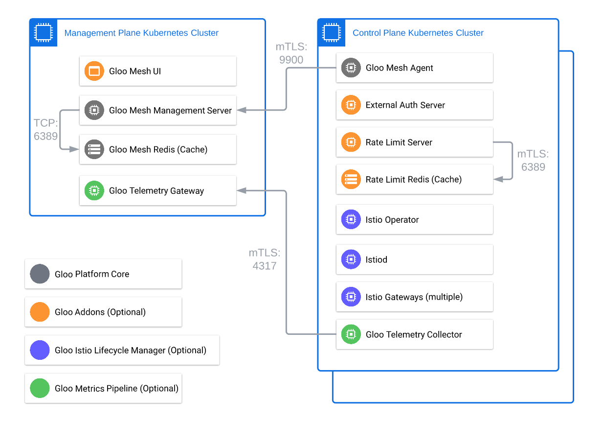

## Lab 01 - Deploy Gloo Platform <a name="lab-01---deploy-gloo-platform-"></a>

Reference Links:
* [Gloo Platform Setup Docs](https://docs.solo.io/gloo-mesh-enterprise/latest/setup/)
* [Gloo Platform Best practices for production](https://docs.solo.io/gloo-mesh-enterprise/latest/setup/prod/recommended_setup/)
* [Gloo Platform Architecture](https://docs.solo.io/gloo-mesh-enterprise/main/concepts/platform/architecture/)

Gloo Platform can be installed using in many ways (helm, terraform, etc). We recommend Helm for the majority of the use cases.

## Architecture

At its core, the Gloo Platform is a simple deployment of a management server and an agent on each workload cluster. Optionally, you can deploy additional components such as external authorization, rate limiting, and Istio lifecycle manager. This workshop will utilize these add-ons to highlight the features they provide on top of the Gloo Platform.



[Low-level architecture](images/gloo-platform-network-arch.png) - More in-depth diagram showing the communication between the components running in the clusters.

## Setup

* A licence key is needed to install the Gloo Platform. If you do not have a license key, contact an account representative. 
```shell
export GLOO_PLATFORM_LICENSE_KEY=<licence_key>
```

* Add helm repository got the Gloo Platform
```shell
helm repo add gloo-platform https://storage.googleapis.com/gloo-platform/helm-charts
helm repo update
```

## Install/Configure the Management Plane

Gloo Platform can be installed a number of ways but the most common is via `helm`. In this workshop helm will be the primary way to deploy assets. In production it is recommended that Gloo Platform is deployed via your CI/CD pipeline. Some popular methods include ArgoCD or Flux.

* Create the `gloo-mesh` namespace in the management cluster.
```shell
kubectl create namespace gloo-mesh --context management
```

* Install Gloo Platform. This command installs the management plane components, such as the management server, UI and Prometheus server.
```shell
# helm show values gloo-platform/gloo-platform --version 2.4.2 > gloo-platform-values.yaml
helm upgrade -i gloo-platform-crds gloo-platform/gloo-platform-crds \
  --version=2.4.2 \
  --kube-context management \
  --namespace=gloo-mesh

helm upgrade -i gloo-platform gloo-platform/gloo-platform \
  --version=2.4.2 \
  --namespace=gloo-mesh \
  --kube-context management \
  --set licensing.glooMeshLicenseKey=$GLOO_PLATFORM_LICENSE_KEY \
  --set licensing.glooTrialLicenseKey=$GLOO_PLATFORM_LICENSE_KEY \
  --set licensing.glooGatewayLicenseKey=$GLOO_PLATFORM_LICENSE_KEY \
  -f data/gloo-mgmt-values.yaml
```

* Confirm that Deployments are Ready (1/1) in the gloo-mesh namespace: 
```bash
kubectl get deploy --context management -n gloo-mesh
```

* Verify that the management server is up and running and the logs look good
```bash
kubectl logs deploy/gloo-mesh-mgmt-server --context management -n gloo-mesh
```

* Now grab the external endpoint of the management server so that the agents can connect to it. We also will grab a token and root TLS certificate for agents to connect to it with. 
```shell
# wait for the load balancer to be provisioned
until kubectl get service/gloo-mesh-mgmt-server --output=jsonpath='{.status.loadBalancer}' --context management -n gloo-mesh | grep "ingress"; do : ; done
until kubectl get service/gloo-telemetry-gateway --output=jsonpath='{.status.loadBalancer}' --context management -n gloo-mesh | grep "ingress"; do : ; done
GLOO_PLATFORM_SERVER_DOMAIN=$(kubectl get svc gloo-mesh-mgmt-server --context management -n gloo-mesh -o jsonpath='{.status.loadBalancer.ingress[0].*}')
GLOO_PLATFORM_SERVER_ADDRESS=${GLOO_PLATFORM_SERVER_DOMAIN}:$(kubectl get svc gloo-mesh-mgmt-server --context management -n gloo-mesh -o jsonpath='{.spec.ports[?(@.name=="grpc")].port}')
GLOO_TELEMETRY_GATEWAY=$(kubectl get svc gloo-telemetry-gateway --context management -n gloo-mesh -o jsonpath='{.status.loadBalancer.ingress[0].*}'):$(kubectl get svc gloo-telemetry-gateway --context management -n gloo-mesh -o jsonpath='{.spec.ports[?(@.port==4317)].port}')

echo "Mgmt Plane Address: $GLOO_PLATFORM_SERVER_ADDRESS"
echo "Metrics Gateway Address: $GLOO_TELEMETRY_GATEWAY"
```
* Before installing Gloo agents on the workload clusters trust needs to be established. The following command copys the public TLS root certificate and a token used for the Gloo agents to authenticate with the management plane.
```shell
kubectl get secret relay-root-tls-secret --context management -n gloo-mesh -o jsonpath='{.data.ca\.crt}' | base64 -d > ca.crt
kubectl get secret relay-identity-token-secret --context management -n gloo-mesh -o jsonpath='{.data.token}' | base64 -d > token
```

* To allow a Gloo agent to connect the management plane must be made aware of its existance. Run the following command to notify the management plane that the remote clusters will connect soon. 
```shell
kubectl apply --context management -f - <<EOF
apiVersion: admin.gloo.solo.io/v2
kind: KubernetesCluster
metadata:
  name: leaf1
  namespace: gloo-mesh
spec:
  clusterDomain: cluster.local
---
apiVersion: admin.gloo.solo.io/v2
kind: KubernetesCluster
metadata:
  name: leaf2
  namespace: gloo-mesh
spec:
  clusterDomain: cluster.local
EOF
```

## Install Gloo Agent on Cluster: leaf1

By simply installing the Gloo Platform Agent on a remote cluster you gain the ability to manage it with Gloo Platform. Initially, the Gloo Agent is non-invasive and simply relays service discovery information to the Management Plane.
* Create the `gloo-mesh` namespace in cluster leaf1
```shell
kubectl create namespace gloo-mesh --context leaf1
```

* Add the authentication token and root TLS certificate
```shell
kubectl create secret generic relay-root-tls-secret --from-file ca.crt=ca.crt --context leaf1 -n gloo-mesh
kubectl create secret generic relay-identity-token-secret --from-file token=token --context leaf1 -n gloo-mesh
```
* Install the Gloo Agent in leaf1
```shell
helm upgrade -i gloo-platform-crds gloo-platform/gloo-platform-crds \
  --version=2.4.2 \
  --namespace=gloo-mesh \
  --kube-context leaf1

helm upgrade -i gloo-agent gloo-platform/gloo-platform \
  --version=2.4.2 \
  --namespace gloo-mesh \
  --kube-context leaf1 \
  --set glooAgent.relay.serverAddress=$GLOO_PLATFORM_SERVER_ADDRESS \
  --set common.cluster=leaf1 \
  --set telemetryCollector.config.exporters.otlp.endpoint=$GLOO_TELEMETRY_GATEWAY \
  -f data/gloo-agent-values.yaml
```

* Verify the `gloo-mesh-agent` logs
```bash
kubectl logs deploy/gloo-mesh-agent --context leaf1 -n gloo-mesh
```

* Verify the `gloo-telemetry-collector` logs
```bash
kubectl logs ds/gloo-telemetry-collector-agent --context leaf1 -n gloo-mesh
```

## Install Gloo Agent on Cluster: leaf2

* Create the `gloo-mesh` namespace in cluster leaf2
```shell
kubectl create namespace gloo-mesh --context leaf2
```

* Add the authentication token and root TLS certificate
```shell
kubectl create secret generic relay-root-tls-secret --from-file ca.crt=ca.crt --context leaf2 -n gloo-mesh
kubectl create secret generic relay-identity-token-secret --from-file token=token --context leaf2 -n gloo-mesh
```
* Install the Gloo Agent in leaf2
```shell
helm upgrade -i gloo-platform-crds gloo-platform/gloo-platform-crds \
  --version=2.4.2 \
  --namespace=gloo-mesh \
  --kube-context leaf2

helm upgrade -i gloo-agent gloo-platform/gloo-platform \
  --version=2.4.2 \
  --namespace gloo-mesh \
  --kube-context leaf2 \
  --set glooAgent.relay.serverAddress=$GLOO_PLATFORM_SERVER_ADDRESS \
  --set common.cluster=leaf2 \
  --set telemetryCollector.config.exporters.otlp.endpoint=$GLOO_TELEMETRY_GATEWAY \
  -f data/gloo-agent-values.yaml
```

* Verify the `gloo-mesh-agent` logs
```bash
kubectl logs deploy/gloo-mesh-agent --context leaf2 -n gloo-mesh
```

* Verify the `gloo-telemetry-collector` logs
```bash
kubectl logs ds/gloo-telemetry-collector-agent --context leaf2 -n gloo-mesh
```

## Verify connectivity in the Gloo Platform UI
* Open the Gloo UI and observe the agents are connected and service discovery is working
```bash
kubectl port-forward svc/gloo-mesh-ui 8090:8090 --context management -n gloo-mesh
echo "Gloo UI: http://localhost:8090"
```
