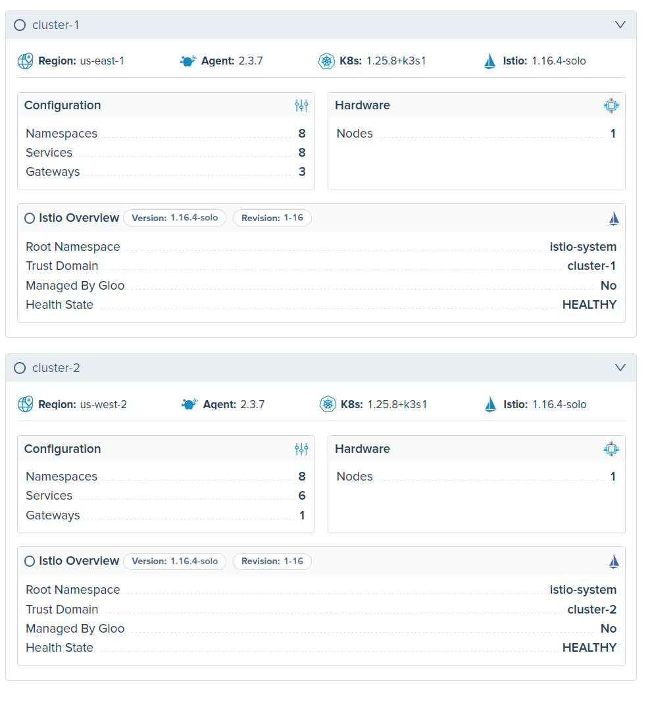
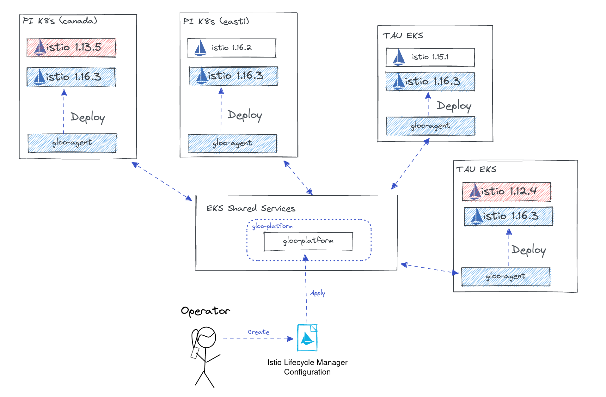
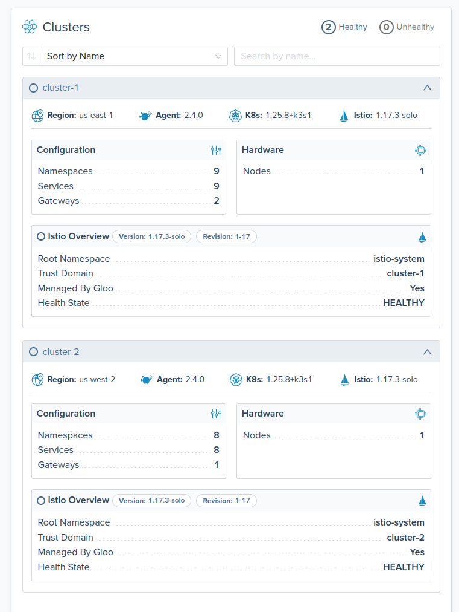

## Lab 02 - Deploy Istio <a name="lab-02---deploy-istio-"></a>




Gloo Platform works with Open Source Istio distributions but Solo.io offers a number of different distributions of Istio for different types of environments and use cases such as FIPS, Arm, and distroless.
To learn more about the different distributions view [Gloo Istio Distributions](https://docs.solo.io/gloo-mesh-enterprise/latest/reference/version/gloo_mesh_istio/).

With a Gloo Platform-managed installation, you no longer need to use istioctl to individually install Istio in each workload cluster. Instead, you can supply IstioOperator configurations in a IstioLifecycleManager resource to your management cluster. Gloo Platform translates this resource into Istio control planes, gateways, and related resources in your registered workload clusters for you.

Links:
- [Gloo Platform Managed Istio](https://docs.solo.io/gloo-mesh-enterprise/latest/setup/installation/istio/gm_managed_istio/)
- [GatewayLifecycleManager API](https://docs.solo.io/gloo-mesh-enterprise/latest/reference/api/gateway_lifecycle_manager/)
- [IstioLifecycleManager API](https://docs.solo.io/gloo-mesh-enterprise/latest/reference/api/istio_lifecycle_manager/)
* Apply IstioLifecycleManager to management plane to deploy Istiod control planes to both remote clusters.
```shell
kubectl apply --context management -f data/control-plane.yaml
```

* Apply GatewayLifecycleManager to management plane to deploy the Istio ingress and eastwest gateways to each remote cluster
```shell
kubectl apply --context management -f data/gateways.yaml
```

* Verify Installations using the Gloo Platform UI
```shell
kubectl port-forward svc/gloo-mesh-ui 8090:8090 --context management -n gloo-mesh
echo "Gloo UI: http://localhost:8090"
```

* Observe the Istio deployment in the Gloo Platform UI


* Verify pods are running
```bash
kubectl get pods --context leaf2 -n istio-system
kubectl get pods --no-headers --context leaf2 -n istio-ingress
kubectl get pods --no-headers --context leaf2 -n istio-eastwest
```

* Verify the load balancer is created`
```shell
kubectl get service --context leaf2 -n istio-ingress
kubectl get service --context leaf2 -n istio-eastwest
```
