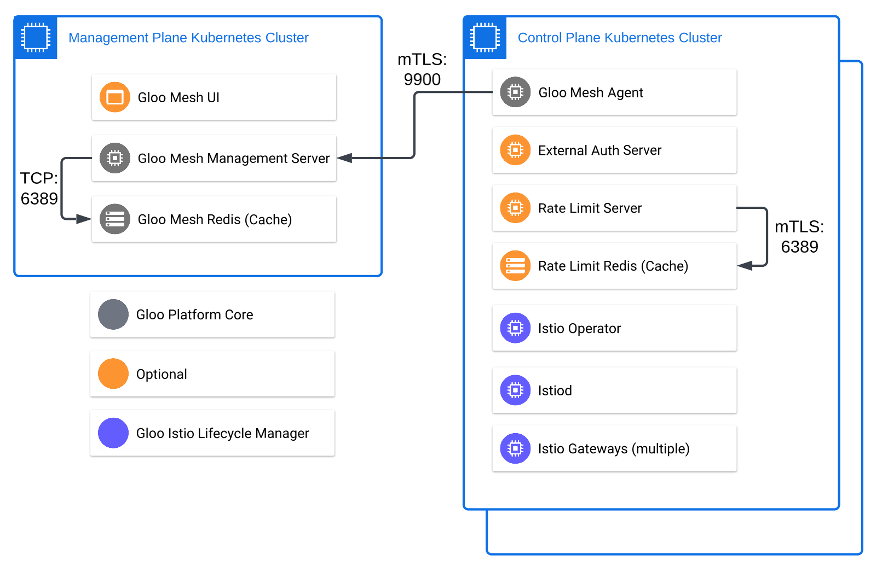

## Lab 03 - Deploy Gloo Platform Addons <a name="lab-03---deploy-gloo-platform-addons-"></a>

The Gloo Platform Addons are extensions that helm enable certain features that are offered within. The Gloo Platform addons contain a set of applications and cache to enable rate limiting.


* Create the Gloo Platform Addons namespace
```shell
kubectl apply --context leaf1 -f data/namespaces.yaml
```

* Install Gloo Platform Addon applications in leaf1
```shell
helm upgrade -i gloo-platform-addons gloo-platform/gloo-platform \
  --namespace gloo-platform-addons \
  --kube-context=leaf1 \
  --version 2.4.2 \
  -f data/gloo-platform-addons.yaml
```

* Verify pods are up and running
```bash
kubectl get pods -n gloo-platform-addons --context leaf1
```

* Register the external authorization server with Gloo Platform
```shell
kubectl create namespace ops-team --context management
kubectl apply --context management -f - <<EOF
apiVersion: admin.gloo.solo.io/v2
kind: ExtAuthServer
metadata:
  name: ext-auth-server
  namespace: ops-team
spec:
  destinationServer:
    kind: VIRTUAL_DESTINATION
    port:
      number: 8083
    ref:
      cluster: management
      name: ext-auth-server-vd
      namespace: ops-team
---
apiVersion: networking.gloo.solo.io/v2
kind: VirtualDestination
metadata:
  name: ext-auth-server-vd
  namespace: ops-team
spec:
  hosts:
  - extauth.vdest.solo.io
  ports:
  - number: 8083
    protocol: TCP
  services:
  - cluster: "leaf1"
    name: ext-auth-service
    namespace: gloo-platform-addons
EOF
```
