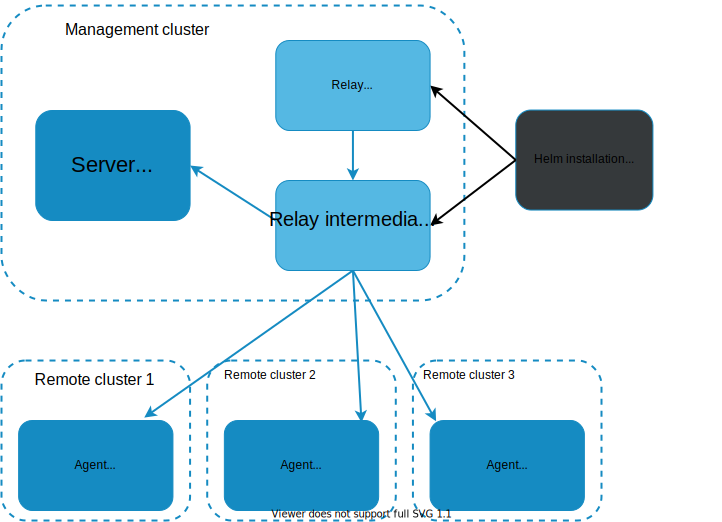
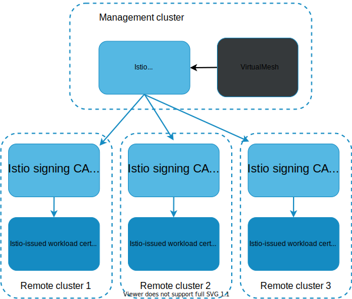

## Lab 04 - Certificate Management <a name="lab-04---certificate-management-"></a>

Links:
* https://docs.solo.io/gloo-mesh-enterprise/latest/setup/prod/certs/ 

## Gloo Relay
To secure communication between the management and data planes, relay agents (gloo-mesh-agent) in workload clusters use server/client mTLS certificates to secure communication with the relay server (gloo-mesh-mgmt-server) in the management cluster.

By default, Gloo Mesh Enterprise autogenerates its own root CA certificate and intermediate signing CA for issuing the server and client certificates.

* The relay-server-tls-secret secret for the root CA certificate is stored in the gloo-mesh namespace of the management cluster.
* The root-trust.gloo-mesh secret for the relay server certificate is stored in the gloo-mesh namespace of the management cluster.
* The relay-client-tls-secret secret for the relay agent certificate is stored in the gloo-mesh namespace of each workload cluster.


## Istio

The Istio deployment in each workload cluster requires a certificate authority (CA) certificate in the cacerts Kubernetes secret in the istio-system namespace.

Gloo Platform uses a root trust policy to configure the relay server (gloo-mesh-mgmt-server) to generate and self-sign a root CA certificate. This root CA certificate can sign Istio intermediate CA certificates whenever an Istio deployment in a workload cluster must create a certificate for a workload pod in its service mesh. Gloo Mesh stores the signed intermediate CA certificate in the cacerts Kubernetes secret in the istio-system namespace of the workload cluster.


## Gloo Platform Managed

* Fully managed option - Gloo Platform will generate a new Root CA and Intermediates for each clusters Istio deployments
```shell
kubectl apply --context management -f - <<EOF
apiVersion: admin.gloo.solo.io/v2
kind: RootTrustPolicy
metadata:
  name: root-trust-policy
  namespace: gloo-mesh
spec:
  config:
    mgmtServerCa:
      generated: {}
    autoRestartPods: true
EOF
```

* Secret Reference - Gloo Platform will use provided Root CA and generate Intermediates for each clusters Istio deployments
```shell
kubectl apply --context management -f - <<EOF
apiVersion: admin.gloo.solo.io/v2
kind: RootTrustPolicy
metadata:
  name: root-trust-policy
  namespace: gloo-mesh
spec:
  config:
    mgmtServerCa:
      secretRef:
        name: $provided_cert_name
        namespace: gloo-mesh
    autoRestartPods: true
EOF
```

In a later section, this workshop will show you how to swap out these autogenerated certificates with a managed Private Key Infrastructure (PKI)
