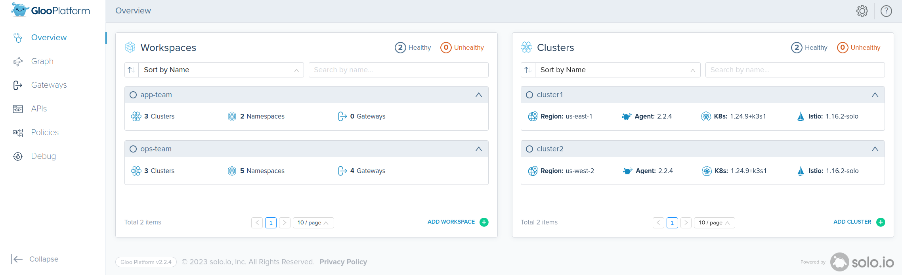
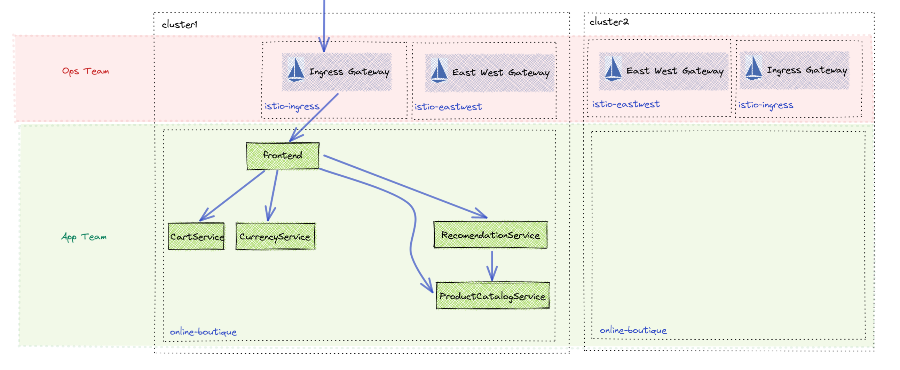
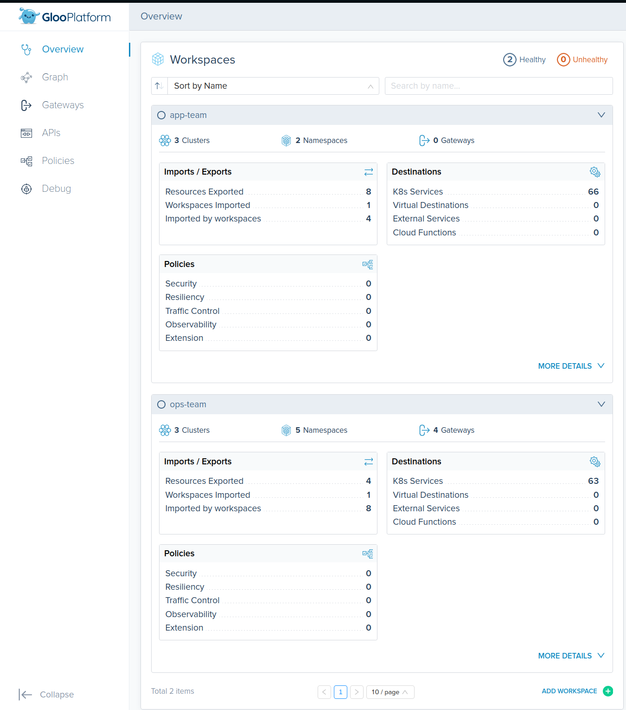
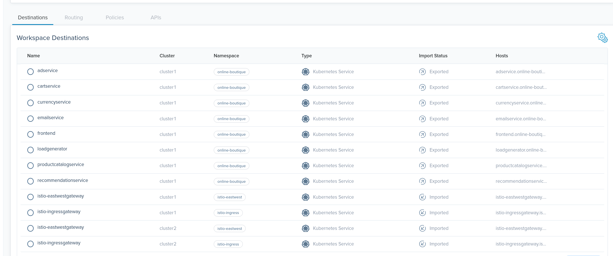

## Lab 06 - Configure Gloo Platform <a name="lab-06---configure-gloo-platform-"></a>



Links:
- [Gloo Platform Multi-Tenancy](https://docs.solo.io/gloo-mesh-enterprise/latest/concepts/multi-tenancy/)
- [Workspace API](https://docs.solo.io/gloo-mesh-enterprise/latest/reference/api/workspace/#workspacespec)
- [WorkspaceSettings API](https://docs.solo.io/gloo-mesh-enterprise/latest/reference/api/workspace_settings/)


## Setup Operations Team configuration namespace

* Create administrative namespace for ops-team
```shell
kubectl create namespace ops-team --context management
```

* Apply Gloo Platform configuration for ops-team
```shell
kubectl apply --context management -f - <<EOF
apiVersion: admin.gloo.solo.io/v2
kind: Workspace
metadata:
  name: ops-team
  namespace: gloo-mesh
spec:
  workloadClusters:
  # administrative namespace
  - name: management
    namespaces:
    - name: ops-team
  # remote cluster namespaces
  - name: '*'
    namespaces:
    - name: istio-ingress
    - name: istio-eastwest
    - name: istio-egress
    - name: gloo-platform-addons
---
# workspace configuration
apiVersion: admin.gloo.solo.io/v2
kind: WorkspaceSettings
metadata:
  name: ops-team
  # placed in the administrative namespace
  namespace: ops-team
spec:
  # import service discovery from app-team
  importFrom:
  - workspaces:
    - name: app-team
  # export service discovery to any workspace that needs ingress
  exportTo:
  - workspaces:
    - name: "*"
  # for mutli cluster routing
  options:
    eastWestGateways:
    - selector:
        labels:
          app: gloo-internal-gateway
EOF
```

## Setup Application Team configuration namespace

* Create administrative namespace for app-team
```shell
kubectl create namespace app-team --context management
```

* Apply Gloo Platform configuration for app-team
```shell
kubectl apply --context management -f - <<EOF
apiVersion: admin.gloo.solo.io/v2
kind: Workspace
metadata:
  name: app-team
  namespace: gloo-mesh
spec:
  workloadClusters:
  # admistrative namespace
  - name: management
    namespaces:
    - name: app-team
  # workload cluster namespace
  - name: '*'
    namespaces:
    - name: online-boutique
---
apiVersion: admin.gloo.solo.io/v2
kind: WorkspaceSettings
metadata:
  name: app-team
  namespace: app-team
spec:
  # import gateway service for ingress
  importFrom:
  - workspaces:
    - name: ops-team
  # share service discovery and routing to ingress
  exportTo:
  - workspaces:
    - name: ops-team
  options:
    eastWestGateways:
    - selector:
        labels:
          app: gloo-internal-gateway
EOF
```

## View Service Discovery in Gloo Platform UI

* Bring up the Gloo Platform Dashboard
```shell
kubectl port-forward svc/gloo-mesh-ui 8090:8090 --context management -n gloo-mesh
echo "Gloo UI: http://localhost:8090"
```

* View workspaces


* View app-team service discovery

