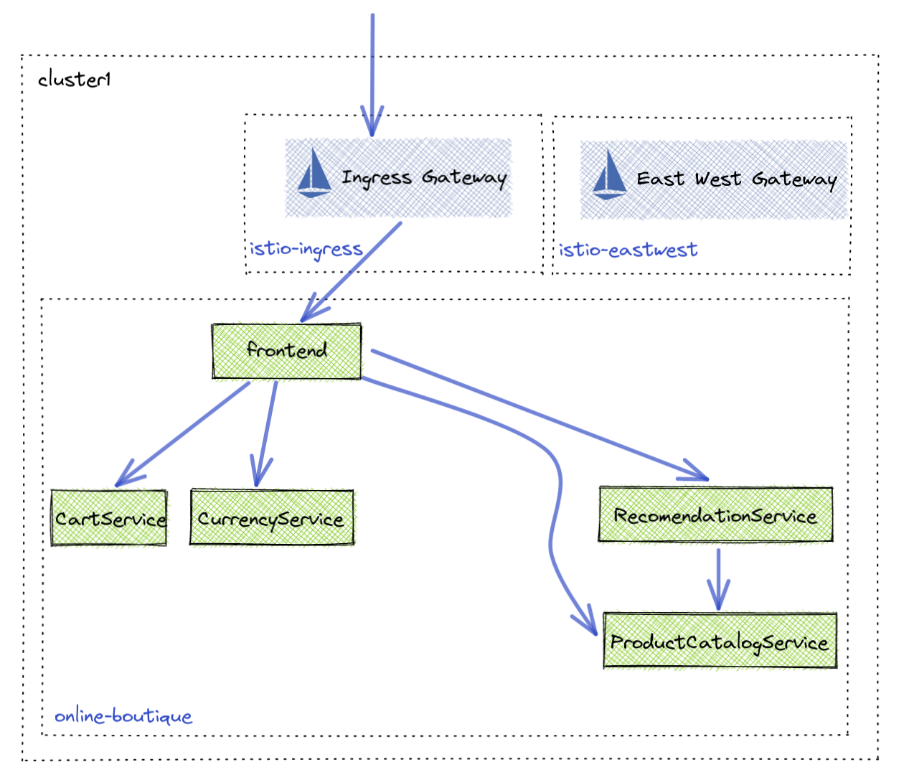

## Lab 07 - Ingress <a name="lab-07---ingress-"></a>


Links:
- [Gloo Platform Routing](https://docs.solo.io/gloo-mesh-enterprise/latest/routing/)
- [VirtualGateway API](https://docs.solo.io/gloo-mesh-enterprise/latest/reference/api/virtual_gateway/)
- [RouteTable API](https://docs.solo.io/gloo-mesh-enterprise/latest/reference/api/route_table/)
- [Route Delegation](https://docs.solo.io/gloo-mesh-enterprise/latest/routing/rt-delegation/)



## Operations team gateway setup

The operations team is responsible for setting the ports and protocols of Gloo Gateway. In a later section they will also secure the gateway with TLS.

* Configure Gloo Gateway ports and protocols using the Gloo `VirtualGateway` API. Delegate routing decisions to themselves, the `ops-team`
```shell
kubectl apply --context management -f - <<EOF
apiVersion: networking.gloo.solo.io/v2
kind: VirtualGateway
metadata:
  name: ingress
  namespace: ops-team
spec:
  workloads:
    - selector:
        labels:
          app: gloo-gateway
        cluster: leaf1
        namespace: istio-ingress
  listeners: 
    # HTTP port
    - http: {}
      port:
        number: 80
      # allow application team to make routing decisions
      allowedRouteTables:
        - host: '*'
          selector:
            workspace: ops-team
EOF
```

**Note** The Operations team has delegates the TOP level routing decisions to themselves. This not only gives them fine grained routing and delegation decision capabilities, it allows them to apply policies at the top level before traffic will reach an application.

* Create a `RouteTable` to delegate traffic decisions to the application team. They will decide where the traffic ultimately flows. 
```shell
kubectl apply --context management -f - <<EOF
apiVersion: networking.gloo.solo.io/v2
kind: RouteTable
metadata:
  name: ingress
  namespace: ops-team
spec:
  hosts:
    - '*'
  virtualGateways:
    - name: ingress
      namespace: ops-team
  workloadSelectors: []
  http:
    - name: application-ingress
      labels:
        ingress: all
      delegate:
        routeTables:
        - namespace: app-team
EOF
```

## Application Team Routing

Due to the Ops team delegating routing decisions to the App team, the App team now needs to configure where traffic should flow.

* Configure a `RouteTable` object to route to online-boutique frontend
```shell
kubectl apply --context management -f - <<EOF
apiVersion: networking.gloo.solo.io/v2
kind: RouteTable
metadata:
  name: frontend
  namespace: app-team
spec:
  workloadSelectors: []
  http:
    - name: frontend
      forwardTo:
        destinations:
          - ref:
              name: frontend
              namespace: online-boutique
              cluster: leaf1
            port:
              number: 80
EOF
```
* Access online-boutique
```shell
export GLOO_GATEWAY=$(kubectl --context leaf1 -n istio-ingress get svc -l istio=ingressgateway -o jsonpath='{.items[0].status.loadBalancer.ingress[0].*}'):80

echo "Online Boutique available at http://$GLOO_GATEWAY"
```

## Secure Ingress with HTTPS

Most users need to secure traffic coming from outside their Kubernetes cluster. To do this you need to create a certificate that can be used by Gloo Gateway in the namespace the gateway resides. 

* Create example certificate and upload to gloo gateway namespace
```shell
openssl req -x509 -nodes -days 365 -newkey rsa:2048 \
   -keyout tls.key -out tls.crt -subj "/CN=*"

kubectl create secret generic tls-secret --from-file=tls.key=tls.key --from-file=tls.crt=tls.crt --context leaf1 -n istio-ingress
```

* Using the `VirtualGateway` API we can update the current configuration to expose traffic on port 443 using TLS.
```shell
kubectl apply --context management -f - <<EOF
apiVersion: networking.gloo.solo.io/v2
kind: VirtualGateway
metadata:
  name: ingress
  namespace: ops-team
spec:
  workloads:
    - selector:
        labels:
          app: gloo-gateway
        cluster: leaf1
        namespace: istio-ingress
  listeners: 
    # HTTP port
    - http: {}
      port:
        number: 80
      allowedRouteTables:
        - host: '*'
          selector:
            workspace: ops-team
    # HTTPS port
    - http: {}
      port:
        number: 443
      tls:
        mode: SIMPLE
        secretName: tls-secret # NOTE
      allowedRouteTables:
        - host: '*'
          selector:
            workspace: ops-team
EOF
```

* Access online-boutique with HTTPS
```shell
export GLOO_GATEWAY_HTTPS=$(kubectl --context leaf1 -n istio-ingress get svc -l istio=ingressgateway -o jsonpath='{.items[0].status.loadBalancer.ingress[0].*}'):443

echo "SECURE Online Boutique available at https://$GLOO_GATEWAY_HTTPS"
```

* Optional curl
```shell
curl -k --write-out '%{http_code}' https://$GLOO_GATEWAY_HTTPS
```
