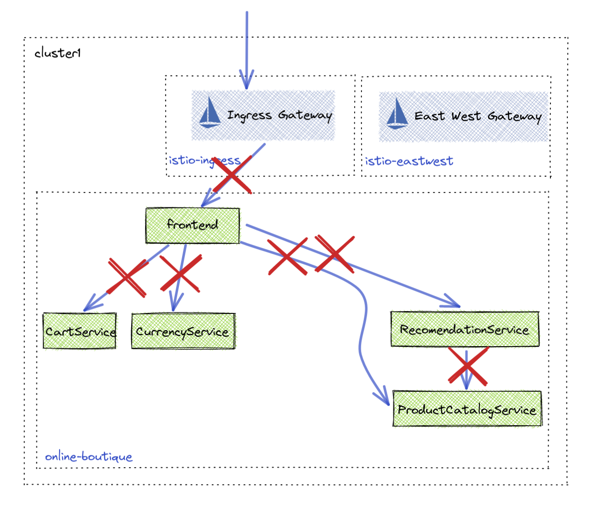
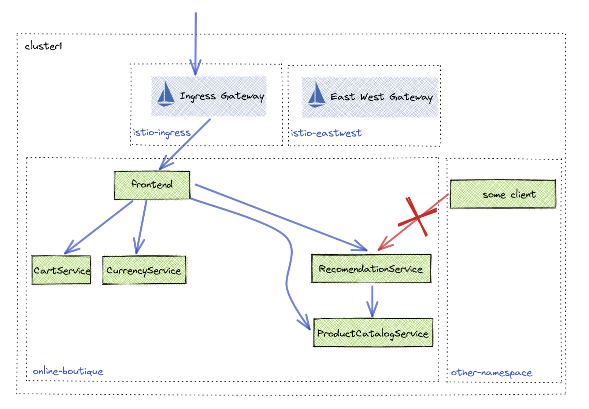
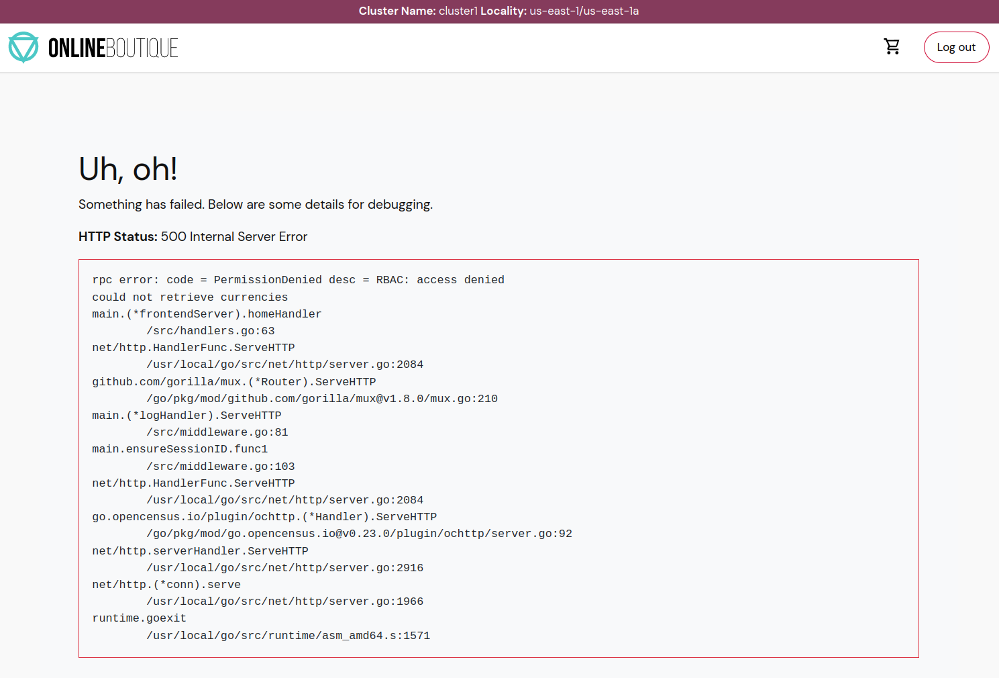

## Lab 08 - Zero Trust Communication <a name="lab-08---zero-trust-communication-"></a>


Links:
  - [Zero Trust Whitepaper](https://www.solo.io/zero-trust/)
  - [Access Policy Docs](https://docs.solo.io/gloo-mesh-enterprise/latest/policies/access/)
  - [AccessPolicy API](https://docs.solo.io/gloo-mesh-enterprise/latest/reference/api/access_policy/)

## Deploy Zero Trust Policy


* Disable all traffic by default for Application Team
```shell
kubectl apply --context management -f - <<EOF
apiVersion: security.policy.gloo.solo.io/v2
kind: AccessPolicy
metadata:
  name: allow-nothing
  namespace: app-team
spec:
  applyToWorkloads:
  - {}
  config:
    authn:
      tlsMode: STRICT
    authz: {}
EOF
```

* Test traffic to online-boutique
```shell
https://$GLOO_GATEWAY_HTTPS
```

* Optional curl
```shell
curl -k --write-out '%{http_code}' https://$GLOO_GATEWAY_HTTPS
```

## Allow Fine Grain Access

Now that all traffic is denied by default, traffic needs to be allowed between the microservices for the Online Boutique to function.


* Allow access to the frontend from the ingress gateway
```shell
kubectl apply --context management -f - <<EOF
apiVersion: security.policy.gloo.solo.io/v2
kind: AccessPolicy
metadata:
  name: frontend-ingress-access
  namespace: app-team
spec:
  applyToDestinations:
  - selector:
      workspace: app-team
  config:
    authz:
      allowedClients:
      - serviceAccountSelector:
          workspace: ops-team
EOF
```
* Open online-boutique
```shell
https://$GLOO_GATEWAY_HTTPS
```

* Allow frontend to reach apis in same namespace
```shell
kubectl apply --context management -f - <<EOF
apiVersion: security.policy.gloo.solo.io/v2
kind: AccessPolicy
metadata:
  name: in-namespace-access
  namespace: app-team
spec:
  applyToDestinations:
  - selector:
      workspace: app-team
  config:
    authz:
      allowedClients:
      - serviceAccountSelector:
          workspace: app-team
EOF
```

* Refresh page
