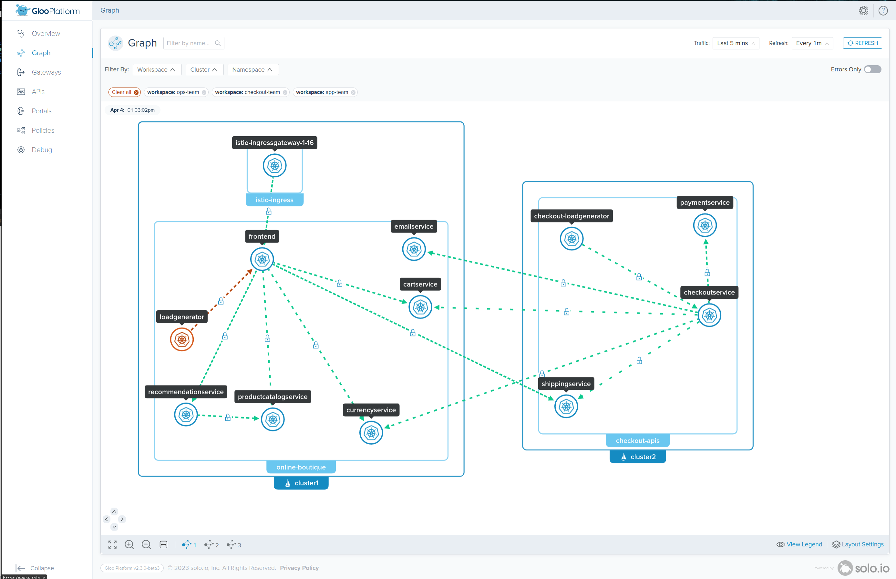
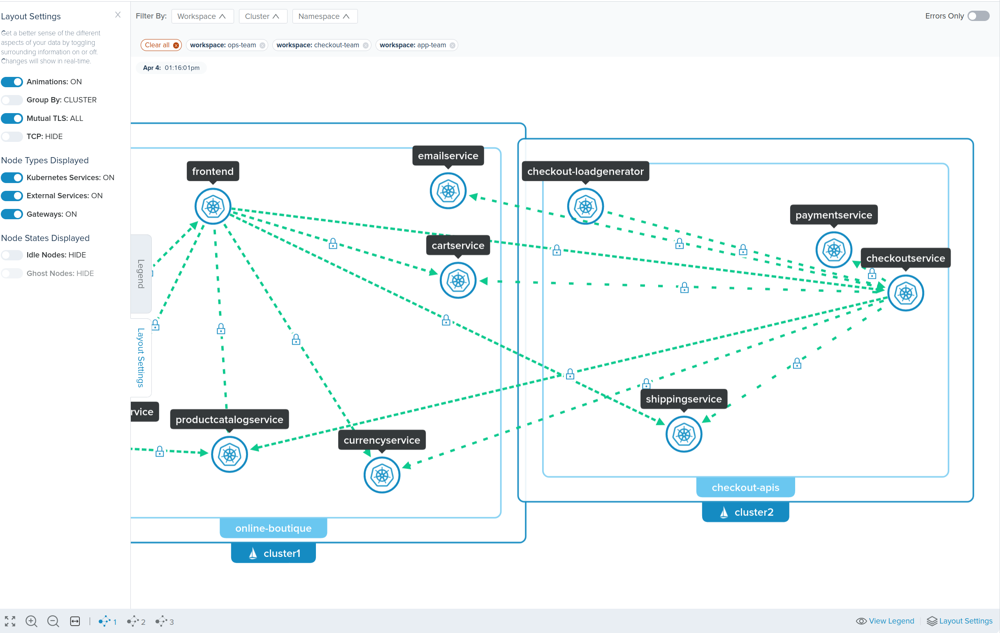
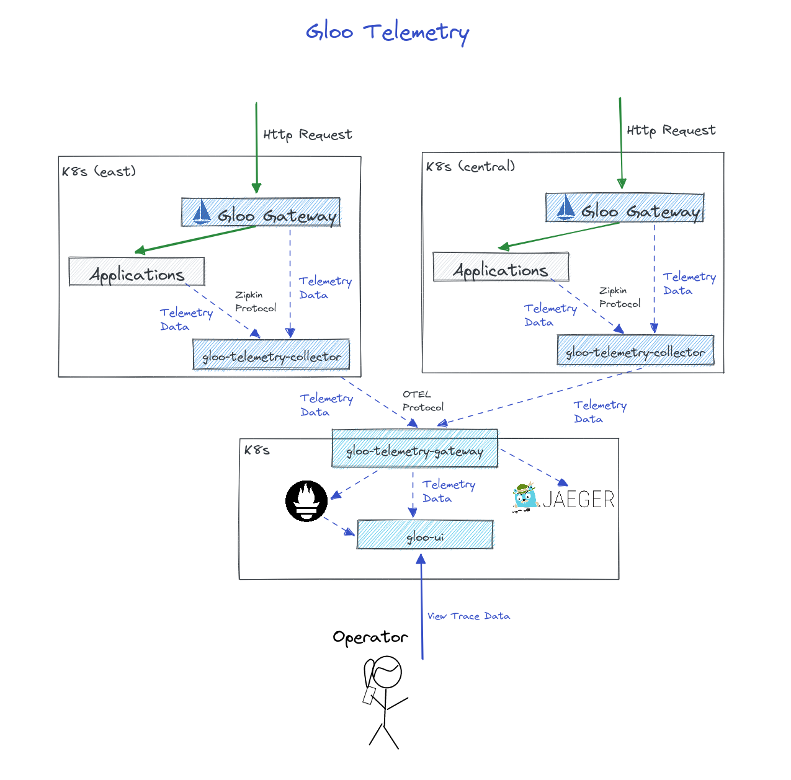
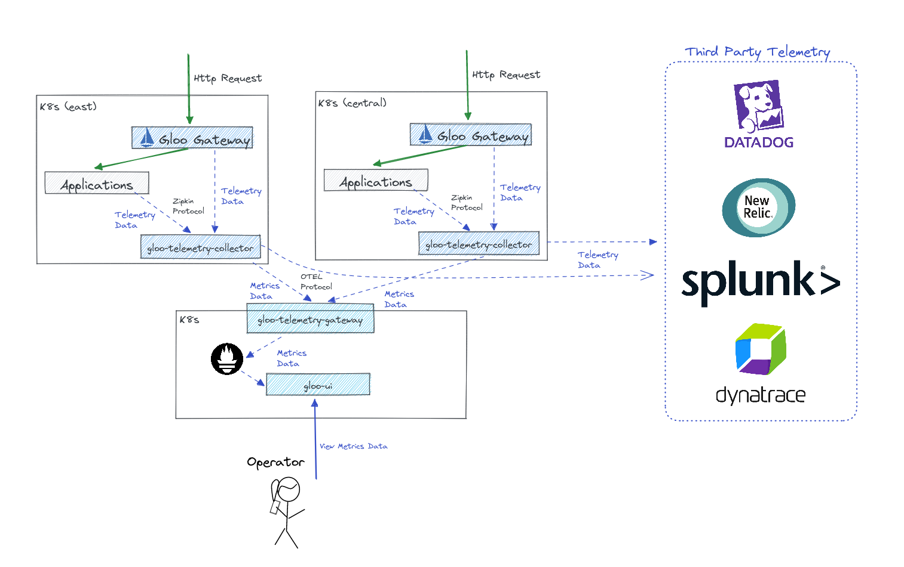
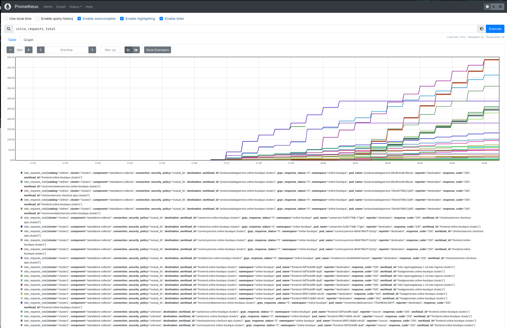
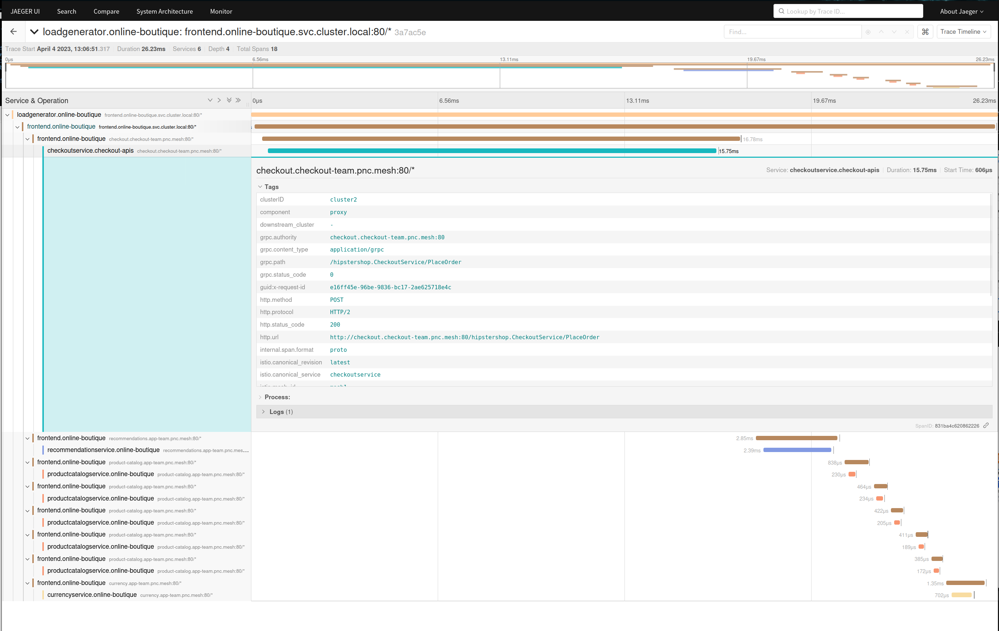

## Lab 10 - Observability <a name="lab-10---observability-"></a>


Gloo Platform offers the best in class observability for communication between your services. By aggregating logging, tracing, and metrics, Gloo Platform combines telemetry from all environments to give you a complete picture of how your platform is performing. 


Links:
* [Exploying the Gloo UI](https://docs.solo.io/gloo-mesh-enterprise/latest/observability/tools/dashboard/ui-overview/)
* [Prometheus](https://docs.solo.io/gloo-mesh-enterprise/latest/observability/tools/prometheus/)
* [Gloo Platform Tracing/Metrics/Logs](https://docs.solo.io/gloo-mesh-enterprise/latest/observability/mesh/)

## Gloo Platform UI

The Gloo UI is automatically installed in the Gloo management cluster. Let's explore some of the key features that you have access to when using the Gloo UI:

* **Gloo Platform overview: With the Gloo UI:** you can view information about your Gloo Platform environment, such as the number of clusters that are registered with the Gloo management server and the Istio version that is deployed to them. You can also review your workspace settings and which Gloo resources you import and export to other workspaces.
* **Verify service mesh configurations:** The Gloo Mesh UI lets you quickly find important information about your service mesh setup, the participating clusters, and the Gloo Mesh resources that you applied to the service mesh. For example, you can review your workspace settings and which Gloo Mesh resources you import and export to other workspaces. You can also view your gateway and listener configurations and traffic policies that you applied to your service mesh routes.
* **Drill into apps and services:** Review what services can communicate with other services in the mesh, the policies that are applied before traffic is sent to a service, and how traffic between services is secured.
* **Visualize and monitor service mesh health metrics:** With the built-in Prometheus integration, the Gloo Mesh UI has access to detailed Kubernetes cluster and service mesh metrics, such as the node's CPU and memory capacity, unresponsive nodes or nodes with degraded traffic, and mTLS settings for services in the mesh. For more information about the Prometheus integration in Gloo Mesh, see Prometheus.
* **OIDC authentication and authorization support:** Set up authentication and authorization (AuthN/AuthZ) for the Gloo Mesh UI by using OpenID Connect (OIDC) and Kubernetes role-based access control (RBAC). The Gloo Mesh UI supports OpenID Connect (OIDC) authentication from common providers such as Google, Okta, and Auth0.

For a detailed overview of what information you can find in the Gloo UI, see [Explore the Gloo UI](https://docs.solo.io/gloo-mesh-enterprise/latest/observability/tools/dashboard/ui-overview/).

* Navigate to Gloo Mesh Graph


```shell
kubectl port-forward svc/gloo-mesh-ui 8090:8090 --context management -n gloo-mesh
echo "Gloo UI: http://localhost:8090"
```

* Click `Workspaces` and select all workspaces

* Click `Layout Settings` in the bottom right of the screen and update `Group By:` to `CLUSTER`


## Telemetry

Gloo Platform Telemetry is based on the [Open Telemetry](https://opentelemetry.io/) standards. Metrics, logs and traces are gathered in cluster by the `Gloo Telemetry Collector`. Where it is shipped from there is up the user. By default, telemetry data will be shipped to the `Gloo Telemetry Gateway` in the `Management Plane` and aggregated with all other telemetry data from other clusters.


**Third Party Support**

Gloo Platform can also ship these metrics to you third party telemetry provider like `Datadog`, `Splunk`, `New Relic`, or `Dynatrace`. 


### Metrics

Metrics provide important information about the health of the apps in your service mesh. You can use these measures to detect failures, troubleshoot bottlenecks, and to find ways to improve the performance and reliability of your service mesh.


* To view the raw metrics
```shell
kubectl port-forward svc/prometheus-server --context management -n gloo-mesh 9080:80
echo "Prometheus available at http://localhost:9080"
```

* Search for metrics prefixed with `istio_`, Example `istio_requests_total`

* Here is an example query that lists non 200 codes for each workload
```bash
sum(rate(istio_requests_total{response_code!="200"}[1m])) by (workload_id,response_code)
```

### Tracing

Sample request traces to monitor the traffic and health of your service mesh.

Distributed tracing helps you track requests across multiple services in your distributed service mesh. Sampling the requests in your mesh can give you insight into request latency, serialization, and parallelism




* Create a service for Istio to send metrics
```shell
kubectl apply --context leaf1 -f data/tracing-service.yaml
kubectl apply --context leaf2 -f data/tracing-service.yaml
```

* Enable Tracing within each cluster
```shell
kubectl apply --context leaf1 -f - <<EOF
apiVersion: telemetry.istio.io/v1alpha1
kind: Telemetry
metadata:
  name: default
  namespace: istio-system
spec:
  tracing:
  - providers:
      - name: zipkincustom
    randomSamplingPercentage: 100
    disableSpanReporting: false
  accessLogging:
  - providers:
    - name: envoyOtelAls
    - name: envoy
EOF
kubectl apply --context leaf2 -f - <<EOF
apiVersion: telemetry.istio.io/v1alpha1
kind: Telemetry
metadata:
  name: default
  namespace: istio-system
spec:
  tracing:
  - providers:
      - name: zipkincustom
    randomSamplingPercentage: 100
    disableSpanReporting: false
  accessLogging:
  - providers:
    - name: envoyOtelAls
    - name: envoy
EOF
```

* Open the Gloo Platform Dashboard and click on `Tracing` tab
```shell
kubectl port-forward svc/gloo-mesh-ui 8090:8090 --context management -n gloo-mesh
echo "Gloo UI: http://localhost:8090"
```

* Select service `frontend.online-boutique` and then click `Find Traces`
