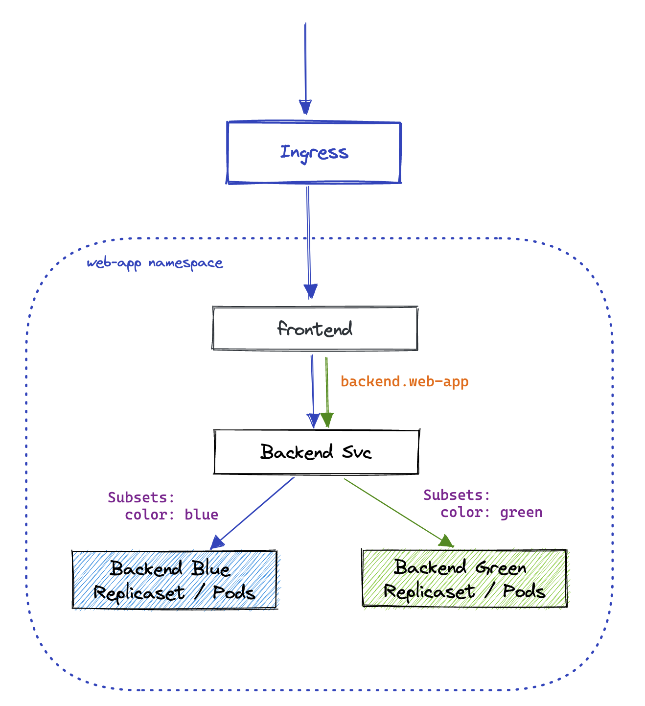
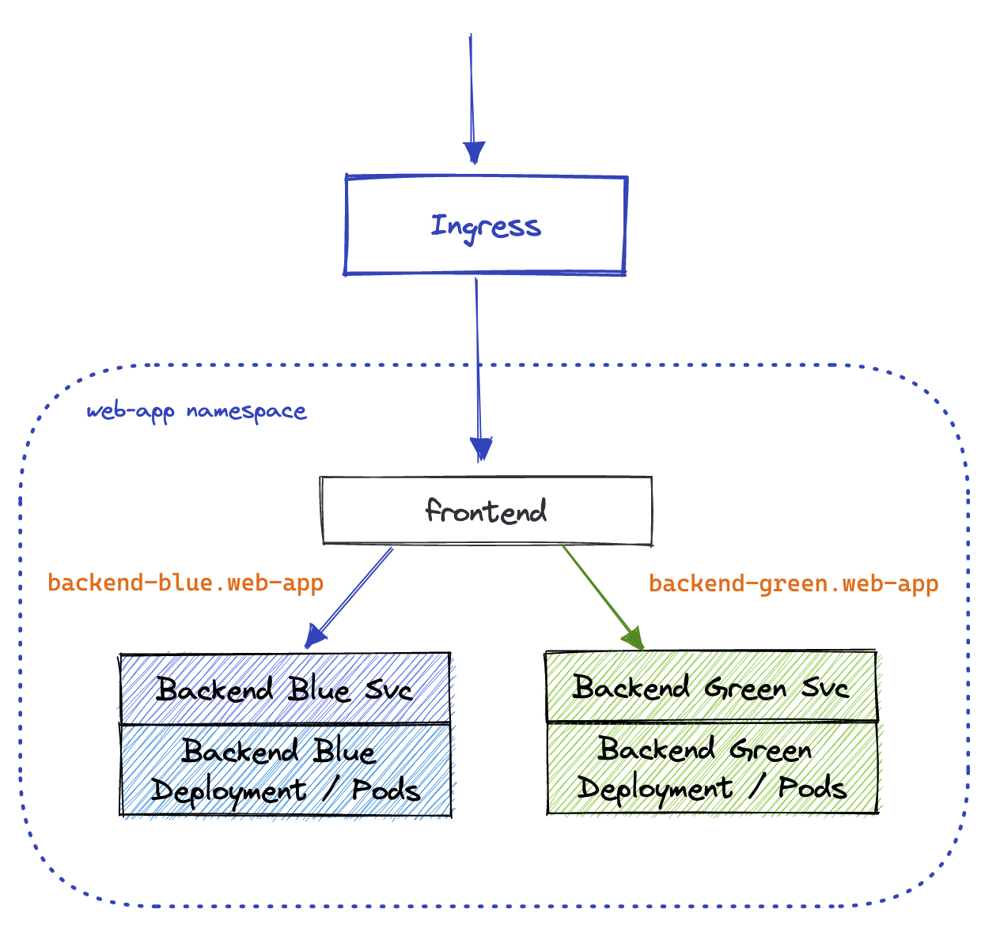
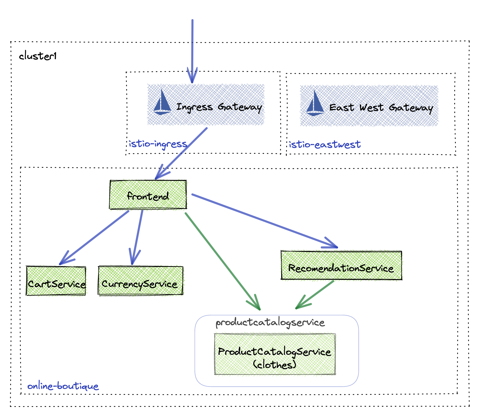
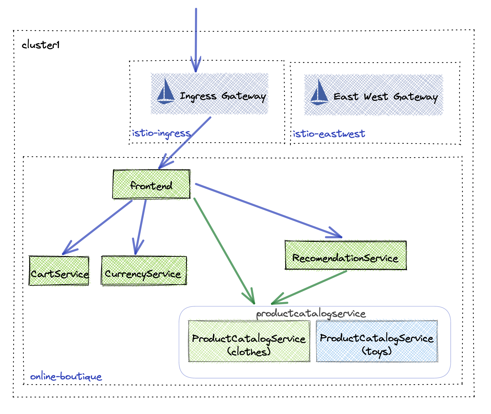
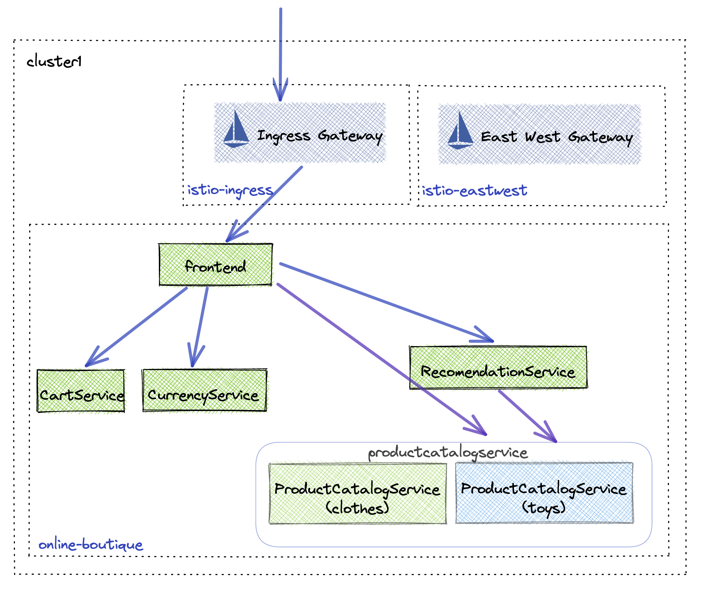

## Lab 11 - Blue Green Application Deployments <a name="lab-11---blue-green-application-deployments-"></a>


Links:
  - [Weighted Multi-Cluster Routing](https://docs.solo.io/gloo-mesh-enterprise/latest/routing/forward-requests/multi-cluster/)

Gloo Platform enables you to individually blue green deploy applications and allows for canary or weighted routing based testing. There are multiple architectures that are supported by Gloo Platform to facilitate blue green deployments.

* Single Kubernetes Service Blue Green Architecture

In the single Kubernetes service blue green architecture, a single Kubernetes service represents multiple Kubernetes Deployments or Replicasets of different varieties. Using subsets you can select the endpoints behind the service that should be routed to. This model is what is used by Argo Rollouts and is demonstrated in this workshop. It requires that your pods be labeled correctly to function.

* Multiple Kubernetes Services Blue Green Architecture

Using multiple kubernetes services to do blue green deployments is more common with helm based architectures. This requires minimal changes to your helm charts and allows you to deploy your blue green application stacks next to each other or even different namespaces.

## Deploy the Toy Catalog API (using single kubernetes service architecture)

To test blue green deployments we are going to introduce a new product catalog of toys instead of clothes. Because this is an experimental API we do not want use traffic to immediately flow to the new API unless specified. Before deploying the toys catalog we need to force traffic to the existing clothes API. This way when you deploy the toys API traffic will not automatically go to it.



* Force traffic to go to the clothes catalog API
```shell
kubectl apply --context management -n app-team -f data/route-table.yaml
```



* Deploy toys catalog API alongside the clothes catalog API
```shell
helm upgrade -i toys-catalog --version "5.0.3" oci://us-central1-docker.pkg.dev/field-engineering-us/helm-charts/onlineboutique \
  --namespace online-boutique  \
  --kube-context leaf1 \
  -f data/toys-catalog-values.yaml
```

* Refresh the Online Boutique and you should still the same catalog


* Update the routing so traffic goes to the toys catalog
```shell
kubectl apply --context management -n app-team -f data/route-table-toys.yaml
```

* Refresh the Online Boutique and now you should see the `toys` catalog

* Cleanup the blue green deployment
```shell
kubectl delete routetable product-catalog --context management -n app-team
kubectl delete deployment productcatalogservice-toys --context leaf1 -n online-boutique
```
