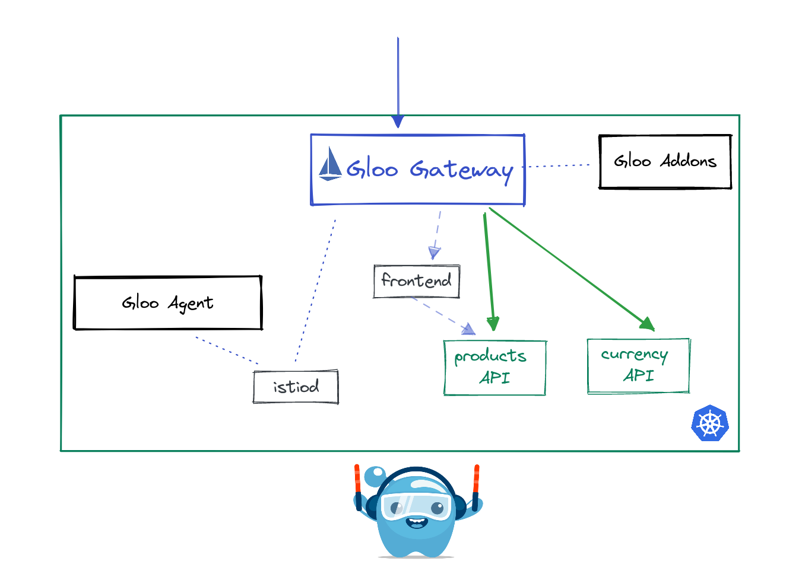

## Lab 12 - Expose APIs <a name="lab-12---expose-apis-"></a>



Next, lets see how easy it is to expose multiple applications. The Online Boutique frontend relies on a number of APIs to populate the UI. The product catalog API is responsible for displaying the available products and the currency API converts the cost of each product into the required denomination. To expose these apis, we will match on URI `prefix: /currencies` and send to the currency service and `prefix: /products` to the product catalog service.
* Reminder to set the `GLOO_GATEWAY_HTTPS` environment variable
```shell
export GLOO_GATEWAY_HTTPS=$(kubectl --context leaf1 -n istio-ingress get svc -l istio=ingressgateway -o jsonpath='{.items[0].status.loadBalancer.ingress[0].*}'):443

echo "SECURE Online Boutique available at https://$GLOO_GATEWAY_HTTPS"
```

**Note**: you may notice the wight: 100 configuration. This tells Gloo gateway to place this RouteTable before the frontend RouteTable with the / prefix route which doesnt have a weight. Higher integer values are considered higher priority. The default value is 0.


* Expose the currency API
```shell
kubectl apply --context management -f data/currency-route-table.yaml
```

* Test the currency API
```shell
# get the available currencies
curl -k https://$GLOO_GATEWAY_HTTPS/currencies

# convert a currency
curl -k https://$GLOO_GATEWAY_HTTPS/currencies/convert \
--header 'Content-Type: application/json' \
--data '{
  "from": {
    "currency_code": "USD",
    "nanos": 0,
    "units": 8
  },
  "to_code": "EUR"
}'
```

* Expose the product catalog API
```shell
kubectl apply --context management -f data/products-route-table.yaml
```

* Test requests to the product catalog API
```shell
curl -k https://$GLOO_GATEWAY_HTTPS/products
```

## Expose API In Another Cluster

The Gloo Gateway can also expose applications that do no reside in its own cluster using VirtualDestinations. The following lab exposes the `shipping` API in leaf2.

* Since the API is owned by the Checkout Team, the Ops team need to import their service to make it routable. 
```shell
kubectl apply --context management -f data/ops-team.yaml
```

* Create the RouteTable pointing to the Shipping VirtualDestination
```shell
kubectl apply --context management -f data/shipping-route-table.yaml
```

* Test that the Gloo Gateway can reach the shipping service
```shell
curl -k -X POST https://$GLOO_GATEWAY_HTTPS/shipping/quote \
  --header 'Content-Type: application/json' \
  --header 'Accept: application/json' \
  --data '{
    "address": {
      "city": "Cambridge",
      "country": "US",
      "state": "MA",
      "street_address": "222 Third Street #3300",
      "zip_code": 12142
    },
    "items": [
      {
        "product_id": "OLJCESPC7Z",
        "quantity": 5
      }
    ]
  }'
```
