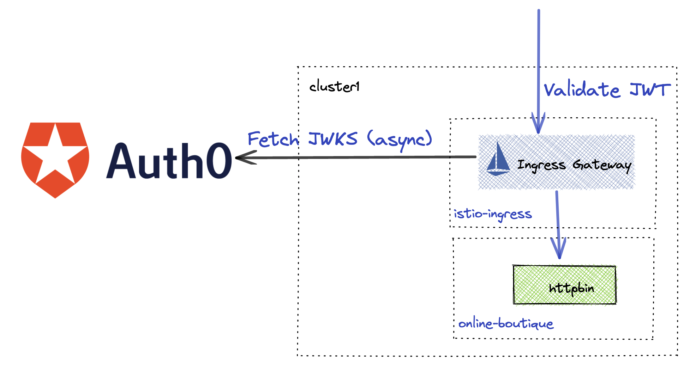

## Lab 14 - Authentication / JWT + JWKS <a name="lab-14---authentication-/-jwt-+-jwks-"></a>


One way for users to authenticate themselves is via JSON Web Tokens or JWT for short. Gloo Platform can validate JWT tokens against an external JSON Web Key Set (JWKS). Below is a lab that validates JWT tokens generated from an external provider Auth0.


Links:
- [External Authorization Docs](https://docs.solo.io/gloo-mesh-enterprise/latest/policies/external-auth/)
- [JWTPolicy API](https://docs.solo.io/gloo-mesh-enterprise/latest/reference/api/jwt_policy/)
* Reminder to set the `GLOO_GATEWAY_HTTPS` environment variable
```shell
export GLOO_GATEWAY_HTTPS=$(kubectl --context leaf1 -n istio-ingress get svc -l istio=ingressgateway -o jsonpath='{.items[0].status.loadBalancer.ingress[0].*}'):443

echo "SECURE Online Boutique available at https://$GLOO_GATEWAY_HTTPS"
```

## Enforcing JWT Authentication

* Since JWT authentication is best viewed while accessing an API, first verify that the currency application is still availabile.
```shell
# get the available currencies
curl -k https://$GLOO_GATEWAY_HTTPS/currencies

# convert a currency
curl -k "https://$GLOO_GATEWAY_HTTPS/currencies/convert" \
--header 'Content-Type: application/json' \
--data '{
  "from": {
    "currency_code": "USD",
    "nanos": 0,
    "units": 8
  },
  "to_code": "EUR"
}'
```

* Enable JWT Authentication for the currency routes
```shell
kubectl apply --context management -f - <<EOF
apiVersion: security.policy.gloo.solo.io/v2
kind: JWTPolicy
metadata:
  name: currency
  namespace: app-team
spec:
  applyToRoutes:
  - route:
      labels:
        route: currency
  config:
    providers:
      local:
        keepToken: true
        claimsToHeaders:
        - append: true
          claim: org
          header: x-org
        - append: true
          claim: email
          header: x-email
        issuer: https://localhost
        local:
          inline: |-
            -----BEGIN PUBLIC KEY-----
            MIIBIjANBgkqhkiG9w0BAQEFAAOCAQ8AMIIBCgKCAQEAvHaLmR1UjwUFqHX6iE42
            ZFojAUXoMXK7W0Sm4CPHZ9moqAe+88bMFE8D/0YnpgpUDFFDgz2g88NK+SUoj7Yy
            LieKsKQWGk6oEnW9hDp7mQ0ORp1GMchR/I4TqmlKOcmVztMTbJgYC4FXknmMnFCf
            BK6ttZazqoc3izKQLiJVeKcYnT12tMdfVc3NdsmkX1uq7dDSKfPfbcTjMZDrolXD
            UNal7tp125gFRV3wlE1GyultnCped/mzCrBiGHVfBKJtLOriWjH38URuhQcbgXIc
            AFyWNSh2x1unM9aDrotjxBCkbJPapGNLyPk8JzJ/NEYGhuerCFft4lA8KAolURga
            /wIDAQAB
            -----END PUBLIC KEY-----
EOF
```

* Call the currency API and get denied
```shell
curl -vk https://$GLOO_GATEWAY_HTTPS/currencies
```

Expected output
```txt
Jwt is missing
```

* Generate JWT from Auth0 using the below command
```shell
ACCESS_TOKEN=$(curl -sS --request POST \
  --url https://dev-64ktibmv.us.auth0.com/oauth/token \
  --header 'content-type: application/json' \
  --data '{"client_id":"1QEVhZ2ERqZOpTQnHChK1TUSKRBduO72","client_secret":"J_vl_qgu0pvudTfGppm_PJcQjkgy-kmy5KRCQDj5XHZbo5eFtxmSbpmqYT5ITv2h","audience":"https://currency/api","grant_type":"client_credentials"}' | jq -r '.access_token')

printf "\n\n Access Token: $ACCESS_TOKEN\n"
```

* Call currency API using the Access token to authenticate
```shell
curl -vk -H "Authorization: Bearer $ACCESS_TOKEN" https://$GLOO_GATEWAY_HTTPS/currencies
```


* Cleanup JWT policy 
```
kubectl delete jwtpolicy currency --context management -n app-team
```
