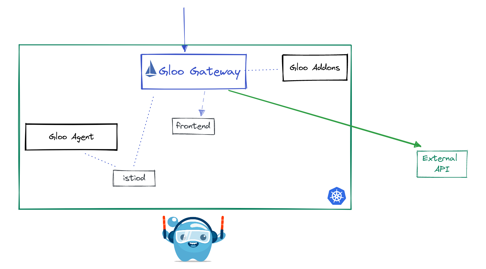

## Lab 15 - Calling External Services <a name="lab-15---calling-external-services-"></a>


Many times users will need to communicate with applications outiside of the service mesh. Gloo Platform represents these applications as `External Services`. By telling Gloo Platform about an External Service you are allowing that endpoint to be discovered and routable from applications running inside the service mesh. This concept becomes powerfull due to the ability to also apply Gloo Platform policies to it. For example in the below lab you will be securing the httpbin.org application with the JWT authentication in the previous lab. 


Links:
  - [External Service Doc](https://docs.solo.io/gloo-mesh-enterprise/latest/routing/forward-requests/external-service/)
  - [ExternalService API](https://docs.solo.io/gloo-mesh-enterprise/latest/reference/api/external_service/)
* Reminder to set the `GLOO_GATEWAY_HTTPS` environment variable
```shell
export GLOO_GATEWAY_HTTPS=$(kubectl --context leaf1 -n istio-ingress get svc -l istio=ingressgateway -o jsonpath='{.items[0].status.loadBalancer.ingress[0].*}'):443

echo "SECURE Online Boutique available at https://$GLOO_GATEWAY_HTTPS"
```

## Create an ExternalService

* Create an ExternalService reference to the external API. 
```shell
kubectl apply --context management -n app-team -f data/external-service.yaml
```

* Update the RouteTable to route to the ExternalService
```shell
kubectl apply --context management -n app-team -f data/external-route-table.yaml
```

* Curl and see the response from the external service
```shell
curl -vk https://$GLOO_GATEWAY_HTTPS/get
```
