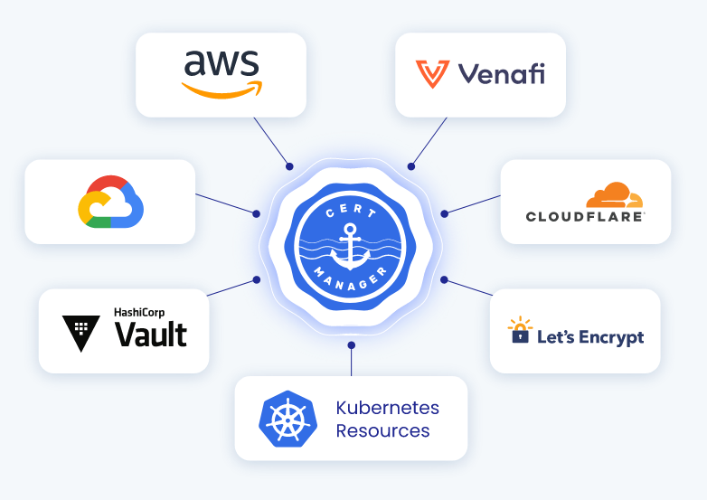

## Lab 16 - Day 2 Certificates <a name="lab-16---day-2-certificates-"></a>


Gloo and Istio heavily rely on TLS certificates to facilitate safe and secure communication. Gloo Platform uses mutual tls authentication for communication between the Server and the Agents. Istio requires an Intermediate Signing CA so that it can issue workload certificates to each of the mesh enabled services. These workload certificates encrypt and authenticate traffic between each of your microservices.

It is important to design and implement a secure and reliable Public Key Infrastructure (PKI) that Gloo and Istio can rely on which is why we chose cert-manager as the PKI due to its versatility and reliability for managing certificates.


* Before you begin, disable the RootTrustPolicy that was created in the beginning of the workshops
```shell
kubectl delete roottrustpolicy --all --context management -n gloo-mesh
```

## Cert Manager

Not only is cert-manager the most widely used Kubernetes based solution, it natively integrates with a number of different issuing systems such as [AWS Private CA](https://github.com/cert-manager/aws-privateca-issuer), [Google Cloud CA](https://github.com/jetstack/google-cas-issuer) and [Vault](https://cert-manager.io/docs/configuration/vault/). 
Finally, cert-manager also creates certificates in the form of kubernetes secrets which are compatible with both Istio and Gloo Platform.
It also has the ability to automatically rotate them when they are nearing their end of life.


* Add the cert-manager helm chart
```shell
helm repo add jetstack https://charts.jetstack.io
helm repo update
```

* Install cert-manager using helm
```shell
helm upgrade -i cert-manager jetstack/cert-manager \
  --namespace cert-manager \
  --create-namespace \
  --version v1.12.2 \
  --kube-context management \
  -f data/cert-manager-values.yaml

helm upgrade -i cert-manager jetstack/cert-manager \
  --namespace cert-manager \
  --create-namespace \
  --version v1.12.2 \
  --kube-context leaf1 \
  -f data/cert-manager-values.yaml

helm upgrade -i cert-manager jetstack/cert-manager \
  --namespace cert-manager \
  --create-namespace \
  --version v1.12.2 \
  --kube-context leaf2 \
  -f data/cert-manager-values.yaml
```

* Wait for deployments to become healthy
```shell
kubectl wait deployment --for condition=Available=True --all --context management -n cert-manager
kubectl wait deployment --for condition=Available=True --all --context leaf1 -n cert-manager
kubectl wait deployment --for condition=Available=True --all --context leaf2 -n cert-manager
```
## Self Signed Root Cert

This lab will use a self signed root certificate for all relay and workload certificates. This is not recommended in production as the Root CA key is stored in a kubernetes secret. Instead an external 3rd party PKI is recommended like Vault or Venafi.

* Create the self-signed secret
```shell
kubectl create secret generic issuer-ca --from-file=tls.key=data/root-key.pem --from-file=tls.crt=data/root-cert.pem --context management -n cert-manager
kubectl create secret generic issuer-ca --from-file=tls.key=data/root-key.pem --from-file=tls.crt=data/root-cert.pem --context leaf1 -n cert-manager
kubectl create secret generic issuer-ca --from-file=tls.key=data/root-key.pem --from-file=tls.crt=data/root-cert.pem --context leaf2 -n cert-manager
```

* Create a ClusterIssuer for the root secret
```shell
kubectl apply --context management -n cert-manager -f data/secret-issuer.yaml
kubectl apply --context leaf1 -n cert-manager -f data/secret-issuer.yaml
kubectl apply --context leaf2 -n cert-manager -f data/secret-issuer.yaml
```

* Verify the issuers 
```bash
kubectl get clusterissuer self-signed-issuer -o jsonpath='{.status}' --context management -n cert-manager
kubectl get clusterissuer self-signed-issuer -o jsonpath='{.status}' --context leaf1 -n cert-manager
kubectl get clusterissuer self-signed-issuer -o jsonpath='{.status}' --context leaf2 -n cert-manager
```

## Cluster: management Configuration

The Gloo Platform server and Telemetry Gateway will need mTLS server certificates. The following commands generate the two certificates to allow the applications to receive connections from the workload clusters.
* Create certificates for Gloo Management Server and Telemetry Gateway
```shell
kubectl apply --context management -f - <<EOF
apiVersion: cert-manager.io/v1
kind: Certificate
metadata:
  name: gloo-mgmt-server
  namespace: gloo-mesh
spec:
  commonName: gloo-mgmt-server
  dnsNames:
    - "*.gloo-mesh"
  duration: 8760h0m0s   ### 1 year life
  renewBefore: 8736h0m0s
  issuerRef:
    kind: ClusterIssuer
    name: self-signed-issuer
  secretName: gloo-mgmt-server-tls
  usages:
    - server auth
    - client auth
  privateKey:
    algorithm: "RSA"
    size: 4096
---
apiVersion: cert-manager.io/v1
kind: Certificate
metadata:
  name: gloo-telemetry-gateway
  namespace: gloo-mesh
spec:
  commonName: gloo-mgmt-server
  dnsNames:
    - "*.gloo-mesh"
  duration: 8760h0m0s   ### 1 year life
  renewBefore: 8736h0m0s
  issuerRef:
    kind: ClusterIssuer
    name: self-signed-issuer
  secretName: gloo-telemetry-gateway
  usages:
    - server auth
    - client auth
  privateKey:
    algorithm: "RSA"
    size: 4096
EOF
```

* Verify certificates were created
```shell
kubectl get certificates --context management -n gloo-mesh
```

**Note** if certificates were not generated it may be beneficial to look at the cert manager logs.
```shell
kubectl logs deploy/cert-manager --context management -n cert-manager
```
* Cleanup old Gloo certificates and allow cert-manager to replace them
```shell
kubectl delete secret relay-server-tls-secret --context management -n gloo-mesh
kubectl delete secret relay-tls-signing-secret --context management -n gloo-mesh
kubectl delete secret relay-root-tls-secret --context management -n gloo-mesh
```

* Update the Gloo Platform to use the new certificates
```shell
helm upgrade --install gloo-platform gloo-platform/gloo-platform \
  --version=2.4.2 \
  --namespace=gloo-mesh \
  --kube-context management \
  --reuse-values \
  -f data/gloo-mgmt-values.yaml
```

## Cluster: leaf1 Configuration

The workload clusters will need 2-3 certificates depending on your environment. The Gloo Platform Agent will require a client mTLS certificate for communicating with the Gloo Platform Server. Likewise the Telemetry Collector will also require an mTLS certificate to communicate with the Telemetry Gateway.

If you are relying on Istio's CA issuer functionality, you will also need to issue Istio a CA certificate to issue workload certificates to the dataplane. If your security posture does not allow for CA certificates to be stored on the workload clusters, ask your Solo.io Representative about `istio-csr`.

* Verify issuers is correctly setup
```shell
kubectl get clusterissuer --context leaf1 -n cert-manager
```

* Create certificates for Gloo Agent, Telemetry Gateway and Istio if needed
```shell
kubectl apply --context leaf1 -f - <<EOF
kind: Certificate
apiVersion: cert-manager.io/v1
metadata:
  name: gloo-agent
  namespace: gloo-mesh
spec:
  commonName: gloo-agent
  dnsNames:
    # Must match the cluster name used in the install
    - "leaf1"
  duration: 8760h0m0s   ### 1 year life
  renewBefore: 8736h0m0s
  issuerRef:
    kind: ClusterIssuer
    name: self-signed-issuer
  secretName: relay-client-tls-secret
  usages:
    - digital signature
    - key encipherment
    - client auth
    - server auth
  privateKey:
    algorithm: "RSA"
    size: 4096
---
kind: Certificate
apiVersion: cert-manager.io/v1
metadata:
  name: gloo-telemetry-collector
  namespace: gloo-mesh
spec:
  commonName: gloo-telemetry-collector
  dnsNames:
    - "leaf1-gloo-telemetry-collector"
  duration: 8760h0m0s   ### 1 year life
  renewBefore: 8736h0m0s
  issuerRef:
    kind: ClusterIssuer
    name: self-signed-issuer
  secretName: gloo-telemetry-collector
  usages:
    - digital signature
    - key encipherment
    - client auth
    - server auth
  privateKey:
    algorithm: "RSA"
    size: 4096
---
apiVersion: cert-manager.io/v1
kind: Certificate
metadata:
  name: istio-cacerts
  namespace: istio-system
spec:
  secretName: cacerts
  duration: 720h # 30d
  renewBefore: 360h # 15d
  commonName: leaf1.tcb.mesh
  isCA: true
  usages:
    - digital signature
    - key encipherment
    - cert sign
  dnsNames:
    - leaf1.tcb.mesh
  issuerRef:
    kind: ClusterIssuer
    name: self-signed-issuer
EOF
```

* Verify certificates were created
```shell
kubectl get certificates --context leaf1 -n gloo-mesh
kubectl get certificates --context leaf1 -n istio-system
```

**Note** if certificates were not generated it may be beneficial to look at the cert manager logs.
```shell
kubectl logs deploy/cert-manager --context leaf1 -n cert-manager
```
* Cleanup old Gloo certificates and allow cert-manager to replace them
```shell
kubectl delete secret relay-client-tls-secret --context leaf1 -n gloo-mesh
kubectl delete secret relay-root-tls-secret --context leaf1 -n gloo-mesh
kubectl delete secret relay-identity-token-secret --context leaf1 -n gloo-mesh
```

* Update the Gloo Platform to use the new certificates
```shell
helm upgrade --install gloo-agent gloo-platform/gloo-platform \
  --version=2.4.2  \
  --namespace gloo-mesh \
  --kube-context leaf1 \
  --reuse-values \
  -f data/gloo-agent-values.yaml
```

* Verify Gloo Agent connectivity
```shell
kubectl logs deploy/gloo-mesh-agent --context leaf1 -n gloo-mesh
```

* Update Istio to use new CA certificate
```shell
kubectl delete secret cacerts --context leaf1 -n istio-system
```

* Verify new cacerts is generated
```shell
kubectl get secret cacerts --context leaf1 -n istio-system
```

* Restart Istiod to pick up new certificate
```shell
kubectl rollout restart deploy --context leaf1 -n istio-system
```

* Verify new certificate is picked up by istiod
```shell
kubectl logs -l app=istiod --tail 500 --context leaf1 -n istio-system| grep x509
```

* Restart Gateways
```shell
kubectl rollout restart deploy --context leaf1 -n istio-ingress
kubectl rollout restart deploy --context leaf1 -n istio-eastwest
kubectl rollout restart deploy --context leaf1 -n gloo-platform-addons
```

* Restart workloads
```shell 
kubectl rollout restart deploy -n online-boutique --context leaf1
```

## Cluster: leaf2 Configuration

* Verify issuers is correctly setup
```shell
kubectl get clusterissuer --context leaf2 -n cert-manager
```

* Create certificates for Gloo Agent, Telemetry Gateway and Istio if needed
```shell
kubectl apply --context leaf2 -f - <<EOF
kind: Certificate
apiVersion: cert-manager.io/v1
metadata:
  name: gloo-agent
  namespace: gloo-mesh
spec:
  commonName: gloo-agent
  dnsNames:
    # Must match the cluster name used in the install
    - "leaf2"
  duration: 8760h0m0s   ### 1 year life
  renewBefore: 8736h0m0s
  issuerRef:
    kind: ClusterIssuer
    name: self-signed-issuer
  secretName: relay-client-tls-secret
  usages:
    - digital signature
    - key encipherment
    - client auth
    - server auth
  privateKey:
    algorithm: "RSA"
    size: 4096
---
kind: Certificate
apiVersion: cert-manager.io/v1
metadata:
  name: gloo-telemetry-collector
  namespace: gloo-mesh
spec:
  commonName: gloo-telemetry-collector
  dnsNames:
    - "leaf2-gloo-telemetry-collector"
  duration: 8760h0m0s   ### 1 year life
  renewBefore: 8736h0m0s
  issuerRef:
    kind: ClusterIssuer
    name: self-signed-issuer
  secretName: gloo-telemetry-collector
  usages:
    - digital signature
    - key encipherment
    - client auth
    - server auth
  privateKey:
    algorithm: "RSA"
    size: 4096
---
apiVersion: cert-manager.io/v1
kind: Certificate
metadata:
  name: istio-cacerts
  namespace: istio-system
spec:
  secretName: cacerts
  duration: 720h # 30d
  renewBefore: 360h # 15d
  commonName: leaf2.tcb.mesh
  isCA: true
  usages:
    - digital signature
    - key encipherment
    - cert sign
  dnsNames:
    - leaf2.tcb.mesh
  issuerRef:
    kind: ClusterIssuer
    name: self-signed-issuer
EOF
```

* Verify certificates were created
```shell
kubectl get certificates --context leaf2 -n gloo-mesh
kubectl get certificates --context leaf2 -n istio-system
```

**Note** if certificates were not generated it may be beneficial to look at the cert manager logs.
```shell
kubectl logs deploy/cert-manager --context leaf2 -n cert-manager
kubectl logs deploy/cert-manager-istio-csr --context leaf2 -n cert-manager
```
* Cleanup old Gloo certificates and allow cert-manager to replace them
```shell
kubectl delete secret relay-client-tls-secret --context leaf2 -n gloo-mesh
kubectl delete secret relay-root-tls-secret --context leaf2 -n gloo-mesh
kubectl delete secret relay-identity-token-secret --context leaf2 -n gloo-mesh
```

* Update the Gloo Platform to use the new certificates
```shell
helm upgrade --install gloo-agent gloo-platform/gloo-platform \
  --version=2.4.2  \
  --namespace gloo-mesh \
  --kube-context leaf2 \
  --reuse-values \
  -f data/gloo-agent-values.yaml
```

* Verify Gloo Agent connectivity
```shell
kubectl logs deploy/gloo-mesh-agent --context leaf2 -n gloo-mesh
```

* Update Istio to use new CA certificate
```shell
kubectl delete secret cacerts --context leaf1 -n istio-system
```

* Verify new cacerts is generated
```shell
kubectl get secret cacerts --context leaf2 -n istio-system
```

* Restart Istiod to pick up new certificate
```shell
kubectl rollout restart deploy --context leaf2 -n istio-system
```

* Verify new certificate is picked up by istiod
```shell
kubectl logs -l app=istiod --tail 500 --context leaf2 -n istio-system| grep x509
```

* Restart Gateways
```shell
kubectl rollout restart deploy --context leaf2 -n istio-ingress
kubectl rollout restart deploy --context leaf2 -n istio-eastwest
```

* Restart workloads
```shell 
kubectl rollout restart deploy -n online-boutique --context leaf2
kubectl rollout restart deploy -n checkout-apis --context leaf2
```
* Verify that the Gloo UI appears to be healthy
* Open the Gloo UI and observe the agents are connected and service discovery is working
```bash
kubectl port-forward svc/gloo-mesh-ui 8090:8090 --context management -n gloo-mesh
echo "Gloo UI: http://localhost:8090"
```

* Verify Online Boutique is functioning as expected
```shell
export GLOO_GATEWAY_HTTPS=$(kubectl --context leaf1 -n istio-ingress get svc -l istio=ingressgateway -o jsonpath='{.items[0].status.loadBalancer.ingress[0].*}'):443

echo "SECURE Online Boutique available at https://$GLOO_GATEWAY_HTTPS"
```

* Optional curl
```shell
curl -k --write-out '%{http_code}' https://$GLOO_GATEWAY_HTTPS
```
