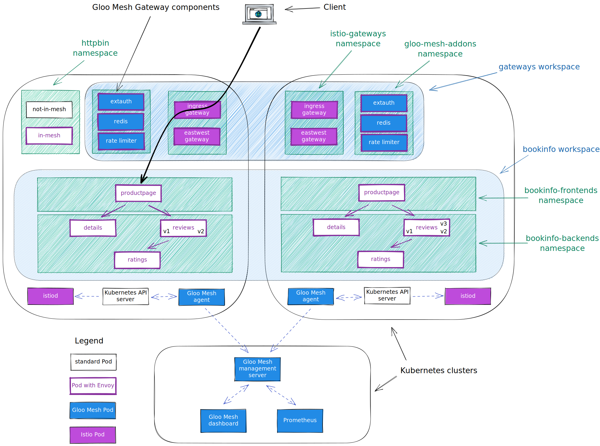
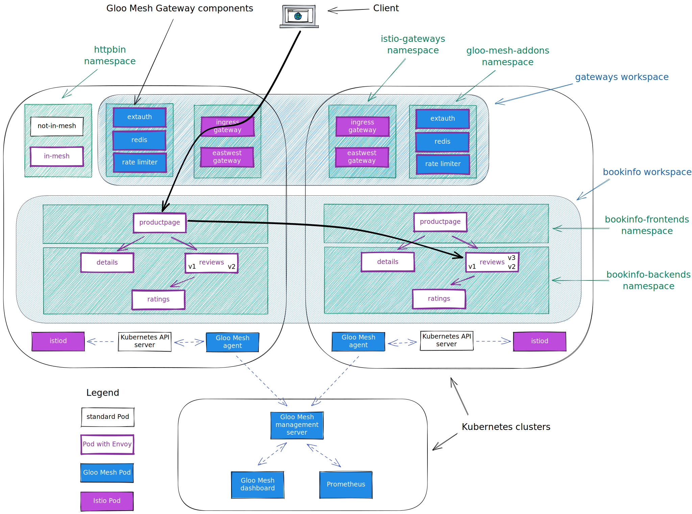
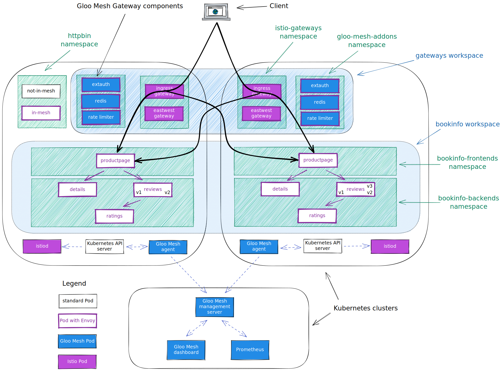

<!--bash
#!/usr/bin/env bash

source ./scripts/assert.sh
-->


# <center>Gloo Mesh Workshop</center>


## Table of Contents
* [Introduction](#introduction)
* [Lab 1 - Deploy KinD clusters](#Lab-1)
* [Lab 2 - Deploy Istio](#Lab-2)
* [Lab 3 - Deploy the Bookinfo demo app](#Lab-3)
* [Lab 4 - Deploy the httpbin demo app](#Lab-4)
* [Lab 5 - Deploy and register Gloo Mesh](#Lab-5)
* [Lab 6 - Create the gateways workspace](#Lab-6)
* [Lab 7 - Create the bookinfo workspace](#Lab-7)
* [Lab 8 - Expose the productpage through a gateway](#Lab-8)
* [Lab 9 - Traffic policies](#Lab-9)
* [Lab 10 - Create the Root Trust Policy](#Lab-10)
* [Lab 11 - Multi-cluster Traffic](#Lab-11)
* [Lab 12 - Leverage Virtual Destinations](#Lab-12)
* [Lab 13 - Deploy sleep containers for zero-trust lab](#Lab-13)
* [Lab 14 - Zero trust](#Lab-14)
* [Lab 15 - Exploring Istio, Envoy Proxy Config, and Metrics](#Lab-15)
* [Lab 16 - Create the httpbin workspace](#Lab-16)
* [Lab 17 - Expose an external service](#Lab-17)
* [Lab 18a - Exposing the Gloo Mesh UI with External Service](#Lab-18a)
* [Lab 18b - (Bonus) Exposing the Gloo Mesh UI with Istio on mgmt cluster](#Lab-18a)


## Introduction <a name="introduction"></a>

[Gloo Mesh Enterprise](https://www.solo.io/products/gloo-mesh/) is a management plane which makes it easy to operate [Istio](https://istio.io) on one or many Kubernetes clusters deployed anywhere (any platform, anywhere).

### Istio support

The Gloo Mesh Enterprise subscription includes end to end Istio support:

- Upstream first
- Specialty builds available (FIPS, ARM, etc)
- Long Term Support (LTS) N-4 
- Critical security patches
- Production break-fix
- One hour SLA Severity 1
- Install / upgrade
- Architecture and operational guidance, best practices

### Gloo Mesh overview

Gloo Mesh provides many unique features, including:

- multi-tenancy based on global workspaces
- zero trust enforcement
- global observability (centralized metrics and access logging)
- simplified cross cluster communications (using virtual destinations)
- advanced gateway capabilities (oauth, jwt, transformations, rate limiting, web application firewall, ...)


### Want to learn more about Gloo Mesh

You can find more information about Gloo Mesh in the official documentation:

[https://docs.solo.io/gloo-mesh/latest/](https://docs.solo.io/gloo-mesh/latest/)


## Lab 1 - Deploy KinD clusters <a name="Lab-1"></a>

Clone this repository and go to the `gloo-mesh-2-0-node-ports` directory.

Set the context environment variables:

```bash
export MGMT=mgmt
export CLUSTER1=cluster1
export CLUSTER2=cluster2
```

> Note that in case you dont't have a Kubernetes cluster dedicated for the management plane, you would set the variables like that:
> ```
> export MGMT=cluster1
> export CLUSTER1=cluster1
> export CLUSTER2=cluster2
> ```

Run the following commands to deploy three Kubernetes clusters using [Kind](https://kind.sigs.k8s.io/):
    

```bash
./scripts/deploy.sh 1 mgmt
./scripts/deploy.sh 2 cluster1 us-west us-west-1
./scripts/deploy.sh 3 cluster2 us-west us-west-2
```

Then run the following commands to wait for all the Pods to be ready:

```bash
./scripts/check.sh mgmt
./scripts/check.sh cluster1 
./scripts/check.sh cluster2 
```

**Note:** If you run the `check.sh` script immediately after the `deploy.sh` script, you may see a jsonpath error. If that happens, simply wait a few seconds and try again.

Once the `check.sh` script completes, when you execute the `kubectl get pods -A` command, you should see the following:

```
NAMESPACE            NAME                                          READY   STATUS    RESTARTS   AGE
kube-system          calico-kube-controllers-59d85c5c84-sbk4k      1/1     Running   0          4h26m
kube-system          calico-node-przxs                             1/1     Running   0          4h26m
kube-system          coredns-6955765f44-ln8f5                      1/1     Running   0          4h26m
kube-system          coredns-6955765f44-s7xxx                      1/1     Running   0          4h26m
kube-system          etcd-cluster1-control-plane                   1/1     Running   0          4h27m
kube-system          kube-apiserver-cluster1-control-plane         1/1     Running   0          4h27m
kube-system          kube-controller-manager-cluster1-control-plane1/1     Running   0          4h27m
kube-system          kube-proxy-ksvzw                              1/1     Running   0          4h26m
kube-system          kube-scheduler-cluster1-control-plane         1/1     Running   0          4h27m
local-path-storage   local-path-provisioner-58f6947c7-lfmdx        1/1     Running   0          4h26m
metallb-system       controller-5c9894b5cd-cn9x2                   1/1     Running   0          4h26m
metallb-system       speaker-d7jkp                                 1/1     Running   0          4h26m
```

You can see that your currently connected to this cluster by executing the `kubectl config get-contexts` command:

```
CURRENT   NAME         CLUSTER         AUTHINFO   NAMESPACE  
          cluster1     kind-cluster1   cluster1
*         cluster2     kind-cluster2   cluster2
          mgmt         kind-mgmt       kind-mgmt 
```

Run the following command to make `mgmt` the current cluster.

```bash
kubectl config use-context ${MGMT}
```


## Lab 2 - Deploy Istio <a name="Lab-2"></a>


We are going to deploy Istio using Helm, but there are several other options. You can find more information in the [Istio documentation](https://istio.io/latest/docs/setup/install/).

First of all, let's Download the Istio release 1.13.4:

```bash
export ISTIO_VERSION=1.13.4
curl -L https://istio.io/downloadIstio | sh -
```

<!--bash
cat <<'EOF' > ./test.js
const chaiExec = require("@jsdevtools/chai-exec");
var chai = require('chai');
var expect = chai.expect;
chai.use(chaiExec);

describe("istioctl version", () => {
  it("version should be correct", () => {
    let cli = chaiExec('./istio-1.13.4/bin/istioctl version --remote=false');

    expect(cli).to.exit.with.code(0);
    expect(cli).stdout.to.contain("1.13.4");
    expect(cli).stderr.to.be.empty;
  });
});
EOF
echo "executing test dist/gloo-mesh-2-0-node-ports/build/templates/steps/deploy-istio/tests/istio-version.test.js.liquid"
mocha ./test.js --timeout 5000 --retries=50 --bail 2> /dev/null || exit 1
-->

Then, you need to create the `istio-system` and the `istio-gateways` namespaces on the first cluster.

```bash
kubectl --context ${CLUSTER1} create ns istio-system
kubectl --context ${CLUSTER1} create ns istio-gateways
```

Now, let's deploy the Istio control plane on the first cluster:

```bash
helm --kube-context=${CLUSTER1} upgrade --install istio-base ./istio-1.13.4/manifests/charts/base -n istio-system --set defaultRevision=1-13

helm --kube-context=${CLUSTER1} upgrade --install istio-1.13.4 ./istio-1.13.4/manifests/charts/istio-control/istio-discovery -n istio-system --values - <<EOF
revision: 1-13
global:
  meshID: mesh1
  multiCluster:
    clusterName: cluster1
  network: network1
  hub: us-docker.pkg.dev/gloo-mesh/istio-workshops
  tag: 1.13.4-solo
meshConfig:
  trustDomain: cluster1
  accessLogFile: /dev/stdout
  enableAutoMtls: true
  defaultConfig:
    envoyMetricsService:
      address: gloo-mesh-agent.gloo-mesh:9977
    envoyAccessLogService:
      address: gloo-mesh-agent.gloo-mesh:9977
    proxyMetadata:
      ISTIO_META_DNS_CAPTURE: "true"
      ISTIO_META_DNS_AUTO_ALLOCATE: "true"
      GLOO_MESH_CLUSTER_NAME: cluster1
pilot:
  env:
    PILOT_ENABLE_K8S_SELECT_WORKLOAD_ENTRIES: "false"
    PILOT_SKIP_VALIDATE_TRUST_DOMAIN: "true"
EOF
```

Note that we set the `trust domain` to be the same as the cluster name and we configure the sidecars to send their metrics and access logs to the Gloo Mesh agent.

After that, you can deploy the gateway(s):

```bash
kubectl --context ${CLUSTER1} label namespace istio-gateways istio.io/rev=1-13

helm --kube-context=${CLUSTER1} upgrade --install istio-ingressgateway ./istio-1.13.4/manifests/charts/gateways/istio-ingress -n istio-gateways --values - <<EOF
global:
  hub: us-docker.pkg.dev/gloo-mesh/istio-workshops
  tag: 1.13.4-solo
gateways:
  istio-ingressgateway:
    name: istio-ingressgateway
    namespace: istio-gateways
    labels:
      istio: ingressgateway
    injectionTemplate: gateway
    type: NodePort
    ports:
    - name: http2
      port: 80
      targetPort: 8080
    - name: https
      port: 443
      targetPort: 8443
EOF

helm --kube-context=${CLUSTER1} upgrade --install istio-eastwestgateway ./istio-1.13.4/manifests/charts/gateways/istio-ingress -n istio-gateways --values - <<EOF
global:
  hub: us-docker.pkg.dev/gloo-mesh/istio-workshops
  tag: 1.13.4-solo
gateways:
  istio-ingressgateway:
    name: istio-eastwestgateway
    namespace: istio-gateways
    labels:
      istio: eastwestgateway
      topology.istio.io/network: network1
    injectionTemplate: gateway
    type: NodePort
    ports:
    - name: tcp-status-port
      port: 15021
      targetPort: 15021
    - name: tls
      port: 15443
      targetPort: 15443
    - name: tcp-istiod
      port: 15012
      targetPort: 15012
    - name: tcp-webhook
      port: 15017
      targetPort: 15017
    env:
      ISTIO_META_ROUTER_MODE: "sni-dnat"
      ISTIO_META_REQUESTED_NETWORK_VIEW: "network1"
EOF
```

As you can see, we deploy the control plane (istiod) in the `istio-system` and gateway(s) in the `istio-gateways` namespace.

One gateway will be used for ingress traffic while the other one will be used for cross cluster communications. It's not mandatory to use separate gateways, but it's a best practice.

Run the following command until all the Istio Pods are ready:

```bash
kubectl --context ${CLUSTER1} get pods -n istio-system && kubectl --context ${CLUSTER1} get pods -n istio-gateways
```

When they are ready, you should get this output:

```
NAME                      READY   STATUS    RESTARTS   AGE
istiod-5c669bcf6f-2hn6c   1/1     Running   0          3m7s
NAME                                     READY   STATUS    RESTARTS   AGE
istio-eastwestgateway-77f79cdb47-f4r7k   1/1     Running   0          2m53s
istio-ingressgateway-744fcf4fb-5dc7q     1/1     Running   0          2m44s
```
You need to create the `istio-system` and the `istio-gateways` namespaces on the second cluster.

```bash
kubectl --context ${CLUSTER2} create ns istio-system
kubectl --context ${CLUSTER2} create ns istio-gateways
```

Now, let's deploy the Istio control plane on the second cluster:

```bash
helm --kube-context=${CLUSTER2} upgrade --install istio-base ./istio-1.13.4/manifests/charts/base -n istio-system --set defaultRevision=1-13

helm --kube-context=${CLUSTER2} upgrade --install istio-1.13.4 ./istio-1.13.4/manifests/charts/istio-control/istio-discovery -n istio-system --values - <<EOF
revision: 1-13
global:
  meshID: mesh1
  multiCluster:
    clusterName: cluster2
  network: network1
  hub: us-docker.pkg.dev/gloo-mesh/istio-workshops
  tag: 1.13.4-solo
meshConfig:
  trustDomain: cluster2
  accessLogFile: /dev/stdout
  enableAutoMtls: true
  defaultConfig:
    envoyMetricsService:
      address: gloo-mesh-agent.gloo-mesh:9977
    envoyAccessLogService:
      address: gloo-mesh-agent.gloo-mesh:9977
    proxyMetadata:
      ISTIO_META_DNS_CAPTURE: "true"
      ISTIO_META_DNS_AUTO_ALLOCATE: "true"
      GLOO_MESH_CLUSTER_NAME: cluster2
pilot:
  env:
    PILOT_ENABLE_K8S_SELECT_WORKLOAD_ENTRIES: "false"
    PILOT_SKIP_VALIDATE_TRUST_DOMAIN: "true"
EOF
```

After that, you can deploy the gateways:

```bash
kubectl --context ${CLUSTER2} label namespace istio-gateways istio.io/rev=1-13

helm --kube-context=${CLUSTER2} upgrade --install istio-ingressgateway ./istio-1.13.4/manifests/charts/gateways/istio-ingress -n istio-gateways --values - <<EOF
global:
  hub: us-docker.pkg.dev/gloo-mesh/istio-workshops
  tag: 1.13.4-solo
gateways:
  istio-ingressgateway:
    name: istio-ingressgateway
    namespace: istio-gateways
    labels:
      istio: ingressgateway
    injectionTemplate: gateway
    type: NodePort
    ports:
    - name: http2
      port: 80
      targetPort: 8080
    - name: https
      port: 443
      targetPort: 8443
EOF

helm --kube-context=${CLUSTER2} upgrade --install istio-eastwestgateway ./istio-1.13.4/manifests/charts/gateways/istio-ingress -n istio-gateways --values - <<EOF
global:
  hub: us-docker.pkg.dev/gloo-mesh/istio-workshops
  tag: 1.13.4-solo
gateways:
  istio-ingressgateway:
    name: istio-eastwestgateway
    namespace: istio-gateways
    labels:
      istio: eastwestgateway
      topology.istio.io/network: network1
    injectionTemplate: gateway
    type: NodePort
    ports:
    - name: tcp-status-port
      port: 15021
      targetPort: 15021
    - name: tls
      port: 15443
      targetPort: 15443
    - name: tcp-istiod
      port: 15012
      targetPort: 15012
    - name: tcp-webhook
      port: 15017
      targetPort: 15017
    env:
      ISTIO_META_ROUTER_MODE: "sni-dnat"
      ISTIO_META_REQUESTED_NETWORK_VIEW: "network1"
EOF
```

<!--bash
cat <<'EOF' > ./test.js

const helpers = require('./tests/chai-exec');

const chaiExec = require("@jsdevtools/chai-exec");
const helpersHttp = require('./tests/chai-http');
const chai = require("chai");
const expect = chai.expect;

afterEach(function (done) {
  if (this.currentTest.currentRetry() > 0) {
    process.stdout.write(".");
    setTimeout(done, 1000);
  } else {
    done();
  }
});

describe("Checking Istio installation", function() {
  let deployments = ["istiod-1-13"];
  deployments.forEach(deploy => {
    it(deploy + ' pods are ready in cluster ' + process.env.CLUSTER1, () => helpers.checkDeployment({ context: process.env.CLUSTER1, namespace: "istio-system", k8sObj: deploy }));
  });
  deployments = ["istio-eastwestgateway", "istio-ingressgateway"];
  deployments.forEach(deploy => {
    it(deploy + ' pods are ready in cluster ' + process.env.CLUSTER1, () => helpers.checkDeployment({ context: process.env.CLUSTER1, namespace: "istio-gateways", k8sObj: deploy }));
  });
  deployments = ["istiod-1-13"];
  deployments.forEach(deploy => {
    it(deploy + ' pods are ready in cluster ' + process.env.CLUSTER2, () => helpers.checkDeployment({ context: process.env.CLUSTER2, namespace: "istio-system", k8sObj: deploy }));
  });
  deployments = ["istio-eastwestgateway", "istio-ingressgateway"];
  deployments.forEach(deploy => {
    it(deploy + ' pods are ready in cluster ' + process.env.CLUSTER2, () => helpers.checkDeployment({ context: process.env.CLUSTER2, namespace: "istio-gateways", k8sObj: deploy }));
  });
});
EOF
echo "executing test dist/gloo-mesh-2-0-node-ports/build/templates/steps/deploy-istio/tests/istio-ready.test.js.liquid"
mocha ./test.js --timeout 5000 --retries=50 --bail 2> /dev/null || exit 1
-->

Check the status on the second cluster using:

```bash
kubectl --context ${CLUSTER2} get pods -n istio-system && kubectl --context ${CLUSTER2} get pods -n istio-gateways
```

Set the environment variable for the service corresponding to the Istio Ingress Gateway of the cluster(s):

```bash
export ENDPOINT_HTTP_GW_CLUSTER1=$(kubectl --context ${CLUSTER1} get nodes -o jsonpath='{.items[0].status.addresses[?(.type=="InternalIP")].address}'):$(kubectl --context ${CLUSTER1} -n istio-gateways get svc istio-ingressgateway -o jsonpath='{.spec.ports[?(@.port==80)].nodePort}')
export ENDPOINT_HTTPS_GW_CLUSTER1=$(kubectl --context ${CLUSTER1} get nodes -o jsonpath='{.items[0].status.addresses[?(.type=="InternalIP")].address}'):$(kubectl --context ${CLUSTER1} -n istio-gateways get svc istio-ingressgateway -o jsonpath='{.spec.ports[?(@.port==443)].nodePort}')
export HOST_GW_CLUSTER1=$(echo ${ENDPOINT_HTTP_GW_CLUSTER1} | cut -d: -f1)
export ENDPOINT_HTTP_GW_CLUSTER2=$(kubectl --context ${CLUSTER2} get nodes -o jsonpath='{.items[0].status.addresses[?(.type=="InternalIP")].address}'):$(kubectl --context ${CLUSTER2} -n istio-gateways get svc istio-ingressgateway -o jsonpath='{.spec.ports[?(@.port==80)].nodePort}')
export ENDPOINT_HTTPS_GW_CLUSTER2=$(kubectl --context ${CLUSTER2} get nodes -o jsonpath='{.items[0].status.addresses[?(.type=="InternalIP")].address}'):$(kubectl --context ${CLUSTER2} -n istio-gateways get svc istio-ingressgateway -o jsonpath='{.spec.ports[?(@.port==443)].nodePort}')
export HOST_GW_CLUSTER2=$(echo ${ENDPOINT_HTTP_GW_CLUSTER2} | cut -d: -f1)
```

<!--bash
cat <<'EOF' > ./test.js
const dns = require('dns');
const chaiHttp = require("chai-http");
const chai = require("chai");
const expect = chai.expect;
chai.use(chaiHttp);
const { waitOnFailedTest } = require('./tests/utils');

afterEach(function(done) { waitOnFailedTest(done, this.currentTest.currentRetry())});

describe("Address '" + process.env.HOST_GW_CLUSTER1 + "' can be resolved in DNS", () => {
    it(process.env.HOST_GW_CLUSTER1 + ' can be resolved', (done) => {
        return dns.lookup(process.env.HOST_GW_CLUSTER1, (err, address, family) => {
            expect(address).to.be.an.ip;
            done();
        });
    });
});
EOF
echo "executing test ./gloo-mesh/tests/can-resolve.test.js.liquid"
mocha ./test.js --timeout 5000 --retries=50 --bail 2> /dev/null || exit 1
-->
<!--bash
cat <<'EOF' > ./test.js
const dns = require('dns');
const chaiHttp = require("chai-http");
const chai = require("chai");
const expect = chai.expect;
chai.use(chaiHttp);
const { waitOnFailedTest } = require('./tests/utils');

afterEach(function(done) { waitOnFailedTest(done, this.currentTest.currentRetry())});

describe("Address '" + process.env.HOST_GW_CLUSTER2 + "' can be resolved in DNS", () => {
    it(process.env.HOST_GW_CLUSTER2 + ' can be resolved', (done) => {
        return dns.lookup(process.env.HOST_GW_CLUSTER2, (err, address, family) => {
            expect(address).to.be.an.ip;
            done();
        });
    });
});
EOF
echo "executing test ./gloo-mesh/tests/can-resolve.test.js.liquid"
mocha ./test.js --timeout 5000 --retries=50 --bail 2> /dev/null || exit 1
-->


## Lab 3 - Deploy the Bookinfo demo app <a name="Lab-3"></a>


We're going to deploy the bookinfo application to demonstrate several features of Istio and Gloo Mesh.

You can find more information about this application [here](https://istio.io/latest/docs/examples/bookinfo/).

Run the following commands to deploy the bookinfo application on `cluster1`:

```bash
kubectl --context ${CLUSTER1} create ns bookinfo-frontends
kubectl --context ${CLUSTER1} create ns bookinfo-backends
curl https://raw.githubusercontent.com/istio/istio/release-1.13/samples/bookinfo/platform/kube/bookinfo.yaml > bookinfo.yaml
kubectl --context ${CLUSTER1} label namespace bookinfo-frontends istio.io/rev=1-13
kubectl --context ${CLUSTER1} label namespace bookinfo-backends istio.io/rev=1-13
# deploy the frontend bookinfo service in the bookinfo-frontends namespace
kubectl --context ${CLUSTER1} -n bookinfo-frontends apply -f bookinfo.yaml -l 'account in (productpage)'
kubectl --context ${CLUSTER1} -n bookinfo-frontends apply -f bookinfo.yaml -l 'app in (productpage)'
# deploy the backend bookinfo services in the bookinfo-backends namespace for all versions less than v3
kubectl --context ${CLUSTER1} -n bookinfo-backends apply -f bookinfo.yaml -l 'account in (reviews,ratings,details)'
kubectl --context ${CLUSTER1} -n bookinfo-backends apply -f bookinfo.yaml -l 'app in (reviews,ratings,details),version notin (v3)'
# Update the productpage deployment to set the environment variables to define where the backend services are running
kubectl --context ${CLUSTER1} -n bookinfo-frontends set env deploy/productpage-v1 DETAILS_HOSTNAME=details.bookinfo-backends.svc.cluster.local
kubectl --context ${CLUSTER1} -n bookinfo-frontends set env deploy/productpage-v1 REVIEWS_HOSTNAME=reviews.bookinfo-backends.svc.cluster.local
# Update the reviews service to display where it is coming from
kubectl --context ${CLUSTER1} -n bookinfo-backends set env deploy/reviews-v1 CLUSTER_NAME=${CLUSTER1}
kubectl --context ${CLUSTER1} -n bookinfo-backends set env deploy/reviews-v2 CLUSTER_NAME=${CLUSTER1}
```

You can check that the app is running using the following command:

```
kubectl --context ${CLUSTER1} -n bookinfo-frontends get pods && kubectl --context ${CLUSTER1} -n bookinfo-backends get pods
```

```
NAME                              READY   STATUS    RESTARTS   AGE
productpage-v1-7654c7546b-7kztp   2/2     Running   0          32m
NAME                          READY   STATUS    RESTARTS   AGE
details-v1-5498c86cf5-tx9f9   2/2     Running   0          32m
ratings-v1-b477cf6cf-fk5rv    2/2     Running   0          32m
reviews-v1-79d546878f-kcc25   2/2     Running   0          32m
reviews-v2-548c57f459-8xh7n   2/2     Running   0          32m
```

Note that we deployed the `productpage` service in the `bookinfo-frontends` namespace and the other services in the `bookinfo-backends` namespace.

And we deployed the `v1` and `v2` versions of the `reviews` microservice, not the `v3` version.

Now, run the following commands to deploy the bookinfo application on `cluster2`:

```bash
kubectl --context ${CLUSTER2} create ns bookinfo-frontends
kubectl --context ${CLUSTER2} create ns bookinfo-backends
kubectl --context ${CLUSTER2} label namespace bookinfo-frontends istio.io/rev=1-13
kubectl --context ${CLUSTER2} label namespace bookinfo-backends istio.io/rev=1-13
# deploy the frontend bookinfo service in the bookinfo-frontends namespace
kubectl --context ${CLUSTER2} -n bookinfo-frontends apply -f bookinfo.yaml -l 'account in (productpage)'
kubectl --context ${CLUSTER2} -n bookinfo-frontends apply -f bookinfo.yaml -l 'app in (productpage)'
# deploy the backend bookinfo services in the bookinfo-backends namespace for all versions
kubectl --context ${CLUSTER2} -n bookinfo-backends apply -f bookinfo.yaml -l 'account in (reviews,ratings,details)'
kubectl --context ${CLUSTER2} -n bookinfo-backends apply -f bookinfo.yaml -l 'app in (reviews,ratings,details)'
# Update the productpage deployment to set the environment variables to define where the backend services are running
kubectl --context ${CLUSTER2} -n bookinfo-frontends set env deploy/productpage-v1 DETAILS_HOSTNAME=details.bookinfo-backends.svc.cluster.local
kubectl --context ${CLUSTER2} -n bookinfo-frontends set env deploy/productpage-v1 REVIEWS_HOSTNAME=reviews.bookinfo-backends.svc.cluster.local
# Update the reviews service to display where it is coming from
kubectl --context ${CLUSTER2} -n bookinfo-backends set env deploy/reviews-v1 CLUSTER_NAME=${CLUSTER2}
kubectl --context ${CLUSTER2} -n bookinfo-backends set env deploy/reviews-v2 CLUSTER_NAME=${CLUSTER2}
kubectl --context ${CLUSTER2} -n bookinfo-backends set env deploy/reviews-v3 CLUSTER_NAME=${CLUSTER2}
```

You can check that the app is running using:

```bash
kubectl --context ${CLUSTER2} -n bookinfo-frontends get pods && kubectl --context ${CLUSTER2} -n bookinfo-backends get pods
```

```
NAME                              READY   STATUS    RESTARTS   AGE
productpage-v1-7654c7546b-wp46l   2/2     Running   0          83s
NAME                          READY   STATUS    RESTARTS   AGE
details-v1-5498c86cf5-hv4tn   2/2     Running   0          85s
ratings-v1-b477cf6cf-8zxtw    2/2     Running   0          85s
reviews-v3-6dd79655b9-mw2ph   2/2     Running   0          84s
reviews-v2-548c57f459-qn2mx   2/2     Running   0          84s
reviews-v1-79d546878f-b7tpw   2/2     Running   0          84s
```

As you can see, we deployed all three versions of the `reviews` microservice on this cluster.

<!--bash
cat <<'EOF' > ./test.js
const helpers = require('./tests/chai-exec');

describe("Bookinfo app", () => {
  let cluster = process.env.CLUSTER1
  let deployments = ["productpage-v1"];
  deployments.forEach(deploy => {
    it(deploy + ' pods are ready in ' + cluster, () => helpers.checkDeployment({ context: cluster, namespace: "bookinfo-frontends", k8sObj: deploy }));
  });
  deployments = ["ratings-v1", "details-v1", "reviews-v1", "reviews-v2"];
  deployments.forEach(deploy => {
    it(deploy + ' pods are ready in ' + cluster, () => helpers.checkDeployment({ context: cluster, namespace: "bookinfo-backends", k8sObj: deploy }));
  });
  cluster = process.env.CLUSTER2
  deployments = ["productpage-v1"];
  deployments.forEach(deploy => {
    it(deploy + ' pods are ready in ' + cluster, () => helpers.checkDeployment({ context: cluster, namespace: "bookinfo-frontends", k8sObj: deploy }));
  });
  deployments = ["ratings-v1", "details-v1", "reviews-v1", "reviews-v2", "reviews-v3"];
  deployments.forEach(deploy => {
    it(deploy + ' pods are ready in ' + cluster, () => helpers.checkDeployment({ context: cluster, namespace: "bookinfo-backends", k8sObj: deploy }));
  });
});
EOF
echo "executing test dist/gloo-mesh-2-0-node-ports/build/templates/steps/apps/bookinfo/deploy-bookinfo/tests/check-bookinfo.test.js.liquid"
mocha ./test.js --timeout 5000 --retries=50 --bail 2> /dev/null || exit 1
-->


## Lab 4 - Deploy the httpbin demo app <a name="Lab-4"></a>

We're going to deploy the httpbin application to demonstrate several features of Istio and Gloo Mesh.

You can find more information about this application [here](http://httpbin.org/).

Run the following commands to deploy the httpbin app on `cluster1` twice.

The first version will be called `not-in-mesh` and won't have the sidecar injected (because we don't label the namespace).

```bash
kubectl --context ${CLUSTER1} create ns httpbin

kubectl --context ${CLUSTER1} apply -n httpbin -f - <<EOF
apiVersion: v1
kind: ServiceAccount
metadata:
  name: not-in-mesh
---
apiVersion: v1
kind: Service
metadata:
  name: not-in-mesh
  labels:
    app: not-in-mesh
    service: not-in-mesh
spec:
  ports:
  - name: http
    port: 8000
    targetPort: 80
  selector:
    app: not-in-mesh
---
apiVersion: apps/v1
kind: Deployment
metadata:
  name: not-in-mesh
spec:
  replicas: 1
  selector:
    matchLabels:
      app: not-in-mesh
      version: v1
  template:
    metadata:
      labels:
        app: not-in-mesh
        version: v1
    spec:
      serviceAccountName: not-in-mesh
      containers:
      - image: docker.io/kennethreitz/httpbin
        imagePullPolicy: IfNotPresent
        name: not-in-mesh
        ports:
        - containerPort: 80
EOF
```

The second version will be called `in-mesh` and will have the sidecar injected (because of the label `istio.io/rev` in the Pod template).

```bash
kubectl --context ${CLUSTER1} apply -n httpbin -f - <<EOF
apiVersion: v1
kind: ServiceAccount
metadata:
  name: in-mesh
---
apiVersion: v1
kind: Service
metadata:
  name: in-mesh
  labels:
    app: in-mesh
    service: in-mesh
spec:
  ports:
  - name: http
    port: 8000
    targetPort: 80
  selector:
    app: in-mesh
---
apiVersion: apps/v1
kind: Deployment
metadata:
  name: in-mesh
spec:
  replicas: 1
  selector:
    matchLabels:
      app: in-mesh
      version: v1
  template:
    metadata:
      labels:
        app: in-mesh
        version: v1
        istio.io/rev: 1-13
    spec:
      serviceAccountName: in-mesh
      containers:
      - image: docker.io/kennethreitz/httpbin
        imagePullPolicy: IfNotPresent
        name: in-mesh
        ports:
        - containerPort: 80
EOF
```

You can check that the app is running using

```
kubectl --context ${CLUSTER1} -n httpbin get pods
```

```
NAME                           READY   STATUS    RESTARTS   AGE
in-mesh-5d9d9549b5-qrdgd       2/2     Running   0          11s
not-in-mesh-5c64bb49cd-m9kwm   1/1     Running   0          11s
```

<!--bash
cat <<'EOF' > ./test.js
const helpers = require('./tests/chai-exec');

describe("Bookinfo app", () => {
  let cluster = process.env.CLUSTER1
  let deployments = ["not-in-mesh", "in-mesh"];
  deployments.forEach(deploy => {
    it(deploy + ' pods are ready in ' + cluster, () => helpers.checkDeployment({ context: cluster, namespace: "httpbin", k8sObj: deploy }));
  });
});
EOF
echo "executing test dist/gloo-mesh-2-0-node-ports/build/templates/steps/apps/httpbin/deploy-httpbin/tests/check-httpbin.test.js.liquid"
mocha ./test.js --timeout 5000 --retries=50 --bail 2> /dev/null || exit 1
-->


## Lab 5 - Deploy and register Gloo Mesh <a name="Lab-5"></a>


First of all, let's install the `meshctl` CLI:

```bash
export GLOO_MESH_VERSION=v2.0.5
curl -sL https://run.solo.io/meshctl/install | sh -
export PATH=$HOME/.gloo-mesh/bin:$PATH
```

Run the following commands to deploy the Gloo Mesh management plane:

<!--bash
cat <<'EOF' > ./test.js
var chai = require('chai');
var expect = chai.expect;

describe("Required environment variables should contain value", () => {
  afterEach(function(done){
    if(this.currentTest.currentRetry() > 0){
      process.stdout.write(".");
       setTimeout(done, 1000);
    } else {
      done();
    }
  });

  it("Context environment variables should not be empty", () => {
    expect(process.env.MGMT).to.not.be.empty
    expect(process.env.CLUSTER1).to.not.be.empty
    expect(process.env.CLUSTER2).to.not.be.empty
  });

  it("Gloo Mesh licence environment variables should not be empty", () => {
    expect(process.env.GLOO_MESH_LICENSE_KEY).to.not.be.empty
  });
});
EOF
echo "executing test dist/gloo-mesh-2-0-node-ports/build/templates/steps/deploy-and-register-gloo-mesh/tests/environment-variables.test.js.liquid"
mocha ./test.js --timeout 5000 --retries=50 --bail 2> /dev/null || exit 1
-->

```bash
helm repo add gloo-mesh-enterprise https://storage.googleapis.com/gloo-mesh-enterprise/gloo-mesh-enterprise 
helm repo update
kubectl --context ${MGMT} create ns gloo-mesh 
helm upgrade --install gloo-mesh-enterprise gloo-mesh-enterprise/gloo-mesh-enterprise \
--namespace gloo-mesh --kube-context ${MGMT} \
--version=2.0.5 \
--set glooMeshMgmtServer.ports.healthcheck=8091 \
--set glooMeshMgmtServer.serviceType=NodePort \
--set glooMeshUi.serviceType=NodePort \
--set mgmtClusterName=${MGMT} \
--set licenseKey=${GLOO_MESH_LICENSE_KEY}
kubectl --context ${MGMT} -n gloo-mesh rollout status deploy/gloo-mesh-mgmt-server
```

Then, you need to set the environment variable to tell the Gloo Mesh agents how to communicate with the management plane:

<!--bash
cat <<'EOF' > ./test.js
const chaiExec = require("@jsdevtools/chai-exec");
var chai = require('chai');
var expect = chai.expect;
chai.use(chaiExec);
EOF
echo "executing test dist/gloo-mesh-2-0-node-ports/build/templates/steps/deploy-and-register-gloo-mesh/tests/get-gloo-mesh-mgmt-server-ip.test.js.liquid"
mocha ./test.js --timeout 5000 --retries=50 --bail 2> /dev/null || exit 1
-->

```bash
export ENDPOINT_GLOO_MESH=$(kubectl --context ${MGMT} get nodes -o jsonpath='{.items[0].status.addresses[?(.type=="InternalIP")].address}'):$(kubectl --context ${MGMT} -n gloo-mesh get svc gloo-mesh-mgmt-server -o jsonpath='{.spec.ports[?(@.port==9900)].nodePort}')
export HOST_GLOO_MESH=$(echo ${ENDPOINT_GLOO_MESH} | cut -d: -f1)
```

Check that the variables have correct values:
```
echo $HOST_GLOO_MESH
echo $ENDPOINT_GLOO_MESH
```
<!--bash
cat <<'EOF' > ./test.js
const dns = require('dns');
const chaiHttp = require("chai-http");
const chai = require("chai");
const expect = chai.expect;
chai.use(chaiHttp);
const { waitOnFailedTest } = require('./tests/utils');

afterEach(function(done) { waitOnFailedTest(done, this.currentTest.currentRetry())});

describe("Address '" + process.env.HOST_GLOO_MESH + "' can be resolved in DNS", () => {
    it(process.env.HOST_GLOO_MESH + ' can be resolved', (done) => {
        return dns.lookup(process.env.HOST_GLOO_MESH, (err, address, family) => {
            expect(address).to.be.an.ip;
            done();
        });
    });
});
EOF
echo "executing test ./gloo-mesh/tests/can-resolve.test.js.liquid"
mocha ./test.js --timeout 5000 --retries=50 --bail 2> /dev/null || exit 1
-->

Finally, you need to register the cluster(s).

Here is how you register the first one:

```bash
helm repo add gloo-mesh-agent https://storage.googleapis.com/gloo-mesh-enterprise/gloo-mesh-agent
helm repo update

kubectl apply --context ${MGMT} -f- <<EOF
apiVersion: admin.gloo.solo.io/v2
kind: KubernetesCluster
metadata:
  name: cluster1
  namespace: gloo-mesh
spec:
  clusterDomain: cluster.local
EOF

kubectl --context ${CLUSTER1} create ns gloo-mesh
kubectl get secret relay-root-tls-secret -n gloo-mesh --context ${MGMT} -o jsonpath='{.data.ca\.crt}' | base64 -d > ca.crt
kubectl create secret generic relay-root-tls-secret -n gloo-mesh --context ${CLUSTER1} --from-file ca.crt=ca.crt
rm ca.crt

kubectl get secret relay-identity-token-secret -n gloo-mesh --context ${MGMT} -o jsonpath='{.data.token}' | base64 -d > token
kubectl create secret generic relay-identity-token-secret -n gloo-mesh --context ${CLUSTER1} --from-file token=token
rm token

helm upgrade --install gloo-mesh-agent gloo-mesh-agent/gloo-mesh-agent \
  --namespace gloo-mesh \
  --kube-context=${CLUSTER1} \
  --set relay.serverAddress=${ENDPOINT_GLOO_MESH} \
  --set relay.authority=gloo-mesh-mgmt-server.gloo-mesh \
  --set rate-limiter.enabled=false \
  --set ext-auth-service.enabled=false \
  --set cluster=cluster1 \
  --version 2.0.5
```

Note that the registration can also be performed using `meshctl cluster register`.

And here is how you register the second one:

```bash
kubectl apply --context ${MGMT} -f- <<EOF
apiVersion: admin.gloo.solo.io/v2
kind: KubernetesCluster
metadata:
  name: cluster2
  namespace: gloo-mesh
spec:
  clusterDomain: cluster.local
EOF

kubectl --context ${CLUSTER2} create ns gloo-mesh
kubectl get secret relay-root-tls-secret -n gloo-mesh --context ${MGMT} -o jsonpath='{.data.ca\.crt}' | base64 -d > ca.crt
kubectl create secret generic relay-root-tls-secret -n gloo-mesh --context ${CLUSTER2} --from-file ca.crt=ca.crt
rm ca.crt

kubectl get secret relay-identity-token-secret -n gloo-mesh --context ${MGMT} -o jsonpath='{.data.token}' | base64 -d > token
kubectl create secret generic relay-identity-token-secret -n gloo-mesh --context ${CLUSTER2} --from-file token=token
rm token

helm upgrade --install gloo-mesh-agent gloo-mesh-agent/gloo-mesh-agent \
  --namespace gloo-mesh \
  --kube-context=${CLUSTER2} \
  --set relay.serverAddress=${ENDPOINT_GLOO_MESH} \
  --set relay.authority=gloo-mesh-mgmt-server.gloo-mesh \
  --set rate-limiter.enabled=false \
  --set ext-auth-service.enabled=false \
  --set cluster=cluster2 \
  --version 2.0.5
```

You can check the cluster(s) have been registered correctly using the following commands:

Method #1: Port-forward to gloo-mesh-mgmt-server admin page

In the terminal, run the port-forward command below to expose the metrics endpoint
```
kubectl port-forward -n gloo-mesh --context ${MGMT} deploy/gloo-mesh-mgmt-server 9091
```

In your browser, connect to http://localhost:9091/metrics

In the metrics UI, look for the following lines. If the values are 1, the agents in the workload clusters are successfully registered with the management server. If the values are 0, the agents are not successfully connected.
```
relay_pull_clients_connected{cluster="cluster1"} 1
relay_pull_clients_connected{cluster="cluster2"} 1
# HELP relay_push_clients_connected Current number of connected Relay push clients (Relay Agents).
# TYPE relay_push_clients_connected gauge
relay_push_clients_connected{cluster="cluster1"} 1
relay_push_clients_connected{cluster="cluster2"} 1
```

Method #2: With Ephemeral Containers feature-flag enabled:
```
pod=$(kubectl --context ${MGMT} -n gloo-mesh get pods -l app=gloo-mesh-mgmt-server -o jsonpath='{.items[0].metadata.name}')
kubectl --context ${MGMT} -n gloo-mesh debug -q -i ${pod} --image=curlimages/curl -- curl -s http://localhost:9091/metrics | grep relay_push_clients_connected
```

You should get an output similar to this:

```
# HELP relay_push_clients_connected Current number of connected Relay push clients (Relay Agents).
# TYPE relay_push_clients_connected gauge
relay_push_clients_connected{cluster="cluster1"} 1
relay_push_clients_connected{cluster="cluster2"} 1
```

Method #3: Visualize in the UI

To open a port-forward to the Gloo Mesh UI you can either use `meshctl` or `kubectl` commands

meshctl:
```
meshctl dashboard --kubecontext ${MGMT}
```

kubectl:
```
kubectl port-forward -n gloo-mesh svc/gloo-mesh-ui 8090 --context ${MGMT}
```

If agents were successfully registered, you should see information in the Clusters section of the Overview page.

<!--bash
cat <<'EOF' > ./test.js
var chai = require('chai');
var expect = chai.expect;
const helpers = require('./tests/chai-exec');
describe("Cluster registration", () => {
  it("cluster1 is registered", () => {
    podName = helpers.getOutputForCommand({ command: "kubectl -n gloo-mesh get pods -l app=gloo-mesh-mgmt-server -o jsonpath='{.items[0].metadata.name}' --context " + process.env.MGMT }).replaceAll("'", "");
    command = helpers.getOutputForCommand({ command: "kubectl --context " + process.env.MGMT + " -n gloo-mesh debug -q -i " + podName + " --image=curlimages/curl -- curl -s http://localhost:9091/metrics" }).replaceAll("'", "");
    expect(command).to.contain("cluster1");
  });
  it("cluster2 is registered", () => {
    podName = helpers.getOutputForCommand({ command: "kubectl -n gloo-mesh get pods -l app=gloo-mesh-mgmt-server -o jsonpath='{.items[0].metadata.name}' --context " + process.env.MGMT }).replaceAll("'", "");
    command = helpers.getOutputForCommand({ command: "kubectl --context " + process.env.MGMT + " -n gloo-mesh debug -q -i " + podName + " --image=curlimages/curl -- curl -s http://localhost:9091/metrics" }).replaceAll("'", "");
    expect(command).to.contain("cluster2");
  });
});
EOF
echo "executing test dist/gloo-mesh-2-0-node-ports/build/templates/steps/deploy-and-register-gloo-mesh/tests/cluster-registration.test.js.liquid"
mocha ./test.js --timeout 5000 --retries=50 --bail 2> /dev/null || exit 1
-->

### (Optional) Deploy Gloo Mesh Addons to enable Gloo Gateway features

To use the Gloo Mesh Gateway advanced features (external authentication, rate limiting, ...), you need to install the Gloo Mesh addons.

First, you need to create a namespace for the addons, with Istio injection enabled:

```bash
kubectl --context ${CLUSTER1} create namespace gloo-mesh-addons
kubectl --context ${CLUSTER1} label namespace gloo-mesh-addons istio.io/rev=1-13
kubectl --context ${CLUSTER2} create namespace gloo-mesh-addons
kubectl --context ${CLUSTER2} label namespace gloo-mesh-addons istio.io/rev=1-13
```

Then, you can deploy the addons on the cluster(s) using Helm:

```bash
helm upgrade --install gloo-mesh-agent-addons gloo-mesh-agent/gloo-mesh-agent \
  --namespace gloo-mesh-addons \
  --kube-context=${CLUSTER1} \
  --set glooMeshAgent.enabled=false \
  --set rate-limiter.enabled=true \
  --set ext-auth-service.enabled=true \
  --version 2.0.5

helm upgrade --install gloo-mesh-agent-addons gloo-mesh-agent/gloo-mesh-agent \
  --namespace gloo-mesh-addons \
  --kube-context=${CLUSTER2} \
  --set glooMeshAgent.enabled=false \
  --set rate-limiter.enabled=true \
  --set ext-auth-service.enabled=true \
  --version 2.0.5
```

Finally, you need to specify which gateways you want to use for cross cluster traffic:

```bash
cat <<EOF | kubectl --context ${MGMT} apply -f -
apiVersion: admin.gloo.solo.io/v2
kind: WorkspaceSettings
metadata:
  name: global
  namespace: gloo-mesh
spec:
  options:
    eastWestGateways:
      - selector:
          labels:
            istio: eastwestgateway
EOF
```

This is how to environment looks like now:


## Lab 6 - Create the gateways workspace <a name="Lab-6"></a>

We're going to create a workspace for the team in charge of the Gateways.

The platform team needs to create the corresponding `Workspace` Kubernetes objects in the Gloo Mesh management cluster.

Let's create the `gateways` workspace which corresponds to the `istio-gateways` and the `gloo-mesh-addons` namespaces on the cluster(s):

```bash
kubectl apply --context ${MGMT} -f- <<EOF
apiVersion: admin.gloo.solo.io/v2
kind: Workspace
metadata:
  name: gateways
  namespace: gloo-mesh
spec:
  workloadClusters:
  - name: cluster1
    namespaces:
    - name: istio-gateways
    # uncomment if gloo-mesh-addons are deployed
    #- name: gloo-mesh-addons
  - name: cluster2
    namespaces:
    - name: istio-gateways
    # uncomment if gloo-mesh-addons are deployed
    #- name: gloo-mesh-addons
EOF
```

Then, the Gateway team creates a `WorkspaceSettings` Kubernetes object in one of the namespaces of the `gateways` workspace (so the `istio-gateways` or the `gloo-mesh-addons` namespace):

```bash
kubectl apply --context ${CLUSTER1} -f- <<EOF
apiVersion: admin.gloo.solo.io/v2
kind: WorkspaceSettings
metadata:
  name: gateways
  namespace: istio-gateways
spec:
  importFrom:
  - workspaces:
    - selector:
        allow_ingress: "true"
    resources:
    - kind: SERVICE
    - kind: ALL
      labels:
        expose: "true"
  exportTo:
  - workspaces:
    - selector:
        allow_ingress: "true"
    resources:
    - kind: SERVICE
EOF
```

The Gateway team has decided to import the following from the workspaces that have the label `allow_ingress` set to `true` (using a selector):
- all the Kubernetes services exported by these workspaces
- all the resources (RouteTables, VirtualDestination, ...) exported by these workspaces that have the label `expose` set to `true`


## Lab 7 - Create the bookinfo workspace <a name="Lab-7"></a>

We're going to create a workspace for the team in charge of the Bookinfo application.

The platform team needs to create the corresponding `Workspace` Kubernetes objects in the Gloo Mesh management cluster.

Let's create the `bookinfo` workspace which corresponds to the `bookinfo-frontends` and `bookinfo-backends` namespaces on the cluster(s):

```bash
kubectl apply --context ${MGMT} -f- <<EOF
apiVersion: admin.gloo.solo.io/v2
kind: Workspace
metadata:
  name: bookinfo
  namespace: gloo-mesh
  labels:
    allow_ingress: "true"
spec:
  workloadClusters:
  - name: cluster1
    namespaces:
    - name: bookinfo-frontends
    - name: bookinfo-backends
  - name: cluster2
    namespaces:
    - name: bookinfo-frontends
    - name: bookinfo-backends
EOF
```

Then, the Bookinfo team creates a `WorkspaceSettings` Kubernetes object in one of the namespaces of the `bookinfo` workspace (so the `bookinfo-frontends` or the `bookinfo-backends` namespace):

```bash
kubectl apply --context ${CLUSTER1} -f- <<EOF
apiVersion: admin.gloo.solo.io/v2
kind: WorkspaceSettings
metadata:
  name: bookinfo
  namespace: bookinfo-frontends
spec:
  importFrom:
  - workspaces:
    - name: gateways
    resources:
    - kind: SERVICE
  exportTo:
  - workspaces:
    - name: gateways
    resources:
    - kind: SERVICE
      labels:
        app: productpage
    - kind: SERVICE
      labels:
        app: reviews
    - kind: ALL
      labels:
        expose: "true"
EOF
```

The Bookinfo team has decided to export the following to the `gateway` workspace (using a reference):
- the `productpage` and the `reviews` Kubernetes services
- all the resources (RouteTables, VirtualDestination, ...) that have the label `expose` set to `true`

This is how the environment looks like with the workspaces:


## Lab 8 - Expose the productpage through a gateway <a name="Lab-8"></a>

In this step, we're going to expose the `productpage` service through the Ingress Gateway using Gloo Mesh.

The Gateway team must create a `VirtualGateway` to configure the Istio Ingress Gateway in cluster1 to listen to incoming requests.

```bash
kubectl --context ${CLUSTER1} apply -f - <<EOF
apiVersion: networking.gloo.solo.io/v2
kind: VirtualGateway
metadata:
  name: north-south-gw
  namespace: istio-gateways
spec:
  workloads:
    - selector:
        labels:
          istio: ingressgateway
        cluster: cluster1
  listeners: 
    - http: {}
      port:
        number: 80
      allowedRouteTables:
        - host: '*'
EOF
```

Then, the Bookinfo team can create a `RouteTable` to determine how they want to handle the traffic.

```bash
kubectl --context ${CLUSTER1} apply -f - <<EOF
apiVersion: networking.gloo.solo.io/v2
kind: RouteTable
metadata:
  name: productpage
  namespace: bookinfo-frontends
  labels:
    expose: "true"
spec:
  hosts:
    - '*'
  virtualGateways:
    - name: north-south-gw
      namespace: istio-gateways
      cluster: cluster1
  workloadSelectors: []
  http:
    - name: productpage
      matchers:
      - uri:
          exact: /productpage
      - uri:
          prefix: /static
      - uri:
          exact: /login
      - uri:
          exact: /logout
      - uri:
          prefix: /api/v1/products
      forwardTo:
        destinations:
          - ref:
              name: productpage
              namespace: bookinfo-frontends
            port:
              number: 9080
EOF
```

You should now be able to access the `productpage` application through the browser.

Get the URL to access the `productpage` service using the following command:
```
echo "http://${ENDPOINT_HTTP_GW_CLUSTER1}/productpage"
```

<!--bash
cat <<'EOF' > ./test.js
const helpers = require('./tests/chai-http');

describe("Productpage is available (HTTP)", () => {
  it('/productpage is available in cluster1', () => helpers.checkURL({ host: 'http://' + process.env.ENDPOINT_HTTP_GW_CLUSTER1, path: '/productpage', retCode: 200 }));
})
EOF
echo "executing test dist/gloo-mesh-2-0-node-ports/build/templates/steps/apps/bookinfo/gateway-expose/tests/productpage-available.test.js.liquid"
mocha ./test.js --timeout 5000 --retries=50 --bail 2> /dev/null || exit 1
-->

Gloo Mesh translates the `VirtualGateway` and `RouteTable` into the corresponding Istio objects (`Gateway` and `VirtualService`).

Now, let's secure the access through TLS.

Let's first create a private key and a self-signed certificate:

```bash
openssl req -x509 -nodes -days 365 -newkey rsa:2048 \
   -keyout tls.key -out tls.crt -subj "/CN=*"
```

Then, you have to store them in a Kubernetes secrets running the following commands:

```bash
kubectl --context ${CLUSTER1} -n istio-gateways create secret generic tls-secret \
--from-file=tls.key=tls.key \
--from-file=tls.crt=tls.crt

kubectl --context ${CLUSTER2} -n istio-gateways create secret generic tls-secret \
--from-file=tls.key=tls.key \
--from-file=tls.crt=tls.crt
```

Finally, the Gateway team needs to update the `VirtualGateway` to use this secret:

```bash
kubectl --context ${CLUSTER1} apply -f - <<EOF
apiVersion: networking.gloo.solo.io/v2
kind: VirtualGateway
metadata:
  name: north-south-gw
  namespace: istio-gateways
spec:
  workloads:
    - selector:
        labels:
          istio: ingressgateway
        cluster: cluster1
  listeners: 
    - http: {}
# ---------------- SSL config ---------------------------
      port:
        number: 443
      tls:
        mode: SIMPLE
        secretName: tls-secret
# -------------------------------------------------------
      allowedRouteTables:
        - host: '*'
EOF
```

You can now access the `productpage` application securely through the browser.
Get the URL to access the `productpage` service using the following command:
```
echo "https://${ENDPOINT_HTTPS_GW_CLUSTER1}/productpage"
```

<!--bash
cat <<'EOF' > ./test.js
const helpers = require('./tests/chai-http');

describe("Productpage is available (HTTPS)", () => {
  it('/productpage is available in cluster1', () => helpers.checkURL({ host: 'https://' + process.env.ENDPOINT_HTTPS_GW_CLUSTER1, path: '/productpage', retCode: 200 }));
})
EOF
echo "executing test dist/gloo-mesh-2-0-node-ports/build/templates/steps/apps/bookinfo/gateway-expose/tests/productpage-available-secure.test.js.liquid"
mocha ./test.js --timeout 5000 --retries=50 --bail 2> /dev/null || exit 1
-->

This diagram shows the flow of the request (through the Istio Ingress Gateway):




## Lab 9 - Traffic policies <a name="Lab-9"></a>

We're going to use Gloo Mesh policies to inject faults and configure timeouts.

Let's create the following `FaultInjectionPolicy` to inject a delay when the `v2` version of the `reviews` service talk to the `ratings` service:

```bash
cat << EOF | kubectl --context ${CLUSTER1} apply -f -
apiVersion: resilience.policy.gloo.solo.io/v2
kind: FaultInjectionPolicy
metadata:
  name: ratings-fault-injection
  namespace: bookinfo-backends
spec:
  applyToRoutes:
  - route:
      labels:
        fault_injection: "true"
  config:
    delay:
      fixedDelay: 2s
      percentage: 100
EOF
```

As you can see, it will be applied to all the routes that have the label `fault_injection` set to `"true"`.

So, you need to create a `RouteTable` with this label set in the corresponding route.

```bash
cat << EOF | kubectl --context ${CLUSTER1} apply -f -
apiVersion: networking.gloo.solo.io/v2
kind: RouteTable
metadata:
  name: ratings
  namespace: bookinfo-backends
spec:
  hosts:
    - 'ratings.bookinfo-backends.svc.cluster.local'
  workloadSelectors:
  - selector:
      labels:
        app: reviews
  http:
    - name: ratings
      labels:
        fault_injection: "true"
      matchers:
      - uri:
          prefix: /
      forwardTo:
        destinations:
          - ref:
              name: ratings
              namespace: bookinfo-backends
            port:
              number: 9080
EOF
```

If you refresh the webpage, you should see that it takes longer to get the `productpage` loaded when version `v2` of the `reviews` services is called.

Now, let's configure a 0.5s request timeout when the `productpage` service calls the `reviews` service on cluster1.

You need to create the following `RetryTimeoutPolicy`:

```bash
cat << EOF | kubectl --context ${CLUSTER1} apply -f -
apiVersion: resilience.policy.gloo.solo.io/v2
kind: RetryTimeoutPolicy
metadata:
  name: reviews-request-timeout
  namespace: bookinfo-backends
spec:
  applyToRoutes:
  - route:
      labels:
        request_timeout: "0.5s"
  config:
    requestTimeout: 0.5s
EOF
```

As you can see, it will be applied to all the routes that have the label `request_timeout` set to `"0.5s"`.

Then, you need to create a `RouteTable` with this label set in the corresponding route.

```bash
cat << EOF | kubectl --context ${CLUSTER1} apply -f -
apiVersion: networking.gloo.solo.io/v2
kind: RouteTable
metadata:
  name: reviews
  namespace: bookinfo-backends
spec:
  hosts:
    - 'reviews.bookinfo-backends.svc.cluster.local'
  workloadSelectors:
  - selector:
      labels:
        app: productpage
  http:
    - name: reviews
      labels:
        request_timeout: "0.5s"
      matchers:
      - uri:
          prefix: /
      forwardTo:
        destinations:
          - ref:
              name: reviews
              namespace: bookinfo-backends
            port:
              number: 9080
            subset:
              version: v2
EOF
```

<!--bash
cat <<'EOF' > ./test.js
var chai = require('chai');
var expect = chai.expect;
const chaiHttp = require("chai-http");
chai.use(chaiHttp);

process.env.NODE_TLS_REJECT_UNAUTHORIZED = '0';

afterEach(function (done) {
  if (this.currentTest.currentRetry() > 0) {
    process.stdout.write(".");
    setTimeout(done, 1000);
  } else {
    done();
  }
});

let searchTest="Sorry, product reviews are currently unavailable for this book.";

describe("Reviews shouldn't be available", () => {
  it("Checking text '" + searchTest + "' in cluster1", async () => {
    await chai.request('https://' + process.env.ENDPOINT_HTTPS_GW_CLUSTER1)
      .get('/productpage')
      .send()
      .then((res) => {
        expect(res.text).to.contain(searchTest);
      });
  });

});

EOF
echo "executing test dist/gloo-mesh-2-0-node-ports/build/templates/steps/apps/bookinfo/traffic-policies/tests/traffic-policies-reviews-unavailable.test.js.liquid"
mocha ./test.js --timeout 5000 --retries=50 --bail 2> /dev/null || exit 1
-->

If you refresh the page several times, you'll see an error message telling that reviews are unavailable when the productpage is trying to communicate with the version `v2` of the `reviews` service.


This diagram shows where the timeout and delay have been applied:


Let's delete the Gloo Mesh objects we've created:

```bash
kubectl --context ${CLUSTER1} -n bookinfo-backends delete faultinjectionpolicy ratings-fault-injection
kubectl --context ${CLUSTER1} -n bookinfo-backends delete routetable ratings
kubectl --context ${CLUSTER1} -n bookinfo-backends delete retrytimeoutpolicy reviews-request-timeout
kubectl --context ${CLUSTER1} -n bookinfo-backends delete routetable reviews
```


## Lab 10 - Create the Root Trust Policy <a name="Lab-10"></a>

To allow secured (end-to-end mTLS) cross cluster communications, we need to make sure the certificates issued by the Istio control plance on each cluster are signed with intermediate certificates which have a common root CA.

Gloo Mesh automates this process.

Run this command to see how the communication between microservices occurs currently:

```
kubectl --context ${CLUSTER1} exec -t -n bookinfo-backends deploy/reviews-v1 \
-- openssl s_client -showcerts -connect ratings:9080 -alpn istio
```

Now, the output should be like that:

```
...
Certificate chain
 0 s:
   i:O = cluster1
-----BEGIN CERTIFICATE-----
MIIDFzCCAf+gAwIBAgIRALsoWlroVcCc1n+VROhATrcwDQYJKoZIhvcNAQELBQAw
...
BPiAYRMH5j0gyBqiZZEwCfzfQe1e6aAgie9T
-----END CERTIFICATE-----
 1 s:O = cluster1
   i:O = cluster1
-----BEGIN CERTIFICATE-----
MIICzjCCAbagAwIBAgIRAKIx2hzMbAYzM74OC4Lj1FUwDQYJKoZIhvcNAQELBQAw
...
uMTPjt7p/sv74fsLgrx8WMI0pVQ7+2plpjaiIZ8KvEK9ye/0Mx8uyzTG7bpmVVWo
ugY=
-----END CERTIFICATE-----
...
```

Now, run the same command on the second cluster:

```
kubectl --context ${CLUSTER2} exec -t -n bookinfo-backends deploy/reviews-v1 \
-- openssl s_client -showcerts -connect ratings:9080 -alpn istio
```

The output should be like that:

```
...
Certificate chain
 0 s:
   i:O = cluster2
-----BEGIN CERTIFICATE-----
MIIDFzCCAf+gAwIBAgIRALo1dmnbbP0hs1G82iBa2oAwDQYJKoZIhvcNAQELBQAw
...
YvDrZfKNOKwFWKMKKhCSi2rmCvLKuXXQJGhy
-----END CERTIFICATE-----
 1 s:O = cluster2
   i:O = cluster2
-----BEGIN CERTIFICATE-----
MIICzjCCAbagAwIBAgIRAIjegnzq/hN/NbMm3dmllnYwDQYJKoZIhvcNAQELBQAw
...
GZRM4zV9BopZg745Tdk2LVoHiBR536QxQv/0h1P0CdN9hNLklAhGN/Yf9SbDgLTw
6Sk=
-----END CERTIFICATE-----
...
```

The first certificate in the chain is the certificate of the workload and the second one is the Istio CA’s signing (CA) certificate.

As you can see, the Istio CA’s signing (CA) certificates are different in the 2 clusters, so one cluster can't validate certificates issued by the other cluster.

Creating a Root Trust Policy will unify these two CAs with a common root identity.

Run the following command to create the *Root Trust Policy*:

### Using Automatically Generated Self-Signed For Testing and POC Environments
Gloo Mesh can automatically generate and issue new Istio Signing CAs with a shared root to all registered clusters with the config below. Useful for quick POCs where a self-signed cert can be used.
```bash
cat << EOF | kubectl --context ${MGMT} apply -f -
apiVersion: admin.gloo.solo.io/v2
kind: RootTrustPolicy
metadata:
  name: root-trust-policy
  namespace: gloo-mesh
spec:
  config:
    mgmtServerCa:
      generated: {}
    autoRestartPods: true
EOF
```

When we create the RootTrustPolicy, Gloo Mesh will kick off the process of unifying identities under a shared root.

First, Gloo Mesh will create the Root certificate.

Then, Gloo Mesh will use the Gloo Mesh Agent on each of the clusters to create a new key/cert pair that will form an intermediate CA used by the mesh on that cluster. It will then create a Certificate Request (CR).


Gloo Mesh will then sign the intermediate certificates with the Root certificate. 

At that point, we want Istio to pick up the new intermediate CA and start using that for its workloads. To do that Gloo Mesh creates a Kubernetes secret called `cacerts` in the `istio-system` namespace.

You can have a look at the Istio documentation [here](https://istio.io/latest/docs/tasks/security/cert-management/plugin-ca-cert) if you want to get more information about this process.

### Create Root and Intermediate Root Certificates
Additionally, Gloo Mesh can take a Root CA in the form of a Kubernetes Secret. Here we will go through the exercise of
- Generate Root Certificate
- Generate Istio signing CA
- Create and sign gloo mesh istio intermediate signing ca
- Create cert chain
- Upload istio signing ca to gloo mesh mgmt plane

A useful script to do this exists in the `tools` directory
```
cd ../tools
generate-istio-signing-ca.sh
```

Note: be sure to change the `MGMT_CONTEXT=mgmt` variable in the script above if your context is named differently


Validate that the `gloo-mesh-istio-signing-ca` secret was created
```
kubectl get secrets -n gloo-mesh --context ${MGMT}
```

Now you can deploy the `RootTrustPolicy` that is referencing this Intermediate Root Signing CA
```bash
cat << EOF | kubectl --context ${MGMT} apply -f -
apiVersion: admin.gloo.solo.io/v2
kind: RootTrustPolicy
metadata:
  name: root-trust-policy
  namespace: gloo-mesh
spec:
  config:
    autoRestartPods: true
    mgmtServerCa:
      secretRef:
        name: gloo-mesh-istio-signing-ca
        namespace: gloo-mesh
EOF
```

Check that the secret containing the new Istio CA has been created in the istio namespace, on the first cluster:

```
kubectl --context ${CLUSTER1} get secret -n istio-system cacerts -o yaml
```

Here is the expected output:

```
apiVersion: v1
data:
  ca-cert.pem: LS0tLS1CRUdJTiBDRVJUSUZJQ0FURS0tLS0tCk1JSUZFRENDQXZpZ0F3SUJBZ0lRUG5kRDkwejN4dytYeTBzYzNmcjRmekFOQmdrcWhraUc5dzBCQVFzRkFEQWIKTVJrd0Z3WURWU...
  jFWVlZtSWl3Si8va0NnNGVzWTkvZXdxSGlTMFByWDJmSDVDCmhrWnQ4dz09Ci0tLS0tRU5EIENFUlRJRklDQVRFLS0tLS0K
  ca-key.pem: LS0tLS1CRUdJTiBSU0EgUFJJVkFURSBLRVktLS0tLQpNSUlKS0FJQkFBS0NBZ0VBczh6U0ZWcEFxeVNodXpMaHVXUlNFMEJJMXVwbnNBc3VnNjE2TzlKdzBlTmhhc3RtClUvZERZS...
  DT2t1bzBhdTFhb1VsS1NucldpL3kyYUtKbz0KLS0tLS1FTkQgUlNBIFBSSVZBVEUgS0VZLS0tLS0K
  cert-chain.pem: LS0tLS1CRUdJTiBDRVJUSUZJQ0FURS0tLS0tCk1JSUZFRENDQXZpZ0F3SUJBZ0lRUG5kRDkwejN4dytYeTBzYzNmcjRmekFOQmdrcWhraUc5dzBCQVFzRkFEQWIKTVJrd0Z3WURWU...
  RBTHpzQUp2ZzFLRUR4T2QwT1JHZFhFbU9CZDBVUDk0KzJCN0tjM2tkNwpzNHYycEV2YVlnPT0KLS0tLS1FTkQgQ0VSVElGSUNBVEUtLS0tLQo=
  key.pem: ""
  root-cert.pem: LS0tLS1CRUdJTiBDRVJUSUZJQ0FURS0tLS0tCk1JSUU0ekNDQXN1Z0F3SUJBZ0lRT2lZbXFGdTF6Q3NzR0RFQ3JOdnBMakFOQmdrcWhraUc5dzBCQVFzRkFEQWIKTVJrd0Z3WURWU...
  UNBVEUtLS0tLQo=
kind: Secret
metadata:
  labels:
    context.mesh.gloo.solo.io/cluster: cluster1
    context.mesh.gloo.solo.io/namespace: istio-system
    gloo.solo.io/parent_cluster: cluster1
    gloo.solo.io/parent_group: internal.gloo.solo.io
    gloo.solo.io/parent_kind: IssuedCertificate
    gloo.solo.io/parent_name: istiod-1-12-istio-system-cluster1
    gloo.solo.io/parent_namespace: istio-system
    gloo.solo.io/parent_version: v2
    reconciler.mesh.gloo.solo.io/name: cert-agent
  name: cacerts
  namespace: istio-system
type: certificates.mesh.gloo.solo.io/issued_certificate
```

Same operation on the second cluster:

```
kubectl --context ${CLUSTER2} get secret -n istio-system cacerts -o yaml
```

Here is the expected output:

```
apiVersion: v1
data:
  ca-cert.pem: LS0tLS1CRUdJTiBDRVJUSUZJQ0FURS0tLS0tCk1JSUZFRENDQXZpZ0F3SUJBZ0lRWXE1V29iWFhGM1gwTjlNL3BYYkNKekFOQmdrcWhraUc5dzBCQVFzRkFEQWIKTVJrd0Z3WURWU...
  XpqQ1RtK2QwNm9YaDI2d1JPSjdQTlNJOTkrR29KUHEraXltCkZIekhVdz09Ci0tLS0tRU5EIENFUlRJRklDQVRFLS0tLS0K
  ca-key.pem: LS0tLS1CRUdJTiBSU0EgUFJJVkFURSBLRVktLS0tLQpNSUlKS1FJQkFBS0NBZ0VBMGJPMTdSRklNTnh4K1lMUkEwcFJqRmRvbG1SdW9Oc3gxNUUvb3BMQ1l1RjFwUEptCndhR1U1V...
  MNU9JWk5ObDA4dUE1aE1Ca2gxNCtPKy9HMkoKLS0tLS1FTkQgUlNBIFBSSVZBVEUgS0VZLS0tLS0K
  cert-chain.pem: LS0tLS1CRUdJTiBDRVJUSUZJQ0FURS0tLS0tCk1JSUZFRENDQXZpZ0F3SUJBZ0lRWXE1V29iWFhGM1gwTjlNL3BYYkNKekFOQmdrcWhraUc5dzBCQVFzRkFEQWIKTVJrd0Z3WURWU...
  RBTHpzQUp2ZzFLRUR4T2QwT1JHZFhFbU9CZDBVUDk0KzJCN0tjM2tkNwpzNHYycEV2YVlnPT0KLS0tLS1FTkQgQ0VSVElGSUNBVEUtLS0tLQo=
  key.pem: ""
  root-cert.pem: LS0tLS1CRUdJTiBDRVJUSUZJQ0FURS0tLS0tCk1JSUU0ekNDQXN1Z0F3SUJBZ0lRT2lZbXFGdTF6Q3NzR0RFQ3JOdnBMakFOQmdrcWhraUc5dzBCQVFzRkFEQWIKTVJrd0Z3WURWU...
  UNBVEUtLS0tLQo=
kind: Secret
metadata:
  labels:
    context.mesh.gloo.solo.io/cluster: cluster2
    context.mesh.gloo.solo.io/namespace: istio-system
    gloo.solo.io/parent_cluster: cluster2
    gloo.solo.io/parent_group: internal.gloo.solo.io
    gloo.solo.io/parent_kind: IssuedCertificate
    gloo.solo.io/parent_name: istiod-1-12-istio-system-cluster2
    gloo.solo.io/parent_namespace: istio-system
    gloo.solo.io/parent_version: v2
    reconciler.mesh.gloo.solo.io/name: cert-agent
  name: cacerts
  namespace: istio-system
type: certificates.mesh.gloo.solo.io/issued_certificate
```

As you can see, the secrets contain the same Root CA (base64 encoded), but different intermediate certs.

Have a look at the `RootTrustPolicy` object we've just created and notice the `autoRestartPods: true` in the `config`. This instructs Gloo Mesh to restart all the Pods in the mesh.

In recent versions of Istio, the control plane is able to pick up this new cert without any restart, but we would need to wait for the different Pods to renew their certificates (which happens every hour by default).

<!--bash
printf "\nWaiting until the secret is created in $CLUSTER1"
until kubectl --context ${CLUSTER1} get secret -n istio-system cacerts &>/dev/null
do
  printf "%s" "."
  sleep 1
done
printf "\n"

printf "\nWaiting until the secret is created in $CLUSTER2"
until kubectl --context ${CLUSTER2} get secret -n istio-system cacerts &>/dev/null
do
  printf "%s" "."
  sleep 1
done
printf "\n"
-->

Now, let's check what certificates we get when we run the same commands we ran before we created the Root Trust Policy:

```
kubectl --context ${CLUSTER1} exec -t -n bookinfo-backends deploy/reviews-v1 \
-- openssl s_client -showcerts -connect ratings:9080 -alpn istio
```

The output should be like that:

```
...
Certificate chain
 0 s:
   i:
-----BEGIN CERTIFICATE-----
MIIEBzCCAe+gAwIBAgIRAK1yjsFkisSjNqm5tzmKQS8wDQYJKoZIhvcNAQELBQAw
...
T77lFKXx0eGtDNtWm/1IPiOutIMlFz/olVuN
-----END CERTIFICATE-----
 1 s:
   i:O = gloo-mesh
-----BEGIN CERTIFICATE-----
MIIFEDCCAvigAwIBAgIQPndD90z3xw+Xy0sc3fr4fzANBgkqhkiG9w0BAQsFADAb
...
hkZt8w==
-----END CERTIFICATE-----
 2 s:O = gloo-mesh
   i:O = gloo-mesh
-----BEGIN CERTIFICATE-----
MIIE4zCCAsugAwIBAgIQOiYmqFu1zCssGDECrNvpLjANBgkqhkiG9w0BAQsFADAb
...
s4v2pEvaYg==
-----END CERTIFICATE-----
 3 s:O = gloo-mesh
   i:O = gloo-mesh
-----BEGIN CERTIFICATE-----
MIIE4zCCAsugAwIBAgIQOiYmqFu1zCssGDECrNvpLjANBgkqhkiG9w0BAQsFADAb
...
s4v2pEvaYg==
-----END CERTIFICATE-----
...
```

And let's compare with what we get on the second cluster:

```
kubectl --context ${CLUSTER2} exec -t -n bookinfo-backends deploy/reviews-v1 \
-- openssl s_client -showcerts -connect ratings:9080 -alpn istio
```

The output should be like that:

```
...
Certificate chain
 0 s:
   i:
-----BEGIN CERTIFICATE-----
MIIEBjCCAe6gAwIBAgIQfSeujXiz3KsbG01+zEcXGjANBgkqhkiG9w0BAQsFADAA
...
EtTlhPLbyf2GwkUgzXhdcu2G8uf6o16b0qU=
-----END CERTIFICATE-----
 1 s:
   i:O = gloo-mesh
-----BEGIN CERTIFICATE-----
MIIFEDCCAvigAwIBAgIQYq5WobXXF3X0N9M/pXbCJzANBgkqhkiG9w0BAQsFADAb
...
FHzHUw==
-----END CERTIFICATE-----
 2 s:O = gloo-mesh
   i:O = gloo-mesh
-----BEGIN CERTIFICATE-----
MIIE4zCCAsugAwIBAgIQOiYmqFu1zCssGDECrNvpLjANBgkqhkiG9w0BAQsFADAb
...
s4v2pEvaYg==
-----END CERTIFICATE-----
 3 s:O = gloo-mesh
   i:O = gloo-mesh
-----BEGIN CERTIFICATE-----
MIIE4zCCAsugAwIBAgIQOiYmqFu1zCssGDECrNvpLjANBgkqhkiG9w0BAQsFADAb
...
s4v2pEvaYg==
-----END CERTIFICATE-----
...
```

<!--bash
cat <<'EOF' > ./test.js
const chaiExec = require("@jsdevtools/chai-exec");
var chai = require('chai');
var expect = chai.expect;
chai.use(chaiExec);

afterEach(function (done) {
  if (this.currentTest.currentRetry() > 0) {
    process.stdout.write(".");
    setTimeout(done, 1000);
  } else {
    done();
  }
});

describe("Certificate issued by Gloo Mesh", () => {
  var expectedOutput = "i:O = gloo-mesh";
  
  it('Gloo mesh is the organization for ' + process.env.CLUSTER1 + ' certificate', () => {
    let cli = chaiExec("kubectl --context " + process.env.CLUSTER1 + " exec -t -n bookinfo-backends deploy/reviews-v1 -c istio-proxy -- openssl s_client -showcerts -connect ratings:9080 -alpn istio");

    expect(cli).stdout.to.contain(expectedOutput);
    expect(cli).stderr.to.not.be.empty;
  });

  it('Gloo mesh is the organization for ' + process.env.CLUSTER2 + ' certificate', () => {
    let cli = chaiExec("kubectl --context " + process.env.CLUSTER2 + " exec -t -n bookinfo-backends deploy/reviews-v1 -c istio-proxy -- openssl s_client -showcerts -connect ratings:9080 -alpn istio");

    expect(cli).stdout.to.contain(expectedOutput);
    expect(cli).stderr.to.not.be.empty;
  });
});
EOF
echo "executing test dist/gloo-mesh-2-0-node-ports/build/templates/steps/root-trust-policy/tests/certificate-issued-by-gloo-mesh.test.js.liquid"
mocha ./test.js --timeout 5000 --retries=50 --bail 2> /dev/null || exit 1
-->

You can see that the last certificate in the chain is now identical on both clusters. It's the new root certificate.

The first certificate is the certificate of the service. Let's decrypt it.

Copy and paste the content of the certificate (including the BEGIN and END CERTIFICATE lines) in a new file called `/tmp/cert` and run the following command:

```
kubectl --context ${CLUSTER1} exec -t -n bookinfo-backends deploy/reviews-v1 \
-- openssl s_client -showcerts -connect ratings:9080 -alpn istio > /tmp/cert

openssl x509 -in /tmp/cert -text
```

The output should be as follow:

```
Certificate:
    Data:
        Version: 3 (0x2)
        Serial Number:
            7d:27:ae:8d:78:b3:dc:ab:1b:1b:4d:7e:cc:47:17:1a
    Signature Algorithm: sha256WithRSAEncryption
        Issuer: 
        Validity
            Not Before: Sep 17 08:21:08 2020 GMT
            Not After : Sep 18 08:21:08 2020 GMT
        Subject: 
        Subject Public Key Info:
            Public Key Algorithm: rsaEncryption
                Public-Key: (2048 bit)
                Modulus:
...
                Exponent: 65537 (0x10001)
        X509v3 extensions:
            X509v3 Key Usage: critical
                Digital Signature, Key Encipherment
            X509v3 Extended Key Usage: 
                TLS Web Server Authentication, TLS Web Client Authentication
            X509v3 Basic Constraints: critical
                CA:FALSE
            X509v3 Subject Alternative Name: critical
                URI:spiffe://cluster2/ns/bookinfo-backends/sa/bookinfo-ratings
    Signature Algorithm: sha256WithRSAEncryption
...
-----BEGIN CERTIFICATE-----
MIIEBjCCAe6gAwIBAgIQfSeujXiz3KsbG01+zEcXGjANBgkqhkiG9w0BAQsFADAA
...
EtTlhPLbyf2GwkUgzXhdcu2G8uf6o16b0qU=
-----END CERTIFICATE-----
```

The Subject Alternative Name (SAN) is the most interesting part. It allows the sidecar proxy of the `reviews` service to validate that it talks to the sidecar proxy of the `ratings` service.

We also need to make sure we restart our `in-mesh` deployment because it's not yet part of a `Workspace`:

```bash
kubectl --context ${CLUSTER1} -n httpbin rollout restart deploy/in-mesh
```

## Lab 11 - Multi-cluster Traffic <a name="Lab-11"></a>

On the first cluster, the `v3` version of the `reviews` microservice doesn't exist, but we can use Gloo Mesh to explicitly direct all the traffic to the `v3` version of the second cluster.

To do that, the Bookinfo team must update the `WorkspaceSettings` to discover all the `reviews` services and to make them available from any cluster.

Before doing so, you should take note of what Gloo Mesh is doing under the hood. First take a look at the existing serviceentries, we should expect to not see any output
```
kubectl get serviceentries -A --context {CLUSTER1}
```

```bash
cat << EOF | kubectl --context ${CLUSTER1} apply -f -
apiVersion: admin.gloo.solo.io/v2
kind: WorkspaceSettings
metadata:
  name: bookinfo
  namespace: bookinfo-frontends
spec:
  importFrom:
  - workspaces:
    - name: gateways
    resources:
    - kind: SERVICE
  exportTo:
  - workspaces:
    - name: gateways
    resources:
    - kind: SERVICE
      labels:
        app: productpage
    - kind: SERVICE
      labels:
        app: reviews
    - kind: ALL
      labels:
        expose: "true"
  options:
    federation:
      enabled: true
      hostSuffix: global
      serviceSelector:
      - workspace: bookinfo
        labels:
          app: reviews
EOF
```

Gloo Mesh will discover the remote services and create the corresponding Istio `ServiceEntries` to make them available.
```
kubectl get serviceentries -A --context {CLUSTER1}
```

After that, you need to create a `RouteTable` to send all the traffic to the `v3` version of the `reviews` service running on the second cluster.

```bash
cat << EOF | kubectl --context ${CLUSTER1} apply -f -
apiVersion: networking.gloo.solo.io/v2
kind: RouteTable
metadata:
  name: reviews
  namespace: bookinfo-backends
spec:
  hosts:
    - 'reviews.bookinfo-backends.svc.cluster.local'
  workloadSelectors:
  - selector:
      labels:
        app: productpage
  http:
    - name: reviews
      matchers:
      - uri:
          prefix: /
      forwardTo:
        destinations:
          - ref:
              name: reviews
              namespace: bookinfo-backends
              cluster: cluster2
            port:
              number: 9080
            subset:
              version: v3
EOF
```

<!--bash
cat <<'EOF' > ./test.js
const chaiExec = require("@jsdevtools/chai-exec");
var chai = require('chai');
var expect = chai.expect;
chai.use(chaiExec);

afterEach(function (done) {
  if (this.currentTest.currentRetry() > 0) {
    process.stdout.write(".");
    setTimeout(done, 1000);
  } else {
    done();
  }
});

describe("Reviews v3", function() {
  it('Got reviews v3', function () {
    expect(process.env.ENDPOINT_HTTPS_GW_CLUSTER1).to.not.be.empty
    let command = 'curl -ks "https://' + process.env.ENDPOINT_HTTPS_GW_CLUSTER1 +'/productpage"'
    let cli = chaiExec(command);
    expect(cli).to.exit.with.code(0);
    expect(cli).output.to.contain('color="red"');
  })
});
EOF
echo "executing test dist/gloo-mesh-2-0-node-ports/build/templates/steps/apps/bookinfo/multicluster-traffic/tests/reviews-v3.test.js.liquid"
mocha ./test.js --timeout 5000 --retries=50 --bail 2> /dev/null || exit 1
-->

If you refresh the page, you'll see the `v3` version of the `reviews` microservice:


This updated diagram shows the flow of the requests:



Let's delete the `RouteTable` we've created:

```bash
kubectl --context ${CLUSTER1} -n bookinfo-backends delete routetable reviews
```


## Lab 12 - Leverage Virtual Destinations <a name="Lab-12"></a>

Right now, we've only exposed the `productpage` service on the first cluster.

In this lab, we're going to make it available on both clusters.

Let's update the VirtualGateway to expose it on both clusters.

```bash
kubectl --context ${CLUSTER1} apply -f - <<EOF
apiVersion: networking.gloo.solo.io/v2
kind: VirtualGateway
metadata:
  name: north-south-gw
  namespace: istio-gateways
spec:
  workloads:
    - selector:
        labels:
          istio: ingressgateway
  listeners: 
    - http: {}
      port:
        number: 443
      tls:
        mode: SIMPLE
        secretName: tls-secret
      allowedRouteTables:
        - host: '*'
EOF
```

Then, we can configure the `RouteTable` to send the traffic to a Virtual Destination which will be composed of the `productpage` services running in both clusters.

Let's create this Virtual Destination.

```bash
kubectl --context ${CLUSTER1} apply -f - <<EOF
apiVersion: networking.gloo.solo.io/v2
kind: VirtualDestination
metadata:
  name: productpage
  namespace: bookinfo-frontends
  labels:
    expose: "true"
spec:
  hosts:
  - productpage.global
  services:
  - namespace: bookinfo-frontends
    labels:
      app: productpage
  ports:
    - number: 9080
      protocol: HTTP
EOF
```

Note that we have added the label `expose` with the value `true` to make sure it will be exported to the Gateway ̀̀`Workspace`.

After that, we need to update the `RouteTable` to use it.

```bash
kubectl --context ${CLUSTER1} apply -f - <<EOF
apiVersion: networking.gloo.solo.io/v2
kind: RouteTable
metadata:
  name: productpage
  namespace: bookinfo-frontends
  labels:
    expose: "true"
spec:
  hosts:
    - '*'
  virtualGateways:
    - name: north-south-gw
      namespace: istio-gateways
      cluster: cluster1
  workloadSelectors: []
  http:
    - name: productpage
      matchers:
      - uri:
          exact: /productpage
      - uri:
          prefix: /static
      - uri:
          exact: /login
      - uri:
          exact: /logout
      - uri:
          prefix: /api/v1/products
      forwardTo:
        destinations:
          - ref:
              name: productpage
              namespace: bookinfo-frontends
            kind: VIRTUAL_DESTINATION
            port:
              number: 9080
EOF
```

You can now access the `productpage` service using the gateway of the second cluster.

Get the URL to access the `productpage` service from the second cluster using the following command:
```
echo "https://${ENDPOINT_HTTPS_GW_CLUSTER2}/productpage"
```

<!--bash
for i in {1..60}; do
  nc -z $HOST_GW_CLUSTER1 443 && break
  sleep 1
done
-->

<!--bash
cat <<'EOF' > ./test.js
const helpers = require('./tests/chai-http');

describe("Productpage is available (SSL)", () => {
  it('/productpage is available in cluster1', () => helpers.checkURL({ host: 'https://' + process.env.ENDPOINT_HTTPS_GW_CLUSTER1, path: '/productpage', retCode: 200 }));
  it('/productpage is available in cluster2', () => helpers.checkURL({ host: 'https://' + process.env.ENDPOINT_HTTPS_GW_CLUSTER2, path: '/productpage', retCode: 200 }));
})
EOF
echo "executing test dist/gloo-mesh-2-0-node-ports/build/templates/steps/apps/bookinfo/virtual-destination/tests/productpage-available-secure.test.js.liquid"
mocha ./test.js --timeout 5000 --retries=50 --bail 2> /dev/null || exit 1
-->

Now, if you try to access it from the first cluster, you can see that you now get the `v3` version of the `reviews` service (red stars).

This diagram shows the flow of the request (through both Istio ingress gateways):



It's nice, but you generally want to direct the traffic to the local services if they're available and failover to the remote cluster only when they're not.

In order to do that we need to create 2 other policies.

The first one is a `FailoverPolicy`:

```bash
kubectl --context ${CLUSTER1} apply -f - <<EOF
apiVersion: resilience.policy.gloo.solo.io/v2
kind: FailoverPolicy
metadata:
  name: failover
  namespace: bookinfo-frontends
spec:
  applyToDestinations:
  - kind: VIRTUAL_DESTINATION
    selector:
      labels:
        failover: "true"
  config:
    localityMappings: []
EOF
```

It will update the Istio `DestinationRule` to enable failover.

The second one is an `OutlierDetectionPolicy`:

```bash
kubectl --context ${CLUSTER1} apply -f - <<EOF
apiVersion: resilience.policy.gloo.solo.io/v2
kind: OutlierDetectionPolicy
metadata:
  name: outlier-detection
  namespace: bookinfo-frontends
spec:
  applyToDestinations:
  - kind: VIRTUAL_DESTINATION
    selector:
      labels:
        failover: "true"
  config:
    consecutiveErrors: 2
    interval: 5s
    baseEjectionTime: 30s
    maxEjectionPercent: 100
EOF
```

It will update the Istio `DestinationRule` to specify how/when we want the failover to happen.

As you can see, both policies will be applied to `VirtualDestination` objects that have the label `failover` set to `"true"`.

So we need to update the `VirtualDestination`:

```bash
kubectl --context ${CLUSTER1} apply -f - <<EOF
apiVersion: networking.gloo.solo.io/v2
kind: VirtualDestination
metadata:
  name: productpage
  namespace: bookinfo-frontends
  labels:
    expose: "true"
    failover: "true"
spec:
  hosts:
  - productpage.global
  services:
  - namespace: bookinfo-frontends
    labels:
      app: productpage
  ports:
    - number: 9080
      protocol: HTTP
EOF
```

<!--bash
cat <<'EOF' > ./test.js
const helpers = require('./tests/chai-http');

describe("Productpage is available (SSL)", () => {
  it('/productpage is available in cluster1', () => helpers.checkURL({ host: 'https://' + process.env.ENDPOINT_HTTPS_GW_CLUSTER1, path: '/productpage', retCode: 200 }));
  it('/productpage is available in cluster2', () => helpers.checkURL({ host: 'https://' + process.env.ENDPOINT_HTTPS_GW_CLUSTER2, path: '/productpage', retCode: 200 }));
})
EOF
echo "executing test dist/gloo-mesh-2-0-node-ports/build/templates/steps/apps/bookinfo/virtual-destination/tests/productpage-available-secure.test.js.liquid"
mocha ./test.js --timeout 5000 --retries=50 --bail 2> /dev/null || exit 1
-->

Now, if you try to access the productpage from the first cluster, you should only get the `v1` and `v2` versions (the local ones).

This updated diagram shows the flow of the requests using the local services:


If the `productpage` service doesn't exist on the first cluster, the Istio Ingress Gateway of this cluster will automatically use the `productpage` service running on the other cluster.

Let's try this:

```bash
kubectl --context ${CLUSTER1} -n bookinfo-frontends scale deploy/productpage-v1 --replicas=0
kubectl --context ${CLUSTER1} -n bookinfo-frontends wait --for=jsonpath='{.spec.replicas}'=0 deploy/productpage-v1
```

<!--bash
cat <<'EOF' > ./test.js
const helpers = require('./tests/chai-http');

describe("Productpage is available (SSL)", () => {
  it('/productpage is available in cluster1', () => helpers.checkURL({ host: 'https://' + process.env.ENDPOINT_HTTPS_GW_CLUSTER1, path: '/productpage', retCode: 200 }));
  it('/productpage is available in cluster2', () => helpers.checkURL({ host: 'https://' + process.env.ENDPOINT_HTTPS_GW_CLUSTER2, path: '/productpage', retCode: 200 }));
})
EOF
echo "executing test dist/gloo-mesh-2-0-node-ports/build/templates/steps/apps/bookinfo/virtual-destination/tests/productpage-available-secure.test.js.liquid"
mocha ./test.js --timeout 5000 --retries=50 --bail 2> /dev/null || exit 1
-->

You can still access the application on cluster1 even if the productpage isn't running there anymore. And you can see the `v3` version of the `reviews` service (red stars).

This updated diagram shows the flow of the request now that the `productpage` service isn't running in the first cluster:


Let's restart the `productpage` service:

```bash
kubectl --context ${CLUSTER1} -n bookinfo-frontends scale deploy/productpage-v1 --replicas=1
kubectl --context ${CLUSTER1} -n bookinfo-frontends wait --for=jsonpath='{.status.readyReplicas}'=1 deploy/productpage-v1
```

But what happens if the `productpage` service is running, but is unavailable ?

Let's try !

The following command will patch the deployment to run a new version which won't respond to the incoming requests.

```bash
kubectl --context ${CLUSTER1} -n bookinfo-frontends patch deploy productpage-v1 --patch '{"spec": {"template": {"spec": {"containers": [{"name": "productpage","command": ["sleep", "20h"]}]}}}}'
kubectl --context ${CLUSTER1} -n bookinfo-frontends rollout status deploy/productpage-v1
```

<!--bash
cat <<'EOF' > ./test.js
const helpers = require('./tests/chai-http');

describe("Productpage is available (SSL)", () => {
  it('/productpage is available in cluster1', () => helpers.checkURL({ host: 'https://' + process.env.ENDPOINT_HTTPS_GW_CLUSTER1, path: '/productpage', retCode: 200 }));
  it('/productpage is available in cluster2', () => helpers.checkURL({ host: 'https://' + process.env.ENDPOINT_HTTPS_GW_CLUSTER2, path: '/productpage', retCode: 200 }));
})
EOF
echo "executing test dist/gloo-mesh-2-0-node-ports/build/templates/steps/apps/bookinfo/virtual-destination/tests/productpage-available-secure.test.js.liquid"
mocha ./test.js --timeout 5000 --retries=50 --bail 2> /dev/null || exit 1
-->

You can still access the bookinfo application.

This updated diagram shows the flow of the request now that the `productpage` service isn't available in the first cluster:


Run the following command to make the `productpage` available again in the first cluster

```bash
kubectl --context ${CLUSTER1} -n bookinfo-frontends patch deployment productpage-v1  --type json   -p '[{"op": "remove", "path": "/spec/template/spec/containers/0/command"}]'
kubectl --context ${CLUSTER1} -n bookinfo-frontends rollout status deploy/productpage-v1
```

Let's apply the original `RouteTable` yaml:

```bash
kubectl --context ${CLUSTER1} apply -f - <<EOF
apiVersion: networking.gloo.solo.io/v2
kind: RouteTable
metadata:
  name: productpage
  namespace: bookinfo-frontends
  labels:
    expose: "true"
spec:
  hosts:
    - '*'
  virtualGateways:
    - name: north-south-gw
      namespace: istio-gateways
      cluster: cluster1
  workloadSelectors: []
  http:
    - name: productpage
      matchers:
      - uri:
          exact: /productpage
      - uri:
          prefix: /static
      - uri:
          exact: /login
      - uri:
          exact: /logout
      - uri:
          prefix: /api/v1/products
      forwardTo:
        destinations:
          - ref:
              name: productpage
              namespace: bookinfo-frontends
            port:
              number: 9080
EOF
```

And also delete the different objects we've created:

```bash
kubectl --context ${CLUSTER1} -n bookinfo-frontends delete virtualdestination productpage
kubectl --context ${CLUSTER1} -n bookinfo-frontends delete failoverpolicy failover
kubectl --context ${CLUSTER1} -n bookinfo-frontends delete outlierdetectionpolicy outlier-detection
```

## Lab 13 - Deploy sleep containers for zero-trust lab <a name="Lab-13"></a>
If you do not have ephemeral containers feature flag turned on, we can replace the functionality with the sleep demo app

Run the following commands to deploy the sleep app on `cluster1` twice

The first version will be called `sleep-not-in-mesh` and won't have the sidecar injected (because we don't label the namespace).
```bash
kubectl --context ${CLUSTER1} create ns sleep

kubectl --context ${CLUSTER1} apply -n sleep -f - <<EOF
apiVersion: v1
kind: ServiceAccount
metadata:
  name: sleep-not-in-mesh
  namespace: sleep
---
apiVersion: v1
kind: Service
metadata:
  name: sleep-not-in-mesh
  namespace: sleep
  labels:
    app: sleep-not-in-mesh
    service: sleep-not-in-mesh
spec:
  ports:
  - port: 80
    name: http
  selector:
    app: sleep-not-in-mesh
---
apiVersion: apps/v1
kind: Deployment
metadata:
  name: sleep-not-in-mesh
  namespace: sleep
spec:
  replicas: 1
  selector:
    matchLabels:
      app: sleep-not-in-mesh
  template:
    metadata:
      labels:
        app: sleep-not-in-mesh
    spec:
      terminationGracePeriodSeconds: 0
      serviceAccountName: sleep-not-in-mesh
      containers:
      - name: sleep
        image: curlimages/curl
        command: ["/bin/sleep", "3650d"]
        imagePullPolicy: IfNotPresent
        volumeMounts:
        - mountPath: /etc/sleep-not-in-mesh/tls
          name: secret-volume
      volumes:
      - name: secret-volume
        secret:
          secretName: sleep-not-in-mesh-secret
          optional: true
EOF
```

The second version will be called sleep-in-mesh and will have the sidecar injected (because of the label istio.io/rev in the Pod template).
```bash
kubectl --context ${CLUSTER1} apply -n sleep -f - <<EOF
apiVersion: v1
kind: ServiceAccount
metadata:
  name: sleep-in-mesh
  namespace: sleep
---
apiVersion: v1
kind: Service
metadata:
  name: sleep-in-mesh
  namespace: sleep
  labels:
    app: sleep-in-mesh
    service: sleep-in-mesh
spec:
  ports:
  - port: 80
    name: http
  selector:
    app: sleep-in-mesh
---
apiVersion: apps/v1
kind: Deployment
metadata:
  name: sleep-in-mesh
  namespace: sleep
spec:
  replicas: 1
  selector:
    matchLabels:
      app: sleep-in-mesh
  template:
    metadata:
      labels:
        app: sleep-in-mesh
        istio.io/rev: 1-13
    spec:
      terminationGracePeriodSeconds: 0
      serviceAccountName: sleep-in-mesh
      containers:
      - name: sleep
        image: curlimages/curl
        command: ["/bin/sleep", "3650d"]
        imagePullPolicy: IfNotPresent
        volumeMounts:
        - mountPath: /etc/sleep-in-mesh/tls
          name: secret-volume
      volumes:
      - name: secret-volume
        secret:
          secretName: sleep-in-mesh-secret
          optional: true
EOF
```


## Lab 14 - Zero trust <a name="Lab-14"></a>

In the previous step, we federated multiple meshes and established a shared root CA for a shared identity domain.

All the communications between Pods in the mesh are now encrypted by default, but:

- communications between services that are in the mesh and others which aren't in the mesh are still allowed and not encrypted
- all the services can talk together

Let's validate this.

Run the following commands to initiate a communication from a service which isn't in the mesh to a service which is in the mesh:

With Sleep App:
```
kubectl --context ${CLUSTER1} exec -it -n sleep deploy/sleep-not-in-mesh -- curl -s -o /dev/null -w "%{http_code}" http://reviews.bookinfo-backends.svc.cluster.local:9080/reviews/0
```

With Ephemeral Containers:
```
pod=$(kubectl --context ${CLUSTER1} -n httpbin get pods -l app=not-in-mesh -o jsonpath='{.items[0].metadata.name}')
kubectl --context ${CLUSTER1} -n httpbin debug -i -q ${pod} --image=curlimages/curl -- curl -s -o /dev/null -w "%{http_code}" http://reviews.bookinfo-backends.svc.cluster.local:9080/reviews/0
```

You should get a `200` response code which confirm that the communication is currently allowed.

<!--bash
cat <<'EOF' > ./test.js
var chai = require('chai');
var expect = chai.expect;
const helpers = require('./tests/chai-exec');
describe("Communication allowed", () => {
  it("Response code should be 200", () => {
    const podName = helpers.getOutputForCommand({ command: "kubectl --context " + process.env.CLUSTER1 + " -n httpbin get pods -l app=not-in-mesh -o jsonpath='{.items[0].metadata.name}'" }).replaceAll("'", "");
    const command = helpers.getOutputForCommand({ command: "kubectl --context " + process.env.CLUSTER1 + " -n httpbin debug -i -q " + podName + " --image=curlimages/curl -- curl -s -o /dev/null -w \"%{http_code}\" http://reviews.bookinfo-backends:9080/reviews/0" }).replaceAll("'", "");
    expect(command).to.contain("200");
  });
});
EOF
echo "executing test dist/gloo-mesh-2-0-node-ports/build/templates/steps/apps/bookinfo/zero-trust/tests/not-in-mesh-to-in-mesh-allowed.test.js.liquid"
mocha ./test.js --timeout 5000 --retries=50 --bail 2> /dev/null || exit 1
-->

Run the following commands to initiate a communication from a service which is in the mesh to another service which is in the mesh:

With Sleep App:
```
kubectl --context ${CLUSTER1} exec -it -n sleep deploy/sleep-in-mesh -- curl -s -o /dev/null -w "%{http_code}" http://reviews.bookinfo-backends.svc.cluster.local:9080/reviews/0
```

With Ephemeral Containers:
```
pod=$(kubectl --context ${CLUSTER1} -n httpbin get pods -l app=in-mesh -o jsonpath='{.items[0].metadata.name}')
kubectl --context ${CLUSTER1} -n httpbin debug -i -q ${pod} --image=curlimages/curl -- curl -s -o /dev/null -w "%{http_code}" http://reviews.bookinfo-backends.svc.cluster.local:9080/reviews/0
```

<!--bash
cat <<'EOF' > ./test.js
var chai = require('chai');
var expect = chai.expect;
const helpers = require('./tests/chai-exec');
describe("Communication allowed", () => {
  it("Response code should be 200", () => {
    const podName = helpers.getOutputForCommand({ command: "kubectl --context " + process.env.CLUSTER1 + " -n httpbin get pods -l app=in-mesh -o jsonpath='{.items[0].metadata.name}'" }).replaceAll("'", "");
    const command = helpers.getOutputForCommand({ command: "kubectl --context " + process.env.CLUSTER1 + " -n httpbin debug -i -q " + podName + " --image=curlimages/curl -- curl -s -o /dev/null -w \"%{http_code}\" http://reviews.bookinfo-backends:9080/reviews/0" }).replaceAll("'", "");
    expect(command).to.contain("200");
  });
});
EOF
echo "executing test dist/gloo-mesh-2-0-node-ports/build/templates/steps/apps/bookinfo/zero-trust/tests/in-mesh-to-in-mesh-allowed.test.js.liquid"
mocha ./test.js --timeout 5000 --retries=50 --bail 2> /dev/null || exit 1
-->

You should get a `200` response code again.

To enfore a zero trust policy, it shouldn't be the case.

If you run the commands below, you will find that no `PeerAuthentication`, `AuthorizationPolicy`, or `Sidecars` have been configured to enforce zero trust.
```
kubectl get PeerAuthentication -A --context ${CLUSTER1}
kubectl get AuthorizationPolicy -A --context ${CLUSTER1}
kubectl get Sidecars -A --context ${CLUSTER1}
```

When running these commands you should see an output that says `No resources found`. This is expected

Now we'll leverage the Gloo Mesh workspaces to get to a state where:

- communications between services which are in the mesh and others which aren't in the mesh aren't allowed anymore
- communications between services in the mesh are allowed only when services are in the same workspace or when their workspaces have import/export rules.

The Bookinfo team must update its `WorkspaceSettings` Kubernetes object to enable service isolation.

```bash
kubectl apply --context ${CLUSTER1} -f- <<EOF
apiVersion: admin.gloo.solo.io/v2
kind: WorkspaceSettings
metadata:
  name: bookinfo
  namespace: bookinfo-frontends
spec:
  importFrom:
  - workspaces:
    - name: gateways
    resources:
    - kind: SERVICE
  exportTo:
  - workspaces:
    - name: gateways
    resources:
    - kind: SERVICE
      labels:
        app: productpage
    - kind: SERVICE
      labels:
        app: reviews
    - kind: ALL
      labels:
        expose: "true"
  options:
    serviceIsolation:
      enabled: true
      trimProxyConfig: true
EOF
```

When service isolation is enabled, Gloo Mesh creates the corresponding Istio `AuthorizationPolicy` and `PeerAuthentication` objects, as well as configures the `Sidecar` objects to enforce zero trust.

When `trimProxyConfig` is set to `true`, Gloo Mesh also creates the corresponding Istio `Sidecar` objects to program the sidecar proxies to only know how to talk to the authorized services.

To validate this, run the commands below:
```
kubectl get PeerAuthentication -A --context ${CLUSTER1}
kubectl get AuthorizationPolicy -A --context ${CLUSTER1}
kubectl get Sidecars -A --context ${CLUSTER1}
```

To dig in deeper, you can run a `kubectl get <resource> -n <namespace> -o yaml` to see more details on what Gloo Mesh is doing under the hood

For example:
```
kubectl get AuthorizationPolicy -n bookinfo-frontends settings-productpage-9080-bookinfo -o yaml
```

Will yield the AuthorizationPolicy that was automatically generated by Gloo Mesh when workspace isolation was turned on:
```
apiVersion: security.istio.io/v1beta1
kind: AuthorizationPolicy
metadata:
  creationTimestamp: "2022-06-14T20:40:44Z"
  generation: 1
  labels:
    agent.gloo.solo.io: gloo-mesh
    cluster.multicluster.solo.io: ""
    context.mesh.gloo.solo.io/cluster: cluster1
    context.mesh.gloo.solo.io/namespace: bookinfo-frontends
    context.mesh.gloo.solo.io/workspace: bookinfo
    gloo.solo.io/parent_cluster: cluster1
    gloo.solo.io/parent_group: ""
    gloo.solo.io/parent_kind: Service
    gloo.solo.io/parent_name: productpage
    gloo.solo.io/parent_namespace: bookinfo-frontends
    gloo.solo.io/parent_version: v1
    owner.gloo.solo.io/name: gloo-mesh
    reconciler.mesh.gloo.solo.io/name: translator
    relay.solo.io/cluster: cluster1
  name: settings-productpage-9080-bookinfo
  namespace: bookinfo-frontends
  resourceVersion: "9799"
  uid: 23499fc1-c1fe-49b5-8a84-ca454214d99d
spec:
  rules:
  - from:
    - source:
        principals:
        - cluster1/ns/bookinfo-backends/sa/bookinfo-details
        - cluster1/ns/bookinfo-backends/sa/bookinfo-ratings
        - cluster1/ns/bookinfo-backends/sa/bookinfo-reviews
        - cluster1/ns/bookinfo-backends/sa/default
        - cluster1/ns/bookinfo-frontends/sa/bookinfo-productpage
        - cluster1/ns/bookinfo-frontends/sa/default
        - cluster2/ns/bookinfo-backends/sa/bookinfo-details
        - cluster2/ns/bookinfo-backends/sa/bookinfo-ratings
        - cluster2/ns/bookinfo-backends/sa/bookinfo-reviews
        - cluster2/ns/bookinfo-backends/sa/default
        - cluster2/ns/bookinfo-frontends/sa/bookinfo-productpage
        - cluster2/ns/bookinfo-frontends/sa/default
    - source:
        principals:
        - cluster1/ns/gloo-mesh-addons/sa/default
        - cluster1/ns/gloo-mesh-addons/sa/ext-auth-service
        - cluster1/ns/gloo-mesh-addons/sa/rate-limiter
        - cluster1/ns/istio-gateways/sa/default
        - cluster1/ns/istio-gateways/sa/istio-eastwestgateway
        - cluster1/ns/istio-gateways/sa/istio-ingressgateway
        - cluster2/ns/gloo-mesh-addons/sa/default
        - cluster2/ns/gloo-mesh-addons/sa/ext-auth-service
        - cluster2/ns/gloo-mesh-addons/sa/rate-limiter
        - cluster2/ns/istio-gateways/sa/default
        - cluster2/ns/istio-gateways/sa/istio-eastwestgateway
        - cluster2/ns/istio-gateways/sa/istio-ingressgateway
    to:
    - operation:
        ports:
        - "9080"
  selector:
    matchLabels:
      app: productpage
```

If you refresh the browser, you'll see that the bookinfo application is still exposed and working correctly.

Run the following commands to initiate a communication from a service which isn't in the mesh to a service which is in the mesh:

With Sleep App:
```
kubectl --context ${CLUSTER1} exec -it -n sleep deploy/sleep-not-in-mesh -- curl -s -o /dev/null -w "%{http_code}" http://reviews.bookinfo-backends.svc.cluster.local:9080/reviews/0
```

With Ephemeral Containers:
```
pod=$(kubectl --context ${CLUSTER1} -n httpbin get pods -l app=not-in-mesh -o jsonpath='{.items[0].metadata.name}')
kubectl --context ${CLUSTER1} -n httpbin debug -i -q ${pod} --image=curlimages/curl -- curl -s -o /dev/null -w "%{http_code}" http://reviews.bookinfo-backends.svc.cluster.local:9080/reviews/0
```

You should get a `000` response code which means that the communication can't be established.

<!--bash
cat <<'EOF' > ./test.js
var chai = require('chai');
var expect = chai.expect;
const helpers = require('./tests/chai-exec');
describe("Communication notallowed", () => {
  it("Response code should be 000", () => {
    const podName = helpers.getOutputForCommand({ command: "kubectl --context " + process.env.CLUSTER1 + " -n httpbin get pods -l app=not-in-mesh -o jsonpath='{.items[0].metadata.name}'" }).replaceAll("'", "");
    const command = helpers.getOutputForCommand({ command: "kubectl --context " + process.env.CLUSTER1 + " -n httpbin debug -i -q " + podName + " --image=curlimages/curl -- curl -s -o /dev/null -w \"%{http_code}\" http://reviews.bookinfo-backends:9080/reviews/0" }).replaceAll("'", "");
    expect(command).to.contain("000");
  });
});
EOF
echo "executing test dist/gloo-mesh-2-0-node-ports/build/templates/steps/apps/bookinfo/zero-trust/tests/not-in-mesh-to-in-mesh-not-allowed.test.js.liquid"
mocha ./test.js --timeout 5000 --retries=50 --bail 2> /dev/null || exit 1
-->

Run the following commands to initiate a communication from a service which is in the mesh to another service which is in the mesh:

With Sleep App:
```
kubectl --context ${CLUSTER1} exec -it -n sleep deploy/sleep-in-mesh -- curl -s -o /dev/null -w "%{http_code}" http://reviews.bookinfo-backends.svc.cluster.local:9080/reviews/0
```

With Ephemeral Containers:
```
pod=$(kubectl --context ${CLUSTER1} -n httpbin get pods -l app=in-mesh -o jsonpath='{.items[0].metadata.name}')
kubectl --context ${CLUSTER1} -n httpbin debug -i -q ${pod} --image=curlimages/curl -- curl -s -o /dev/null -w "%{http_code}" http://reviews.bookinfo-backends.svc.cluster.local:9080/reviews/0
```

<!--bash
cat <<'EOF' > ./test.js
var chai = require('chai');
var expect = chai.expect;
const helpers = require('./tests/chai-exec');
describe("Communication not allowed", () => {
  it("Response code should be 403", () => {
    const podName = helpers.getOutputForCommand({ command: "kubectl --context " + process.env.CLUSTER1 + " -n httpbin get pods -l app=in-mesh -o jsonpath='{.items[0].metadata.name}'" }).replaceAll("'", "");
    const command = helpers.getOutputForCommand({ command: "kubectl --context " + process.env.CLUSTER1 + " -n httpbin debug -i -q " + podName + " --image=curlimages/curl -- curl -s -o /dev/null -w \"%{http_code}\" http://reviews.bookinfo-backends:9080/reviews/0" }).replaceAll("'", "");
    expect(command).to.contain("403");
  });
});
EOF
echo "executing test dist/gloo-mesh-2-0-node-ports/build/templates/steps/apps/bookinfo/zero-trust/tests/in-mesh-to-in-mesh-not-allowed.test.js.liquid"
mocha ./test.js --timeout 5000 --retries=50 --bail 2> /dev/null || exit 1
-->

You should get a `403` response code which means that the sidecar proxy of the `reviews` service doesn't allow the request.

You've achieved zero trust with nearly no effort.

## Lab 15 - Exploring Istio, Envoy Proxy Config, and Metrics <a name="Lab-15"></a>
(Will clean this section up more later)

## Get an overview of your mesh
```
istioctl proxy-status
```

Example output
```
% istioctl proxy-status
NAME                                                       CLUSTER     CDS        LDS        EDS        RDS          ECDS         ISTIOD                           VERSION
details-v1-597f86fbdf-6wz97.bookinfo-backends-foo          mgmt        SYNCED     SYNCED     SYNCED     SYNCED       NOT SENT     istiod-1-13-7c669c66d4-pj5jb     1.13.4-solo
ext-auth-service-68b64b4886-lkw5t.gloo-mesh-addons         mgmt        SYNCED     SYNCED     SYNCED     SYNCED       NOT SENT     istiod-1-13-7c669c66d4-pj5jb     1.13.4-solo
gloo-mesh-ui-5ccf6f44cc-gbjhn.gloo-mesh                    mgmt        SYNCED     SYNCED     SYNCED     SYNCED       NOT SENT     istiod-1-13-7c669c66d4-pj5jb     1.13.4-solo
in-mesh-755d9df68b-gm769.httpbin                           mgmt        SYNCED     SYNCED     SYNCED     SYNCED       NOT SENT     istiod-1-13-7c669c66d4-pj5jb     1.13.4-solo
istio-eastwestgateway-65664978cf-zz9x7.istio-gateways      mgmt        SYNCED     SYNCED     SYNCED     NOT SENT     NOT SENT     istiod-1-13-7c669c66d4-pj5jb     1.13.4-solo
istio-ingressgateway-5d85f95f97-9kmb7.istio-gateways       mgmt        SYNCED     SYNCED     SYNCED     SYNCED       NOT SENT     istiod-1-13-7c669c66d4-pj5jb     1.13.4-solo
productpage-v1-5f47bdf77b-5mstx.bookinfo-frontends-foo     mgmt        SYNCED     SYNCED     SYNCED     SYNCED       NOT SENT     istiod-1-13-7c669c66d4-pj5jb     1.13.4-solo
rate-limiter-5d76cffd58-wqbsk.gloo-mesh-addons             mgmt        SYNCED     SYNCED     SYNCED     SYNCED       NOT SENT     istiod-1-13-7c669c66d4-pj5jb     1.13.4-solo
ratings-v1-bd7dc5bf7-j4ctx.bookinfo-backends-foo           mgmt        SYNCED     SYNCED     SYNCED     SYNCED       NOT SENT     istiod-1-13-7c669c66d4-pj5jb     1.13.4-solo
redis-578865fd78-tj6dw.gloo-mesh-addons                    mgmt        SYNCED     SYNCED     SYNCED     SYNCED       NOT SENT     istiod-1-13-7c669c66d4-pj5jb     1.13.4-solo
reviews-v1-58f99b554c-bcqbl.bookinfo-backends-foo          mgmt        SYNCED     SYNCED     SYNCED     SYNCED       NOT SENT     istiod-1-13-7c669c66d4-pj5jb     1.13.4-solo
reviews-v2-57459866f5-gbpzt.bookinfo-backends-foo          mgmt        SYNCED     SYNCED     SYNCED     SYNCED       NOT SENT     istiod-1-13-7c669c66d4-pj5jb     1.13.4-solo
svclb-istio-eastwestgateway-shmm4.istio-gateways           mgmt        SYNCED     SYNCED     SYNCED     SYNCED       NOT SENT     istiod-1-13-7c669c66d4-pj5jb     1.13.4-solo
svclb-istio-ingressgateway-t89xr.istio-gateways            mgmt        SYNCED     SYNCED     SYNCED     SYNCED       NOT SENT     istiod-1-13-7c669c66d4-pj5jb     1.13.4-solo
```

## Retrief diffs between Envoy and Istiod
```
% istioctl proxy-status productpage-v1-5f47bdf77b-5mstx -n bookinfo-frontends-foo
Clusters Match
Listeners Match
Routes Match (RDS last loaded at Tue, 14 Jun 2022 20:43:02 PDT)
```

## grab envoy stats of sidecar using istioctl
```
istioctl experimental envoy-stats <pod> --namespace <namespace> 
```

Example:
```
$ istioctl experimental envoy-stats --namespace bookinfo-frontends-foo productpage-v1-5f47bdf77b-5mstx
cluster_manager.cds.version_text: "2022-06-15T03:43:37Z/29"
listener_manager.lds.version_text: "2022-06-15T03:43:37Z/29"
cluster.xds-grpc.assignment_stale: 0
cluster.xds-grpc.assignment_timeout_received: 0
cluster.xds-grpc.bind_errors: 0
cluster.xds-grpc.circuit_breakers.default.cx_open: 0
cluster.xds-grpc.circuit_breakers.default.cx_pool_open: 0
cluster.xds-grpc.circuit_breakers.default.rq_open: 0
cluster.xds-grpc.circuit_breakers.default.rq_pending_open: 0
cluster.xds-grpc.circuit_breakers.default.rq_retry_open: 0
cluster.xds-grpc.circuit_breakers.high.cx_open: 0
cluster.xds-grpc.circuit_breakers.high.cx_pool_open: 0
cluster.xds-grpc.circuit_breakers.high.rq_open: 0
cluster.xds-grpc.circuit_breakers.high.rq_pending_open: 0
cluster.xds-grpc.circuit_breakers.high.rq_retry_open: 0
cluster.xds-grpc.default.total_match_count: 1
cluster.xds-grpc.http2.dropped_headers_with_underscores: 0
cluster.xds-grpc.http2.header_overflow: 0
cluster.xds-grpc.http2.headers_cb_no_stream: 0
cluster.xds-grpc.http2.inbound_empty_frames_flood: 0
cluster.xds-grpc.http2.inbound_priority_frames_flood: 0
cluster.xds-grpc.http2.inbound_window_update_frames_flood: 0
cluster.xds-grpc.http2.keepalive_timeout: 0
cluster.xds-grpc.http2.metadata_empty_frames: 0
cluster.xds-grpc.http2.outbound_control_flood: 0
cluster.xds-grpc.http2.outbound_flood: 0
cluster.xds-grpc.http2.pending_send_bytes: 0
cluster.xds-grpc.http2.requests_rejected_with_underscores_in_headers: 0
cluster.xds-grpc.http2.rx_messaging_error: 0
cluster.xds-grpc.http2.rx_reset: 0
cluster.xds-grpc.http2.stream_refused_errors: 0
cluster.xds-grpc.http2.streams_active: 1
cluster.xds-grpc.http2.trailers: 0
cluster.xds-grpc.http2.tx_flush_timeout: 0
cluster.xds-grpc.http2.tx_reset: 0
cluster.xds-grpc.internal.upstream_rq_200: 1
cluster.xds-grpc.internal.upstream_rq_2xx: 1
cluster.xds-grpc.internal.upstream_rq_completed: 1
cluster.xds-grpc.lb_healthy_panic: 0
cluster.xds-grpc.lb_local_cluster_not_ok: 0
cluster.xds-grpc.lb_recalculate_zone_structures: 0
cluster.xds-grpc.lb_subsets_active: 0
cluster.xds-grpc.lb_subsets_created: 0
cluster.xds-grpc.lb_subsets_fallback: 0
cluster.xds-grpc.lb_subsets_fallback_panic: 0
cluster.xds-grpc.lb_subsets_removed: 0
cluster.xds-grpc.lb_subsets_selected: 0
cluster.xds-grpc.lb_zone_cluster_too_small: 0
cluster.xds-grpc.lb_zone_no_capacity_left: 0
cluster.xds-grpc.lb_zone_number_differs: 0
cluster.xds-grpc.lb_zone_routing_all_directly: 0
cluster.xds-grpc.lb_zone_routing_cross_zone: 0
cluster.xds-grpc.lb_zone_routing_sampled: 0
cluster.xds-grpc.max_host_weight: 0
cluster.xds-grpc.membership_change: 1
cluster.xds-grpc.membership_degraded: 0
cluster.xds-grpc.membership_excluded: 0
cluster.xds-grpc.membership_healthy: 1
cluster.xds-grpc.membership_total: 1
cluster.xds-grpc.original_dst_host_invalid: 0
cluster.xds-grpc.retry_or_shadow_abandoned: 0
cluster.xds-grpc.update_attempt: 0
cluster.xds-grpc.update_empty: 0
cluster.xds-grpc.update_failure: 0
cluster.xds-grpc.update_no_rebuild: 0
cluster.xds-grpc.update_success: 0
cluster.xds-grpc.upstream_cx_active: 1
cluster.xds-grpc.upstream_cx_close_notify: 0
cluster.xds-grpc.upstream_cx_connect_attempts_exceeded: 0
cluster.xds-grpc.upstream_cx_connect_fail: 0
cluster.xds-grpc.upstream_cx_connect_timeout: 0
cluster.xds-grpc.upstream_cx_destroy: 0
cluster.xds-grpc.upstream_cx_destroy_local: 0
cluster.xds-grpc.upstream_cx_destroy_local_with_active_rq: 0
cluster.xds-grpc.upstream_cx_destroy_remote: 0
cluster.xds-grpc.upstream_cx_destroy_remote_with_active_rq: 0
cluster.xds-grpc.upstream_cx_destroy_with_active_rq: 0
cluster.xds-grpc.upstream_cx_http1_total: 0
cluster.xds-grpc.upstream_cx_http2_total: 1
cluster.xds-grpc.upstream_cx_http3_total: 0
cluster.xds-grpc.upstream_cx_idle_timeout: 0
cluster.xds-grpc.upstream_cx_max_duration_reached: 0
cluster.xds-grpc.upstream_cx_max_requests: 1
cluster.xds-grpc.upstream_cx_none_healthy: 0
cluster.xds-grpc.upstream_cx_overflow: 0
cluster.xds-grpc.upstream_cx_pool_overflow: 0
cluster.xds-grpc.upstream_cx_protocol_error: 0
cluster.xds-grpc.upstream_cx_rx_bytes_buffered: 17
cluster.xds-grpc.upstream_cx_rx_bytes_total: 2782690
cluster.xds-grpc.upstream_cx_total: 1
cluster.xds-grpc.upstream_cx_tx_bytes_buffered: 0
cluster.xds-grpc.upstream_cx_tx_bytes_total: 69983
cluster.xds-grpc.upstream_flow_control_backed_up_total: 0
cluster.xds-grpc.upstream_flow_control_drained_total: 0
cluster.xds-grpc.upstream_flow_control_paused_reading_total: 0
cluster.xds-grpc.upstream_flow_control_resumed_reading_total: 0
cluster.xds-grpc.upstream_internal_redirect_failed_total: 0
cluster.xds-grpc.upstream_internal_redirect_succeeded_total: 0
cluster.xds-grpc.upstream_rq_200: 1
cluster.xds-grpc.upstream_rq_2xx: 1
cluster.xds-grpc.upstream_rq_active: 1
cluster.xds-grpc.upstream_rq_cancelled: 0
cluster.xds-grpc.upstream_rq_completed: 1
cluster.xds-grpc.upstream_rq_maintenance_mode: 0
cluster.xds-grpc.upstream_rq_max_duration_reached: 0
cluster.xds-grpc.upstream_rq_pending_active: 0
cluster.xds-grpc.upstream_rq_pending_failure_eject: 0
cluster.xds-grpc.upstream_rq_pending_overflow: 0
cluster.xds-grpc.upstream_rq_pending_total: 1
cluster.xds-grpc.upstream_rq_per_try_idle_timeout: 0
cluster.xds-grpc.upstream_rq_per_try_timeout: 0
cluster.xds-grpc.upstream_rq_retry: 0
cluster.xds-grpc.upstream_rq_retry_backoff_exponential: 0
cluster.xds-grpc.upstream_rq_retry_backoff_ratelimited: 0
cluster.xds-grpc.upstream_rq_retry_limit_exceeded: 0
cluster.xds-grpc.upstream_rq_retry_overflow: 0
cluster.xds-grpc.upstream_rq_retry_success: 0
cluster.xds-grpc.upstream_rq_rx_reset: 0
cluster.xds-grpc.upstream_rq_timeout: 0
cluster.xds-grpc.upstream_rq_total: 1
cluster.xds-grpc.upstream_rq_tx_reset: 0
cluster.xds-grpc.version: 0
cluster_manager.active_clusters: 67
cluster_manager.cds.init_fetch_timeout: 0
cluster_manager.cds.update_attempt: 9
cluster_manager.cds.update_failure: 0
cluster_manager.cds.update_rejected: 0
cluster_manager.cds.update_success: 8
cluster_manager.cds.update_time: 1655264617244
cluster_manager.cds.version: 14300737844584284995
cluster_manager.cluster_added: 67
cluster_manager.cluster_modified: 3
cluster_manager.cluster_removed: 0
cluster_manager.cluster_updated: 6
cluster_manager.cluster_updated_via_merge: 0
cluster_manager.update_merge_cancelled: 0
cluster_manager.update_out_of_merge_window: 0
cluster_manager.warming_clusters: 0
listener_manager.lds.init_fetch_timeout: 0
listener_manager.lds.update_attempt: 9
listener_manager.lds.update_failure: 0
listener_manager.lds.update_rejected: 0
listener_manager.lds.update_success: 8
listener_manager.lds.update_time: 1655264617284
listener_manager.lds.version: 14300737844584284995
listener_manager.listener_added: 53
listener_manager.listener_create_failure: 0
listener_manager.listener_create_success: 106
listener_manager.listener_in_place_updated: 0
listener_manager.listener_modified: 0
listener_manager.listener_removed: 0
listener_manager.listener_stopped: 0
listener_manager.total_filter_chains_draining: 0
listener_manager.total_listeners_active: 53
listener_manager.total_listeners_draining: 0
listener_manager.total_listeners_warming: 0
listener_manager.workers_started: 1
server.compilation_settings.fips_mode: 0
server.concurrency: 2
server.days_until_first_cert_expiring: 0
server.debug_assertion_failures: 0
server.dropped_stat_flushes: 0
server.dynamic_unknown_fields: 0
server.envoy_bug_failures: 0
server.hot_restart_epoch: 0
server.live: 1
server.main_thread.watchdog_mega_miss: 0
server.main_thread.watchdog_miss: 0
server.memory_allocated: 16148680
server.memory_heap_size: 24641536
server.memory_physical_size: 27262976
server.parent_connections: 0
server.seconds_until_first_ocsp_response_expiring: 0
server.state: 0
server.static_unknown_fields: 0
server.stats_recent_lookups: 13147
server.total_connections: 1
server.uptime: 515
server.version: 16728612
server.wip_protos: 0
server.worker_0.watchdog_mega_miss: 0
server.worker_0.watchdog_miss: 0
server.worker_1.watchdog_mega_miss: 0
server.worker_1.watchdog_miss: 0
wasm.envoy.wasm.runtime.null.active: 20
wasm.envoy.wasm.runtime.null.created: 25
wasm.remote_load_cache_entries: 0
wasm.remote_load_cache_hits: 0
wasm.remote_load_cache_misses: 0
wasm.remote_load_cache_negative_hits: 0
wasm.remote_load_fetch_failures: 0
wasm.remote_load_fetch_successes: 0
wasmcustom.component.proxy.tag.1.13.4-solo;.istio_build: 1
wasmcustom.wasm_filter.stats_filter.cache.hit.metric_cache_count: 0
wasmcustom.wasm_filter.stats_filter.cache.miss.metric_cache_count: 0
cluster.xds-grpc.upstream_cx_connect_ms: P0(nan,13.0) P25(nan,13.25) P50(nan,13.5) P75(nan,13.75) P90(nan,13.9) P95(nan,13.95) P99(nan,13.99) P99.5(nan,13.995) P99.9(nan,13.999) P100(nan,14.0)
cluster.xds-grpc.upstream_cx_length_ms: No recorded values
cluster_manager.cds.update_duration: P0(nan,3.0) P25(nan,4.1) P50(nan,5.1) P75(nan,7.1) P90(nan,41.2) P95(nan,41.6) P99(nan,41.92) P99.5(nan,41.96) P99.9(nan,41.992) P100(nan,42.0)
listener_manager.lds.update_duration: P0(nan,8.0) P25(nan,11.0) P50(nan,14.5) P75(nan,17.0) P90(nan,93.2) P95(nan,93.6) P99(nan,93.92) P99.5(nan,93.96) P99.9(nan,93.992) P100(nan,94.0)
server.initialization_time_ms: P0(nan,330.0) P25(nan,332.5) P50(nan,335.0) P75(nan,337.5) P90(nan,339.0) P95(nan,339.5) P99(nan,339.9) P99.5(nan,339.95) P99.9(nan,339.99) P100(nan,340.0)
```

### output in prometheus format
```
% istioctl experimental envoy-stats --namespace bookinfo-frontends-foo productpage-v1-5f47bdf77b-5mstx
 --output prom
# TYPE envoy_cluster_assignment_stale counter
envoy_cluster_assignment_stale{cluster_name="xds-grpc"} 0

# TYPE envoy_cluster_assignment_timeout_received counter
envoy_cluster_assignment_timeout_received{cluster_name="xds-grpc"} 0

# TYPE envoy_cluster_bind_errors counter
envoy_cluster_bind_errors{cluster_name="xds-grpc"} 0

# TYPE envoy_cluster_default_total_match_count counter
envoy_cluster_default_total_match_count{cluster_name="xds-grpc"} 1

# TYPE envoy_cluster_http2_dropped_headers_with_underscores counter
envoy_cluster_http2_dropped_headers_with_underscores{cluster_name="xds-grpc"} 0

# TYPE envoy_cluster_http2_header_overflow counter
envoy_cluster_http2_header_overflow{cluster_name="xds-grpc"} 0

# TYPE envoy_cluster_http2_headers_cb_no_stream counter
envoy_cluster_http2_headers_cb_no_stream{cluster_name="xds-grpc"} 0

# TYPE envoy_cluster_http2_inbound_empty_frames_flood counter
envoy_cluster_http2_inbound_empty_frames_flood{cluster_name="xds-grpc"} 0

# TYPE envoy_cluster_http2_inbound_priority_frames_flood counter
envoy_cluster_http2_inbound_priority_frames_flood{cluster_name="xds-grpc"} 0

# TYPE envoy_cluster_http2_inbound_window_update_frames_flood counter
envoy_cluster_http2_inbound_window_update_frames_flood{cluster_name="xds-grpc"} 0

# TYPE envoy_cluster_http2_keepalive_timeout counter
envoy_cluster_http2_keepalive_timeout{cluster_name="xds-grpc"} 0

# TYPE envoy_cluster_http2_metadata_empty_frames counter
envoy_cluster_http2_metadata_empty_frames{cluster_name="xds-grpc"} 0

# TYPE envoy_cluster_http2_outbound_control_flood counter
envoy_cluster_http2_outbound_control_flood{cluster_name="xds-grpc"} 0

# TYPE envoy_cluster_http2_outbound_flood counter
envoy_cluster_http2_outbound_flood{cluster_name="xds-grpc"} 0

# TYPE envoy_cluster_http2_requests_rejected_with_underscores_in_headers counter
envoy_cluster_http2_requests_rejected_with_underscores_in_headers{cluster_name="xds-grpc"} 0

# TYPE envoy_cluster_http2_rx_messaging_error counter
envoy_cluster_http2_rx_messaging_error{cluster_name="xds-grpc"} 0

# TYPE envoy_cluster_http2_rx_reset counter
envoy_cluster_http2_rx_reset{cluster_name="xds-grpc"} 0

# TYPE envoy_cluster_http2_stream_refused_errors counter
envoy_cluster_http2_stream_refused_errors{cluster_name="xds-grpc"} 0

# TYPE envoy_cluster_http2_trailers counter
envoy_cluster_http2_trailers{cluster_name="xds-grpc"} 0

# TYPE envoy_cluster_http2_tx_flush_timeout counter
envoy_cluster_http2_tx_flush_timeout{cluster_name="xds-grpc"} 0

# TYPE envoy_cluster_http2_tx_reset counter
envoy_cluster_http2_tx_reset{cluster_name="xds-grpc"} 0

# TYPE envoy_cluster_internal_upstream_rq counter
envoy_cluster_internal_upstream_rq{response_code_class="2xx",cluster_name="xds-grpc"} 1

# TYPE envoy_cluster_internal_upstream_rq_200 counter
envoy_cluster_internal_upstream_rq_200{cluster_name="xds-grpc"} 1

# TYPE envoy_cluster_internal_upstream_rq_completed counter
envoy_cluster_internal_upstream_rq_completed{cluster_name="xds-grpc"} 1

# TYPE envoy_cluster_lb_healthy_panic counter
envoy_cluster_lb_healthy_panic{cluster_name="xds-grpc"} 0

# TYPE envoy_cluster_lb_local_cluster_not_ok counter
envoy_cluster_lb_local_cluster_not_ok{cluster_name="xds-grpc"} 0

# TYPE envoy_cluster_lb_recalculate_zone_structures counter
envoy_cluster_lb_recalculate_zone_structures{cluster_name="xds-grpc"} 0

# TYPE envoy_cluster_lb_subsets_created counter
envoy_cluster_lb_subsets_created{cluster_name="xds-grpc"} 0

# TYPE envoy_cluster_lb_subsets_fallback counter
envoy_cluster_lb_subsets_fallback{cluster_name="xds-grpc"} 0

# TYPE envoy_cluster_lb_subsets_fallback_panic counter
envoy_cluster_lb_subsets_fallback_panic{cluster_name="xds-grpc"} 0

# TYPE envoy_cluster_lb_subsets_removed counter
envoy_cluster_lb_subsets_removed{cluster_name="xds-grpc"} 0

# TYPE envoy_cluster_lb_subsets_selected counter
envoy_cluster_lb_subsets_selected{cluster_name="xds-grpc"} 0

# TYPE envoy_cluster_lb_zone_cluster_too_small counter
envoy_cluster_lb_zone_cluster_too_small{cluster_name="xds-grpc"} 0

# TYPE envoy_cluster_lb_zone_no_capacity_left counter
envoy_cluster_lb_zone_no_capacity_left{cluster_name="xds-grpc"} 0

# TYPE envoy_cluster_lb_zone_number_differs counter
envoy_cluster_lb_zone_number_differs{cluster_name="xds-grpc"} 0

# TYPE envoy_cluster_lb_zone_routing_all_directly counter
envoy_cluster_lb_zone_routing_all_directly{cluster_name="xds-grpc"} 0

# TYPE envoy_cluster_lb_zone_routing_cross_zone counter
envoy_cluster_lb_zone_routing_cross_zone{cluster_name="xds-grpc"} 0

# TYPE envoy_cluster_lb_zone_routing_sampled counter
envoy_cluster_lb_zone_routing_sampled{cluster_name="xds-grpc"} 0

# TYPE envoy_cluster_membership_change counter
envoy_cluster_membership_change{cluster_name="xds-grpc"} 1

# TYPE envoy_cluster_original_dst_host_invalid counter
envoy_cluster_original_dst_host_invalid{cluster_name="xds-grpc"} 0

# TYPE envoy_cluster_retry_or_shadow_abandoned counter
envoy_cluster_retry_or_shadow_abandoned{cluster_name="xds-grpc"} 0

# TYPE envoy_cluster_update_attempt counter
envoy_cluster_update_attempt{cluster_name="xds-grpc"} 0

# TYPE envoy_cluster_update_empty counter
envoy_cluster_update_empty{cluster_name="xds-grpc"} 0

# TYPE envoy_cluster_update_failure counter
envoy_cluster_update_failure{cluster_name="xds-grpc"} 0

# TYPE envoy_cluster_update_no_rebuild counter
envoy_cluster_update_no_rebuild{cluster_name="xds-grpc"} 0

# TYPE envoy_cluster_update_success counter
envoy_cluster_update_success{cluster_name="xds-grpc"} 0

# TYPE envoy_cluster_upstream_cx_close_notify counter
envoy_cluster_upstream_cx_close_notify{cluster_name="xds-grpc"} 0

# TYPE envoy_cluster_upstream_cx_connect_attempts_exceeded counter
envoy_cluster_upstream_cx_connect_attempts_exceeded{cluster_name="xds-grpc"} 0

# TYPE envoy_cluster_upstream_cx_connect_fail counter
envoy_cluster_upstream_cx_connect_fail{cluster_name="xds-grpc"} 0

# TYPE envoy_cluster_upstream_cx_connect_timeout counter
envoy_cluster_upstream_cx_connect_timeout{cluster_name="xds-grpc"} 0

# TYPE envoy_cluster_upstream_cx_destroy counter
envoy_cluster_upstream_cx_destroy{cluster_name="xds-grpc"} 0

# TYPE envoy_cluster_upstream_cx_destroy_local counter
envoy_cluster_upstream_cx_destroy_local{cluster_name="xds-grpc"} 0

# TYPE envoy_cluster_upstream_cx_destroy_local_with_active_rq counter
envoy_cluster_upstream_cx_destroy_local_with_active_rq{cluster_name="xds-grpc"} 0

# TYPE envoy_cluster_upstream_cx_destroy_remote counter
envoy_cluster_upstream_cx_destroy_remote{cluster_name="xds-grpc"} 0

# TYPE envoy_cluster_upstream_cx_destroy_remote_with_active_rq counter
envoy_cluster_upstream_cx_destroy_remote_with_active_rq{cluster_name="xds-grpc"} 0

# TYPE envoy_cluster_upstream_cx_destroy_with_active_rq counter
envoy_cluster_upstream_cx_destroy_with_active_rq{cluster_name="xds-grpc"} 0

# TYPE envoy_cluster_upstream_cx_http1_total counter
envoy_cluster_upstream_cx_http1_total{cluster_name="xds-grpc"} 0

# TYPE envoy_cluster_upstream_cx_http2_total counter
envoy_cluster_upstream_cx_http2_total{cluster_name="xds-grpc"} 1

# TYPE envoy_cluster_upstream_cx_http3_total counter
envoy_cluster_upstream_cx_http3_total{cluster_name="xds-grpc"} 0

# TYPE envoy_cluster_upstream_cx_idle_timeout counter
envoy_cluster_upstream_cx_idle_timeout{cluster_name="xds-grpc"} 0

# TYPE envoy_cluster_upstream_cx_max_duration_reached counter
envoy_cluster_upstream_cx_max_duration_reached{cluster_name="xds-grpc"} 0

# TYPE envoy_cluster_upstream_cx_max_requests counter
envoy_cluster_upstream_cx_max_requests{cluster_name="xds-grpc"} 1

# TYPE envoy_cluster_upstream_cx_none_healthy counter
envoy_cluster_upstream_cx_none_healthy{cluster_name="xds-grpc"} 0

# TYPE envoy_cluster_upstream_cx_overflow counter
envoy_cluster_upstream_cx_overflow{cluster_name="xds-grpc"} 0

# TYPE envoy_cluster_upstream_cx_pool_overflow counter
envoy_cluster_upstream_cx_pool_overflow{cluster_name="xds-grpc"} 0

# TYPE envoy_cluster_upstream_cx_protocol_error counter
envoy_cluster_upstream_cx_protocol_error{cluster_name="xds-grpc"} 0

# TYPE envoy_cluster_upstream_cx_rx_bytes_total counter
envoy_cluster_upstream_cx_rx_bytes_total{cluster_name="xds-grpc"} 2782911

# TYPE envoy_cluster_upstream_cx_total counter
envoy_cluster_upstream_cx_total{cluster_name="xds-grpc"} 1

# TYPE envoy_cluster_upstream_cx_tx_bytes_total counter
envoy_cluster_upstream_cx_tx_bytes_total{cluster_name="xds-grpc"} 70204

# TYPE envoy_cluster_upstream_flow_control_backed_up_total counter
envoy_cluster_upstream_flow_control_backed_up_total{cluster_name="xds-grpc"} 0

# TYPE envoy_cluster_upstream_flow_control_drained_total counter
envoy_cluster_upstream_flow_control_drained_total{cluster_name="xds-grpc"} 0

# TYPE envoy_cluster_upstream_flow_control_paused_reading_total counter
envoy_cluster_upstream_flow_control_paused_reading_total{cluster_name="xds-grpc"} 0

# TYPE envoy_cluster_upstream_flow_control_resumed_reading_total counter
envoy_cluster_upstream_flow_control_resumed_reading_total{cluster_name="xds-grpc"} 0

# TYPE envoy_cluster_upstream_internal_redirect_failed_total counter
envoy_cluster_upstream_internal_redirect_failed_total{cluster_name="xds-grpc"} 0

# TYPE envoy_cluster_upstream_internal_redirect_succeeded_total counter
envoy_cluster_upstream_internal_redirect_succeeded_total{cluster_name="xds-grpc"} 0

# TYPE envoy_cluster_upstream_rq counter
envoy_cluster_upstream_rq{response_code_class="2xx",cluster_name="xds-grpc"} 1

# TYPE envoy_cluster_upstream_rq_200 counter
envoy_cluster_upstream_rq_200{cluster_name="xds-grpc"} 1

# TYPE envoy_cluster_upstream_rq_cancelled counter
envoy_cluster_upstream_rq_cancelled{cluster_name="xds-grpc"} 0

# TYPE envoy_cluster_upstream_rq_completed counter
envoy_cluster_upstream_rq_completed{cluster_name="xds-grpc"} 1

# TYPE envoy_cluster_upstream_rq_maintenance_mode counter
envoy_cluster_upstream_rq_maintenance_mode{cluster_name="xds-grpc"} 0

# TYPE envoy_cluster_upstream_rq_max_duration_reached counter
envoy_cluster_upstream_rq_max_duration_reached{cluster_name="xds-grpc"} 0

# TYPE envoy_cluster_upstream_rq_pending_failure_eject counter
envoy_cluster_upstream_rq_pending_failure_eject{cluster_name="xds-grpc"} 0

# TYPE envoy_cluster_upstream_rq_pending_overflow counter
envoy_cluster_upstream_rq_pending_overflow{cluster_name="xds-grpc"} 0

# TYPE envoy_cluster_upstream_rq_pending_total counter
envoy_cluster_upstream_rq_pending_total{cluster_name="xds-grpc"} 1

# TYPE envoy_cluster_upstream_rq_per_try_idle_timeout counter
envoy_cluster_upstream_rq_per_try_idle_timeout{cluster_name="xds-grpc"} 0

# TYPE envoy_cluster_upstream_rq_per_try_timeout counter
envoy_cluster_upstream_rq_per_try_timeout{cluster_name="xds-grpc"} 0

# TYPE envoy_cluster_upstream_rq_retry counter
envoy_cluster_upstream_rq_retry{cluster_name="xds-grpc"} 0

# TYPE envoy_cluster_upstream_rq_retry_backoff_exponential counter
envoy_cluster_upstream_rq_retry_backoff_exponential{cluster_name="xds-grpc"} 0

# TYPE envoy_cluster_upstream_rq_retry_backoff_ratelimited counter
envoy_cluster_upstream_rq_retry_backoff_ratelimited{cluster_name="xds-grpc"} 0

# TYPE envoy_cluster_upstream_rq_retry_limit_exceeded counter
envoy_cluster_upstream_rq_retry_limit_exceeded{cluster_name="xds-grpc"} 0

# TYPE envoy_cluster_upstream_rq_retry_overflow counter
envoy_cluster_upstream_rq_retry_overflow{cluster_name="xds-grpc"} 0

# TYPE envoy_cluster_upstream_rq_retry_success counter
envoy_cluster_upstream_rq_retry_success{cluster_name="xds-grpc"} 0

# TYPE envoy_cluster_upstream_rq_rx_reset counter
envoy_cluster_upstream_rq_rx_reset{cluster_name="xds-grpc"} 0

# TYPE envoy_cluster_upstream_rq_timeout counter
envoy_cluster_upstream_rq_timeout{cluster_name="xds-grpc"} 0

# TYPE envoy_cluster_upstream_rq_total counter
envoy_cluster_upstream_rq_total{cluster_name="xds-grpc"} 1

# TYPE envoy_cluster_upstream_rq_tx_reset counter
envoy_cluster_upstream_rq_tx_reset{cluster_name="xds-grpc"} 0

# TYPE envoy_cluster_manager_cds_init_fetch_timeout counter
envoy_cluster_manager_cds_init_fetch_timeout{} 0

# TYPE envoy_cluster_manager_cds_update_attempt counter
envoy_cluster_manager_cds_update_attempt{} 9

# TYPE envoy_cluster_manager_cds_update_failure counter
envoy_cluster_manager_cds_update_failure{} 0

# TYPE envoy_cluster_manager_cds_update_rejected counter
envoy_cluster_manager_cds_update_rejected{} 0

# TYPE envoy_cluster_manager_cds_update_success counter
envoy_cluster_manager_cds_update_success{} 8

# TYPE envoy_cluster_manager_cluster_added counter
envoy_cluster_manager_cluster_added{} 67

# TYPE envoy_cluster_manager_cluster_modified counter
envoy_cluster_manager_cluster_modified{} 3

# TYPE envoy_cluster_manager_cluster_removed counter
envoy_cluster_manager_cluster_removed{} 0

# TYPE envoy_cluster_manager_cluster_updated counter
envoy_cluster_manager_cluster_updated{} 6

# TYPE envoy_cluster_manager_cluster_updated_via_merge counter
envoy_cluster_manager_cluster_updated_via_merge{} 0

# TYPE envoy_cluster_manager_update_merge_cancelled counter
envoy_cluster_manager_update_merge_cancelled{} 0

# TYPE envoy_cluster_manager_update_out_of_merge_window counter
envoy_cluster_manager_update_out_of_merge_window{} 0

# TYPE envoy_listener_manager_lds_init_fetch_timeout counter
envoy_listener_manager_lds_init_fetch_timeout{} 0

# TYPE envoy_listener_manager_lds_update_attempt counter
envoy_listener_manager_lds_update_attempt{} 9

# TYPE envoy_listener_manager_lds_update_failure counter
envoy_listener_manager_lds_update_failure{} 0

# TYPE envoy_listener_manager_lds_update_rejected counter
envoy_listener_manager_lds_update_rejected{} 0

# TYPE envoy_listener_manager_lds_update_success counter
envoy_listener_manager_lds_update_success{} 8

# TYPE envoy_listener_manager_listener_added counter
envoy_listener_manager_listener_added{} 53

# TYPE envoy_listener_manager_listener_create_failure counter
envoy_listener_manager_listener_create_failure{} 0

# TYPE envoy_listener_manager_listener_create_success counter
envoy_listener_manager_listener_create_success{} 106

# TYPE envoy_listener_manager_listener_in_place_updated counter
envoy_listener_manager_listener_in_place_updated{} 0

# TYPE envoy_listener_manager_listener_modified counter
envoy_listener_manager_listener_modified{} 0

# TYPE envoy_listener_manager_listener_removed counter
envoy_listener_manager_listener_removed{} 0

# TYPE envoy_listener_manager_listener_stopped counter
envoy_listener_manager_listener_stopped{} 0

# TYPE envoy_server_debug_assertion_failures counter
envoy_server_debug_assertion_failures{} 0

# TYPE envoy_server_dropped_stat_flushes counter
envoy_server_dropped_stat_flushes{} 0

# TYPE envoy_server_dynamic_unknown_fields counter
envoy_server_dynamic_unknown_fields{} 0

# TYPE envoy_server_envoy_bug_failures counter
envoy_server_envoy_bug_failures{} 0

# TYPE envoy_server_main_thread_watchdog_mega_miss counter
envoy_server_main_thread_watchdog_mega_miss{} 0

# TYPE envoy_server_main_thread_watchdog_miss counter
envoy_server_main_thread_watchdog_miss{} 0

# TYPE envoy_server_static_unknown_fields counter
envoy_server_static_unknown_fields{} 0

# TYPE envoy_server_wip_protos counter
envoy_server_wip_protos{} 0

# TYPE envoy_server_worker_0_watchdog_mega_miss counter
envoy_server_worker_0_watchdog_mega_miss{} 0

# TYPE envoy_server_worker_0_watchdog_miss counter
envoy_server_worker_0_watchdog_miss{} 0

# TYPE envoy_server_worker_1_watchdog_mega_miss counter
envoy_server_worker_1_watchdog_mega_miss{} 0

# TYPE envoy_server_worker_1_watchdog_miss counter
envoy_server_worker_1_watchdog_miss{} 0

# TYPE envoy_wasm_envoy_wasm_runtime_null_created counter
envoy_wasm_envoy_wasm_runtime_null_created{} 25

# TYPE envoy_wasm_remote_load_cache_hits counter
envoy_wasm_remote_load_cache_hits{} 0

# TYPE envoy_wasm_remote_load_cache_misses counter
envoy_wasm_remote_load_cache_misses{} 0

# TYPE envoy_wasm_remote_load_cache_negative_hits counter
envoy_wasm_remote_load_cache_negative_hits{} 0

# TYPE envoy_wasm_remote_load_fetch_failures counter
envoy_wasm_remote_load_fetch_failures{} 0

# TYPE envoy_wasm_remote_load_fetch_successes counter
envoy_wasm_remote_load_fetch_successes{} 0

# TYPE metric_cache_count counter
metric_cache_count{cache="hit",wasm_filter="stats_filter"} 0
metric_cache_count{cache="miss",wasm_filter="stats_filter"} 0

# TYPE envoy_cluster_circuit_breakers_default_cx_open gauge
envoy_cluster_circuit_breakers_default_cx_open{cluster_name="xds-grpc"} 0

# TYPE envoy_cluster_circuit_breakers_default_cx_pool_open gauge
envoy_cluster_circuit_breakers_default_cx_pool_open{cluster_name="xds-grpc"} 0

# TYPE envoy_cluster_circuit_breakers_default_rq_open gauge
envoy_cluster_circuit_breakers_default_rq_open{cluster_name="xds-grpc"} 0

# TYPE envoy_cluster_circuit_breakers_default_rq_pending_open gauge
envoy_cluster_circuit_breakers_default_rq_pending_open{cluster_name="xds-grpc"} 0

# TYPE envoy_cluster_circuit_breakers_default_rq_retry_open gauge
envoy_cluster_circuit_breakers_default_rq_retry_open{cluster_name="xds-grpc"} 0

# TYPE envoy_cluster_circuit_breakers_high_cx_open gauge
envoy_cluster_circuit_breakers_high_cx_open{cluster_name="xds-grpc"} 0

# TYPE envoy_cluster_circuit_breakers_high_cx_pool_open gauge
envoy_cluster_circuit_breakers_high_cx_pool_open{cluster_name="xds-grpc"} 0

# TYPE envoy_cluster_circuit_breakers_high_rq_open gauge
envoy_cluster_circuit_breakers_high_rq_open{cluster_name="xds-grpc"} 0

# TYPE envoy_cluster_circuit_breakers_high_rq_pending_open gauge
envoy_cluster_circuit_breakers_high_rq_pending_open{cluster_name="xds-grpc"} 0

# TYPE envoy_cluster_circuit_breakers_high_rq_retry_open gauge
envoy_cluster_circuit_breakers_high_rq_retry_open{cluster_name="xds-grpc"} 0

# TYPE envoy_cluster_http2_pending_send_bytes gauge
envoy_cluster_http2_pending_send_bytes{cluster_name="xds-grpc"} 0

# TYPE envoy_cluster_http2_streams_active gauge
envoy_cluster_http2_streams_active{cluster_name="xds-grpc"} 1

# TYPE envoy_cluster_lb_subsets_active gauge
envoy_cluster_lb_subsets_active{cluster_name="xds-grpc"} 0

# TYPE envoy_cluster_max_host_weight gauge
envoy_cluster_max_host_weight{cluster_name="xds-grpc"} 0

# TYPE envoy_cluster_membership_degraded gauge
envoy_cluster_membership_degraded{cluster_name="xds-grpc"} 0

# TYPE envoy_cluster_membership_excluded gauge
envoy_cluster_membership_excluded{cluster_name="xds-grpc"} 0

# TYPE envoy_cluster_membership_healthy gauge
envoy_cluster_membership_healthy{cluster_name="xds-grpc"} 1

# TYPE envoy_cluster_membership_total gauge
envoy_cluster_membership_total{cluster_name="xds-grpc"} 1

# TYPE envoy_cluster_upstream_cx_active gauge
envoy_cluster_upstream_cx_active{cluster_name="xds-grpc"} 1

# TYPE envoy_cluster_upstream_cx_rx_bytes_buffered gauge
envoy_cluster_upstream_cx_rx_bytes_buffered{cluster_name="xds-grpc"} 17

# TYPE envoy_cluster_upstream_cx_tx_bytes_buffered gauge
envoy_cluster_upstream_cx_tx_bytes_buffered{cluster_name="xds-grpc"} 0

# TYPE envoy_cluster_upstream_rq_active gauge
envoy_cluster_upstream_rq_active{cluster_name="xds-grpc"} 1

# TYPE envoy_cluster_upstream_rq_pending_active gauge
envoy_cluster_upstream_rq_pending_active{cluster_name="xds-grpc"} 0

# TYPE envoy_cluster_version gauge
envoy_cluster_version{cluster_name="xds-grpc"} 0

# TYPE envoy_cluster_manager_active_clusters gauge
envoy_cluster_manager_active_clusters{} 67

# TYPE envoy_cluster_manager_cds_update_time gauge
envoy_cluster_manager_cds_update_time{} 1655264617244

# TYPE envoy_cluster_manager_cds_version gauge
envoy_cluster_manager_cds_version{} 14300737844584284995

# TYPE envoy_cluster_manager_warming_clusters gauge
envoy_cluster_manager_warming_clusters{} 0

# TYPE envoy_listener_manager_lds_update_time gauge
envoy_listener_manager_lds_update_time{} 1655264617284

# TYPE envoy_listener_manager_lds_version gauge
envoy_listener_manager_lds_version{} 14300737844584284995

# TYPE envoy_listener_manager_total_filter_chains_draining gauge
envoy_listener_manager_total_filter_chains_draining{} 0

# TYPE envoy_listener_manager_total_listeners_active gauge
envoy_listener_manager_total_listeners_active{} 53

# TYPE envoy_listener_manager_total_listeners_draining gauge
envoy_listener_manager_total_listeners_draining{} 0

# TYPE envoy_listener_manager_total_listeners_warming gauge
envoy_listener_manager_total_listeners_warming{} 0

# TYPE envoy_listener_manager_workers_started gauge
envoy_listener_manager_workers_started{} 1

# TYPE envoy_server_compilation_settings_fips_mode gauge
envoy_server_compilation_settings_fips_mode{} 0

# TYPE envoy_server_concurrency gauge
envoy_server_concurrency{} 2

# TYPE envoy_server_days_until_first_cert_expiring gauge
envoy_server_days_until_first_cert_expiring{} 0

# TYPE envoy_server_hot_restart_epoch gauge
envoy_server_hot_restart_epoch{} 0

# TYPE envoy_server_live gauge
envoy_server_live{} 1

# TYPE envoy_server_memory_allocated gauge
envoy_server_memory_allocated{} 16152776

# TYPE envoy_server_memory_heap_size gauge
envoy_server_memory_heap_size{} 24641536

# TYPE envoy_server_memory_physical_size gauge
envoy_server_memory_physical_size{} 27262976

# TYPE envoy_server_parent_connections gauge
envoy_server_parent_connections{} 0

# TYPE envoy_server_seconds_until_first_ocsp_response_expiring gauge
envoy_server_seconds_until_first_ocsp_response_expiring{} 0

# TYPE envoy_server_state gauge
envoy_server_state{} 0

# TYPE envoy_server_stats_recent_lookups gauge
envoy_server_stats_recent_lookups{} 13147

# TYPE envoy_server_total_connections gauge
envoy_server_total_connections{} 1

# TYPE envoy_server_uptime gauge
envoy_server_uptime{} 925

# TYPE envoy_server_version gauge
envoy_server_version{} 16728612

# TYPE envoy_wasm_envoy_wasm_runtime_null_active gauge
envoy_wasm_envoy_wasm_runtime_null_active{} 20

# TYPE envoy_wasm_remote_load_cache_entries gauge
envoy_wasm_remote_load_cache_entries{} 0

# TYPE istio_build gauge
istio_build{component="proxy",tag="1.13.4-solo"} 1

# TYPE envoy_cluster_upstream_cx_connect_ms histogram
envoy_cluster_upstream_cx_connect_ms_bucket{cluster_name="xds-grpc",le="0.5"} 0
envoy_cluster_upstream_cx_connect_ms_bucket{cluster_name="xds-grpc",le="1"} 0
envoy_cluster_upstream_cx_connect_ms_bucket{cluster_name="xds-grpc",le="5"} 0
envoy_cluster_upstream_cx_connect_ms_bucket{cluster_name="xds-grpc",le="10"} 0
envoy_cluster_upstream_cx_connect_ms_bucket{cluster_name="xds-grpc",le="25"} 1
envoy_cluster_upstream_cx_connect_ms_bucket{cluster_name="xds-grpc",le="50"} 1
envoy_cluster_upstream_cx_connect_ms_bucket{cluster_name="xds-grpc",le="100"} 1
envoy_cluster_upstream_cx_connect_ms_bucket{cluster_name="xds-grpc",le="250"} 1
envoy_cluster_upstream_cx_connect_ms_bucket{cluster_name="xds-grpc",le="500"} 1
envoy_cluster_upstream_cx_connect_ms_bucket{cluster_name="xds-grpc",le="1000"} 1
envoy_cluster_upstream_cx_connect_ms_bucket{cluster_name="xds-grpc",le="2500"} 1
envoy_cluster_upstream_cx_connect_ms_bucket{cluster_name="xds-grpc",le="5000"} 1
envoy_cluster_upstream_cx_connect_ms_bucket{cluster_name="xds-grpc",le="10000"} 1
envoy_cluster_upstream_cx_connect_ms_bucket{cluster_name="xds-grpc",le="30000"} 1
envoy_cluster_upstream_cx_connect_ms_bucket{cluster_name="xds-grpc",le="60000"} 1
envoy_cluster_upstream_cx_connect_ms_bucket{cluster_name="xds-grpc",le="300000"} 1
envoy_cluster_upstream_cx_connect_ms_bucket{cluster_name="xds-grpc",le="600000"} 1
envoy_cluster_upstream_cx_connect_ms_bucket{cluster_name="xds-grpc",le="1800000"} 1
envoy_cluster_upstream_cx_connect_ms_bucket{cluster_name="xds-grpc",le="3600000"} 1
envoy_cluster_upstream_cx_connect_ms_bucket{cluster_name="xds-grpc",le="+Inf"} 1
envoy_cluster_upstream_cx_connect_ms_sum{cluster_name="xds-grpc"} 13.5
envoy_cluster_upstream_cx_connect_ms_count{cluster_name="xds-grpc"} 1

# TYPE envoy_cluster_upstream_cx_length_ms histogram
envoy_cluster_upstream_cx_length_ms_bucket{cluster_name="xds-grpc",le="0.5"} 0
envoy_cluster_upstream_cx_length_ms_bucket{cluster_name="xds-grpc",le="1"} 0
envoy_cluster_upstream_cx_length_ms_bucket{cluster_name="xds-grpc",le="5"} 0
envoy_cluster_upstream_cx_length_ms_bucket{cluster_name="xds-grpc",le="10"} 0
envoy_cluster_upstream_cx_length_ms_bucket{cluster_name="xds-grpc",le="25"} 0
envoy_cluster_upstream_cx_length_ms_bucket{cluster_name="xds-grpc",le="50"} 0
envoy_cluster_upstream_cx_length_ms_bucket{cluster_name="xds-grpc",le="100"} 0
envoy_cluster_upstream_cx_length_ms_bucket{cluster_name="xds-grpc",le="250"} 0
envoy_cluster_upstream_cx_length_ms_bucket{cluster_name="xds-grpc",le="500"} 0
envoy_cluster_upstream_cx_length_ms_bucket{cluster_name="xds-grpc",le="1000"} 0
envoy_cluster_upstream_cx_length_ms_bucket{cluster_name="xds-grpc",le="2500"} 0
envoy_cluster_upstream_cx_length_ms_bucket{cluster_name="xds-grpc",le="5000"} 0
envoy_cluster_upstream_cx_length_ms_bucket{cluster_name="xds-grpc",le="10000"} 0
envoy_cluster_upstream_cx_length_ms_bucket{cluster_name="xds-grpc",le="30000"} 0
envoy_cluster_upstream_cx_length_ms_bucket{cluster_name="xds-grpc",le="60000"} 0
envoy_cluster_upstream_cx_length_ms_bucket{cluster_name="xds-grpc",le="300000"} 0
envoy_cluster_upstream_cx_length_ms_bucket{cluster_name="xds-grpc",le="600000"} 0
envoy_cluster_upstream_cx_length_ms_bucket{cluster_name="xds-grpc",le="1800000"} 0
envoy_cluster_upstream_cx_length_ms_bucket{cluster_name="xds-grpc",le="3600000"} 0
envoy_cluster_upstream_cx_length_ms_bucket{cluster_name="xds-grpc",le="+Inf"} 0
envoy_cluster_upstream_cx_length_ms_sum{cluster_name="xds-grpc"} 0
envoy_cluster_upstream_cx_length_ms_count{cluster_name="xds-grpc"} 0

# TYPE envoy_cluster_manager_cds_update_duration histogram
envoy_cluster_manager_cds_update_duration_bucket{le="0.5"} 0
envoy_cluster_manager_cds_update_duration_bucket{le="1"} 0
envoy_cluster_manager_cds_update_duration_bucket{le="5"} 2
envoy_cluster_manager_cds_update_duration_bucket{le="10"} 6
envoy_cluster_manager_cds_update_duration_bucket{le="25"} 6
envoy_cluster_manager_cds_update_duration_bucket{le="50"} 8
envoy_cluster_manager_cds_update_duration_bucket{le="100"} 8
envoy_cluster_manager_cds_update_duration_bucket{le="250"} 8
envoy_cluster_manager_cds_update_duration_bucket{le="500"} 8
envoy_cluster_manager_cds_update_duration_bucket{le="1000"} 8
envoy_cluster_manager_cds_update_duration_bucket{le="2500"} 8
envoy_cluster_manager_cds_update_duration_bucket{le="5000"} 8
envoy_cluster_manager_cds_update_duration_bucket{le="10000"} 8
envoy_cluster_manager_cds_update_duration_bucket{le="30000"} 8
envoy_cluster_manager_cds_update_duration_bucket{le="60000"} 8
envoy_cluster_manager_cds_update_duration_bucket{le="300000"} 8
envoy_cluster_manager_cds_update_duration_bucket{le="600000"} 8
envoy_cluster_manager_cds_update_duration_bucket{le="1800000"} 8
envoy_cluster_manager_cds_update_duration_bucket{le="3600000"} 8
envoy_cluster_manager_cds_update_duration_bucket{le="+Inf"} 8
envoy_cluster_manager_cds_update_duration_sum{} 99.299999999999997157829056959599
envoy_cluster_manager_cds_update_duration_count{} 8

# TYPE envoy_listener_manager_lds_update_duration histogram
envoy_listener_manager_lds_update_duration_bucket{le="0.5"} 0
envoy_listener_manager_lds_update_duration_bucket{le="1"} 0
envoy_listener_manager_lds_update_duration_bucket{le="5"} 0
envoy_listener_manager_lds_update_duration_bucket{le="10"} 1
envoy_listener_manager_lds_update_duration_bucket{le="25"} 7
envoy_listener_manager_lds_update_duration_bucket{le="50"} 7
envoy_listener_manager_lds_update_duration_bucket{le="100"} 8
envoy_listener_manager_lds_update_duration_bucket{le="250"} 8
envoy_listener_manager_lds_update_duration_bucket{le="500"} 8
envoy_listener_manager_lds_update_duration_bucket{le="1000"} 8
envoy_listener_manager_lds_update_duration_bucket{le="2500"} 8
envoy_listener_manager_lds_update_duration_bucket{le="5000"} 8
envoy_listener_manager_lds_update_duration_bucket{le="10000"} 8
envoy_listener_manager_lds_update_duration_bucket{le="30000"} 8
envoy_listener_manager_lds_update_duration_bucket{le="60000"} 8
envoy_listener_manager_lds_update_duration_bucket{le="300000"} 8
envoy_listener_manager_lds_update_duration_bucket{le="600000"} 8
envoy_listener_manager_lds_update_duration_bucket{le="1800000"} 8
envoy_listener_manager_lds_update_duration_bucket{le="3600000"} 8
envoy_listener_manager_lds_update_duration_bucket{le="+Inf"} 8
envoy_listener_manager_lds_update_duration_sum{} 191.5500000000000113686837721616
envoy_listener_manager_lds_update_duration_count{} 8

# TYPE envoy_server_initialization_time_ms histogram
envoy_server_initialization_time_ms_bucket{le="0.5"} 0
envoy_server_initialization_time_ms_bucket{le="1"} 0
envoy_server_initialization_time_ms_bucket{le="5"} 0
envoy_server_initialization_time_ms_bucket{le="10"} 0
envoy_server_initialization_time_ms_bucket{le="25"} 0
envoy_server_initialization_time_ms_bucket{le="50"} 0
envoy_server_initialization_time_ms_bucket{le="100"} 0
envoy_server_initialization_time_ms_bucket{le="250"} 0
envoy_server_initialization_time_ms_bucket{le="500"} 1
envoy_server_initialization_time_ms_bucket{le="1000"} 1
envoy_server_initialization_time_ms_bucket{le="2500"} 1
envoy_server_initialization_time_ms_bucket{le="5000"} 1
envoy_server_initialization_time_ms_bucket{le="10000"} 1
envoy_server_initialization_time_ms_bucket{le="30000"} 1
envoy_server_initialization_time_ms_bucket{le="60000"} 1
envoy_server_initialization_time_ms_bucket{le="300000"} 1
envoy_server_initialization_time_ms_bucket{le="600000"} 1
envoy_server_initialization_time_ms_bucket{le="1800000"} 1
envoy_server_initialization_time_ms_bucket{le="3600000"} 1
envoy_server_initialization_time_ms_bucket{le="+Inf"} 1
envoy_server_initialization_time_ms_sum{} 335
envoy_server_initialization_time_ms_count{} 1
```

## Get all Envoy proxy config
```
istioctl proxy-config all -n <namespace> <pod> -o <output>
```

Example:
```
$ istioctl proxy-config all -n bookinfo-frontends-foo productpage-v1-5f47bdf77b-5mstx
SERVICE FQDN                                                         PORT      SUBSET     DIRECTION     TYPE             DESTINATION RULE
                                                                     9080      -          inbound       ORIGINAL_DST     
BlackHoleCluster                                                     -         -          -             STATIC           
InboundPassthroughClusterIpv4                                        -         -          -             ORIGINAL_DST     
InboundPassthroughClusterIpv6                                        -         -          -             ORIGINAL_DST     
PassthroughCluster                                                   -         -          -             ORIGINAL_DST     
agent                                                                -         -          -             STATIC           
argocd-applicationset-controller.argocd.svc.cluster.local            7000      -          outbound      EDS              
argocd-applicationset-controller.argocd.svc.cluster.local            8080      -          outbound      EDS              
argocd-dex-server.argocd.svc.cluster.local                           5556      -          outbound      EDS              
argocd-dex-server.argocd.svc.cluster.local                           5557      -          outbound      EDS              
argocd-dex-server.argocd.svc.cluster.local                           5558      -          outbound      EDS              
argocd-metrics.argocd.svc.cluster.local                              8082      -          outbound      EDS              
argocd-notifications-controller-metrics.argocd.svc.cluster.local     9001      -          outbound      EDS              
argocd-redis.argocd.svc.cluster.local                                6379      -          outbound      EDS              
argocd-repo-server.argocd.svc.cluster.local                          8081      -          outbound      EDS              
argocd-repo-server.argocd.svc.cluster.local                          8084      -          outbound      EDS              
argocd-server-metrics.argocd.svc.cluster.local                       8083      -          outbound      EDS              
argocd-server.argocd.svc.cluster.local                               80        -          outbound      EDS              
argocd-server.argocd.svc.cluster.local                               443       -          outbound      EDS              
cert-manager-webhook.cert-manager.svc.cluster.local                  443       -          outbound      EDS              
cert-manager.cert-manager.svc.cluster.local                          9402      -          outbound      EDS              
details.bookinfo-backends-foo.svc.cluster.local                      9080      -          outbound      EDS              
envoy_accesslog_service                                              -         -          -             STRICT_DNS       
envoy_metrics_service                                                -         -          -             STRICT_DNS       
ext-auth-service.gloo-mesh-addons.svc.cluster.local                  8082      -          outbound      EDS              
ext-auth-service.gloo-mesh-addons.svc.cluster.local                  8083      -          outbound      EDS              
ext-auth-service.gloo-mesh-addons.svc.cluster.local                  9091      -          outbound      EDS              
gloo-mesh-agent.gloo-mesh.svc.cluster.local                          9091      -          outbound      EDS              
gloo-mesh-agent.gloo-mesh.svc.cluster.local                          9977      -          outbound      EDS              
gloo-mesh-agent.gloo-mesh.svc.cluster.local                          9988      -          outbound      EDS              
gloo-mesh-mgmt-server.gloo-mesh.svc.cluster.local                    8091      -          outbound      EDS              
gloo-mesh-mgmt-server.gloo-mesh.svc.cluster.local                    9900      -          outbound      EDS              
gloo-mesh-redis.gloo-mesh.svc.cluster.local                          6379      -          outbound      EDS              
gloo-mesh-ui.gloo-mesh.svc.cluster.local                             8081      -          outbound      EDS              
gloo-mesh-ui.gloo-mesh.svc.cluster.local                             8090      -          outbound      EDS              
gloo-mesh-ui.gloo-mesh.svc.cluster.local                             10101     -          outbound      EDS              
grafana.istio-system.svc.cluster.local                               3000      -          outbound      EDS              
in-mesh.httpbin.svc.cluster.local                                    8000      -          outbound      EDS              
istio-eastwestgateway.istio-gateways.svc.cluster.local               15012     -          outbound      EDS              
istio-eastwestgateway.istio-gateways.svc.cluster.local               15017     -          outbound      EDS              
istio-eastwestgateway.istio-gateways.svc.cluster.local               15021     -          outbound      EDS              
istio-eastwestgateway.istio-gateways.svc.cluster.local               15443     -          outbound      EDS              
istio-ingressgateway.istio-gateways.svc.cluster.local                80        -          outbound      EDS              
istio-ingressgateway.istio-gateways.svc.cluster.local                443       -          outbound      EDS              
istiod-1-13.istio-system.svc.cluster.local                           443       -          outbound      EDS              
istiod-1-13.istio-system.svc.cluster.local                           15010     -          outbound      EDS              
istiod-1-13.istio-system.svc.cluster.local                           15012     -          outbound      EDS              
istiod-1-13.istio-system.svc.cluster.local                           15014     -          outbound      EDS              
kiali.istio-system.svc.cluster.local                                 9090      -          outbound      EDS              
kiali.istio-system.svc.cluster.local                                 20001     -          outbound      EDS              
kube-dns.kube-system.svc.cluster.local                               53        -          outbound      EDS              
kube-dns.kube-system.svc.cluster.local                               9153      -          outbound      EDS              
kubernetes.default.svc.cluster.local                                 443       -          outbound      EDS              
metrics-server.kube-system.svc.cluster.local                         443       -          outbound      EDS              
productpage.bookinfo-frontends-foo.svc.cluster.local                 9081      -          outbound      EDS              
prometheus-server.gloo-mesh.svc.cluster.local                        80        -          outbound      EDS              
prometheus.istio-system.svc.cluster.local                            9090      -          outbound      EDS              
prometheus_stats                                                     -         -          -             STATIC           
rate-limiter.gloo-mesh-addons.svc.cluster.local                      8083      -          outbound      EDS              
rate-limiter.gloo-mesh-addons.svc.cluster.local                      8084      -          outbound      EDS              
rate-limiter.gloo-mesh-addons.svc.cluster.local                      9091      -          outbound      EDS              
ratings.bookinfo-backends-foo.svc.cluster.local                      9080      -          outbound      EDS              
redis.gloo-mesh-addons.svc.cluster.local                             6379      -          outbound      EDS              
reviews.bookinfo-backends-foo.svc.cluster.local                      9080      -          outbound      EDS              
sds-grpc                                                             -         -          -             STATIC           
xds-grpc                                                             -         -          -             STATIC           
zipkin                                                               -         -          -             STRICT_DNS       

ADDRESS       PORT  MATCH                                                                                           DESTINATION
10.43.0.10    53    ALL                                                                                             Cluster: outbound|53||kube-dns.kube-system.svc.cluster.local
0.0.0.0       80    Trans: raw_buffer; App: http/1.1,h2c                                                            Route: 80
0.0.0.0       80    ALL                                                                                             PassthroughCluster
10.43.0.1     443   ALL                                                                                             Cluster: outbound|443||kubernetes.default.svc.cluster.local
10.43.130.218 443   ALL                                                                                             Cluster: outbound|443||metrics-server.kube-system.svc.cluster.local
10.43.226.142 443   ALL                                                                                             Cluster: outbound|443||istio-ingressgateway.istio-gateways.svc.cluster.local
10.43.232.107 443   ALL                                                                                             Cluster: outbound|443||argocd-server.argocd.svc.cluster.local
10.43.233.218 443   ALL                                                                                             Cluster: outbound|443||cert-manager-webhook.cert-manager.svc.cluster.local
10.43.90.38   443   ALL                                                                                             Cluster: outbound|443||istiod-1-13.istio-system.svc.cluster.local
10.43.7.92    3000  Trans: raw_buffer; App: http/1.1,h2c                                                            Route: grafana.istio-system.svc.cluster.local:3000
10.43.7.92    3000  ALL                                                                                             Cluster: outbound|3000||grafana.istio-system.svc.cluster.local
0.0.0.0       5556  Trans: raw_buffer; App: http/1.1,h2c                                                            Route: 5556
0.0.0.0       5556  ALL                                                                                             PassthroughCluster
0.0.0.0       5557  Trans: raw_buffer; App: http/1.1,h2c                                                            Route: 5557
0.0.0.0       5557  ALL                                                                                             PassthroughCluster
10.43.154.148 5558  Trans: raw_buffer; App: http/1.1,h2c                                                            Route: argocd-dex-server.argocd.svc.cluster.local:5558
10.43.154.148 5558  ALL                                                                                             Cluster: outbound|5558||argocd-dex-server.argocd.svc.cluster.local
10.43.176.201 6379  ALL                                                                                             Cluster: outbound|6379||gloo-mesh-redis.gloo-mesh.svc.cluster.local
10.43.5.110   6379  ALL                                                                                             Cluster: outbound|6379||redis.gloo-mesh-addons.svc.cluster.local
10.43.74.75   6379  ALL                                                                                             Cluster: outbound|6379||argocd-redis.argocd.svc.cluster.local
10.43.147.48  7000  Trans: raw_buffer; App: http/1.1,h2c                                                            Route: argocd-applicationset-controller.argocd.svc.cluster.local:7000
10.43.147.48  7000  ALL                                                                                             Cluster: outbound|7000||argocd-applicationset-controller.argocd.svc.cluster.local
0.0.0.0       8000  Trans: raw_buffer; App: http/1.1,h2c                                                            Route: 8000
0.0.0.0       8000  ALL                                                                                             PassthroughCluster
10.43.147.48  8080  Trans: raw_buffer; App: http/1.1,h2c                                                            Route: argocd-applicationset-controller.argocd.svc.cluster.local:8080
10.43.147.48  8080  ALL                                                                                             Cluster: outbound|8080||argocd-applicationset-controller.argocd.svc.cluster.local
10.43.13.114  8081  Trans: raw_buffer; App: http/1.1,h2c                                                            Route: gloo-mesh-ui.gloo-mesh.svc.cluster.local:8081
10.43.13.114  8081  ALL                                                                                             Cluster: outbound|8081||gloo-mesh-ui.gloo-mesh.svc.cluster.local
10.43.176.45  8081  Trans: raw_buffer; App: http/1.1,h2c                                                            Route: argocd-repo-server.argocd.svc.cluster.local:8081
10.43.176.45  8081  ALL                                                                                             Cluster: outbound|8081||argocd-repo-server.argocd.svc.cluster.local
10.43.126.237 8082  Trans: raw_buffer; App: http/1.1,h2c                                                            Route: argocd-metrics.argocd.svc.cluster.local:8082
10.43.126.237 8082  ALL                                                                                             Cluster: outbound|8082||argocd-metrics.argocd.svc.cluster.local
10.43.240.159 8082  Trans: raw_buffer; App: http/1.1,h2c                                                            Route: ext-auth-service.gloo-mesh-addons.svc.cluster.local:8082
10.43.240.159 8082  ALL                                                                                             Cluster: outbound|8082||ext-auth-service.gloo-mesh-addons.svc.cluster.local
0.0.0.0       8083  Trans: raw_buffer; App: http/1.1,h2c                                                            Route: 8083
0.0.0.0       8083  ALL                                                                                             PassthroughCluster
10.43.247.226 8083  Trans: raw_buffer; App: http/1.1,h2c                                                            Route: argocd-server-metrics.argocd.svc.cluster.local:8083
10.43.247.226 8083  ALL                                                                                             Cluster: outbound|8083||argocd-server-metrics.argocd.svc.cluster.local
10.43.176.45  8084  Trans: raw_buffer; App: http/1.1,h2c                                                            Route: argocd-repo-server.argocd.svc.cluster.local:8084
10.43.176.45  8084  ALL                                                                                             Cluster: outbound|8084||argocd-repo-server.argocd.svc.cluster.local
10.43.59.128  8084  Trans: raw_buffer; App: http/1.1,h2c                                                            Route: rate-limiter.gloo-mesh-addons.svc.cluster.local:8084
10.43.59.128  8084  ALL                                                                                             Cluster: outbound|8084||rate-limiter.gloo-mesh-addons.svc.cluster.local
10.43.13.114  8090  Trans: raw_buffer; App: http/1.1,h2c                                                            Route: gloo-mesh-ui.gloo-mesh.svc.cluster.local:8090
10.43.13.114  8090  ALL                                                                                             Cluster: outbound|8090||gloo-mesh-ui.gloo-mesh.svc.cluster.local
10.43.148.167 8091  Trans: raw_buffer; App: http/1.1,h2c                                                            Route: gloo-mesh-mgmt-server.gloo-mesh.svc.cluster.local:8091
10.43.148.167 8091  ALL                                                                                             Cluster: outbound|8091||gloo-mesh-mgmt-server.gloo-mesh.svc.cluster.local
10.43.219.58  9001  Trans: raw_buffer; App: http/1.1,h2c                                                            Route: argocd-notifications-controller-metrics.argocd.svc.cluster.local:9001
10.43.219.58  9001  ALL                                                                                             Cluster: outbound|9001||argocd-notifications-controller-metrics.argocd.svc.cluster.local
0.0.0.0       9080  Trans: raw_buffer; App: http/1.1,h2c                                                            Route: 9080
0.0.0.0       9080  ALL                                                                                             PassthroughCluster
0.0.0.0       9081  Trans: raw_buffer; App: http/1.1,h2c                                                            Route: 9081
0.0.0.0       9081  ALL                                                                                             PassthroughCluster
0.0.0.0       9090  Trans: raw_buffer; App: http/1.1,h2c                                                            Route: 9090
0.0.0.0       9090  ALL                                                                                             PassthroughCluster
10.43.215.86  9091  Trans: raw_buffer; App: http/1.1,h2c                                                            Route: gloo-mesh-agent.gloo-mesh.svc.cluster.local:9091
10.43.215.86  9091  ALL                                                                                             Cluster: outbound|9091||gloo-mesh-agent.gloo-mesh.svc.cluster.local
10.43.240.159 9091  Trans: raw_buffer; App: http/1.1,h2c                                                            Route: ext-auth-service.gloo-mesh-addons.svc.cluster.local:9091
10.43.240.159 9091  ALL                                                                                             Cluster: outbound|9091||ext-auth-service.gloo-mesh-addons.svc.cluster.local
10.43.59.128  9091  Trans: raw_buffer; App: http/1.1,h2c                                                            Route: rate-limiter.gloo-mesh-addons.svc.cluster.local:9091
10.43.59.128  9091  ALL                                                                                             Cluster: outbound|9091||rate-limiter.gloo-mesh-addons.svc.cluster.local
10.43.0.10    9153  Trans: raw_buffer; App: http/1.1,h2c                                                            Route: kube-dns.kube-system.svc.cluster.local:9153
10.43.0.10    9153  ALL                                                                                             Cluster: outbound|9153||kube-dns.kube-system.svc.cluster.local
10.43.71.70   9402  ALL                                                                                             Cluster: outbound|9402||cert-manager.cert-manager.svc.cluster.local
0.0.0.0       9900  Trans: raw_buffer; App: http/1.1,h2c                                                            Route: 9900
0.0.0.0       9900  ALL                                                                                             PassthroughCluster
0.0.0.0       9977  Trans: raw_buffer; App: http/1.1,h2c                                                            Route: 9977
0.0.0.0       9977  ALL                                                                                             PassthroughCluster
0.0.0.0       9988  Trans: raw_buffer; App: http/1.1,h2c                                                            Route: 9988
0.0.0.0       9988  ALL                                                                                             PassthroughCluster
0.0.0.0       10101 Trans: raw_buffer; App: http/1.1,h2c                                                            Route: 10101
0.0.0.0       10101 ALL                                                                                             PassthroughCluster
0.0.0.0       15001 ALL                                                                                             PassthroughCluster
0.0.0.0       15001 Addr: *:15001                                                                                   Non-HTTP/Non-TCP
0.0.0.0       15006 Addr: *:15006                                                                                   Non-HTTP/Non-TCP
0.0.0.0       15006 Trans: tls; Addr: ::0/0                                                                         InboundPassthroughClusterIpv6
0.0.0.0       15006 Trans: raw_buffer; Addr: ::0/0                                                                  InboundPassthroughClusterIpv6
0.0.0.0       15006 Trans: tls; App: TCP TLS; Addr: ::0/0                                                           InboundPassthroughClusterIpv6
0.0.0.0       15006 Trans: raw_buffer; App: http/1.1,h2c; Addr: ::0/0                                               InboundPassthroughClusterIpv6
0.0.0.0       15006 Trans: tls; App: istio-http/1.0,istio-http/1.1,istio-h2; Addr: ::0/0                            InboundPassthroughClusterIpv6
0.0.0.0       15006 Trans: tls; Addr: 0.0.0.0/0                                                                     InboundPassthroughClusterIpv4
0.0.0.0       15006 Trans: raw_buffer; Addr: 0.0.0.0/0                                                              InboundPassthroughClusterIpv4
0.0.0.0       15006 Trans: tls; App: TCP TLS; Addr: 0.0.0.0/0                                                       InboundPassthroughClusterIpv4
0.0.0.0       15006 Trans: raw_buffer; App: http/1.1,h2c; Addr: 0.0.0.0/0                                           InboundPassthroughClusterIpv4
0.0.0.0       15006 Trans: tls; App: istio-http/1.0,istio-http/1.1,istio-h2; Addr: 0.0.0.0/0                        InboundPassthroughClusterIpv4
0.0.0.0       15006 Trans: tls; App: istio,istio-peer-exchange,istio-http/1.0,istio-http/1.1,istio-h2; Addr: *:9080 Cluster: inbound|9080||
0.0.0.0       15006 Trans: raw_buffer; Addr: *:9080                                                                 Cluster: inbound|9080||
0.0.0.0       15010 Trans: raw_buffer; App: http/1.1,h2c                                                            Route: 15010
0.0.0.0       15010 ALL                                                                                             PassthroughCluster
10.43.115.63  15012 ALL                                                                                             Cluster: outbound|15012||istio-eastwestgateway.istio-gateways.svc.cluster.local
10.43.90.38   15012 ALL                                                                                             Cluster: outbound|15012||istiod-1-13.istio-system.svc.cluster.local
0.0.0.0       15014 Trans: raw_buffer; App: http/1.1,h2c                                                            Route: 15014
0.0.0.0       15014 ALL                                                                                             PassthroughCluster
10.43.115.63  15017 ALL                                                                                             Cluster: outbound|15017||istio-eastwestgateway.istio-gateways.svc.cluster.local
0.0.0.0       15021 ALL                                                                                             Inline Route: /healthz/ready*
10.43.115.63  15021 ALL                                                                                             Cluster: outbound|15021||istio-eastwestgateway.istio-gateways.svc.cluster.local
0.0.0.0       15090 ALL                                                                                             Inline Route: /stats/prometheus*
10.43.115.63  15443 ALL                                                                                             Cluster: outbound|15443||istio-eastwestgateway.istio-gateways.svc.cluster.local
0.0.0.0       20001 Trans: raw_buffer; App: http/1.1,h2c                                                            Route: 20001
0.0.0.0       20001 ALL                                                                                             PassthroughCluster

NAME                                                                      DOMAINS                                                         MATCH                  VIRTUAL SERVICE
argocd-notifications-controller-metrics.argocd.svc.cluster.local:9001     *                                                               /*                     
grafana.istio-system.svc.cluster.local:3000                               *                                                               /*                     
kube-dns.kube-system.svc.cluster.local:9153                               *                                                               /*                     
argocd-applicationset-controller.argocd.svc.cluster.local:8080            *                                                               /*                     
gloo-mesh-mgmt-server.gloo-mesh.svc.cluster.local:8091                    *                                                               /*                     
argocd-server-metrics.argocd.svc.cluster.local:8083                       *                                                               /*                     
9081                                                                      productpage, productpage.bookinfo-frontends-foo + 1 more...     /*                     
80                                                                        argocd-server.argocd, 10.43.232.107                             /*                     
80                                                                        istio-ingressgateway.istio-gateways, 10.43.226.142              /*                     
80                                                                        prometheus-server.gloo-mesh, 10.43.235.215                      /*                     
gloo-mesh-agent.gloo-mesh.svc.cluster.local:9091                          *                                                               /*                     
rate-limiter.gloo-mesh-addons.svc.cluster.local:9091                      *                                                               /*                     
argocd-metrics.argocd.svc.cluster.local:8082                              *                                                               /*                     
8083                                                                      argocd-server-metrics.argocd, 10.43.247.226                     /*                     
8083                                                                      ext-auth-service.gloo-mesh-addons, 10.43.240.159                /*                     
8083                                                                      rate-limiter.gloo-mesh-addons, 10.43.59.128                     /*                     
15014                                                                     istiod-1-13.istio-system, 10.43.90.38                           /*                     
9977                                                                      gloo-mesh-agent.gloo-mesh, 10.43.215.86                         /*                     
9080                                                                      details.bookinfo-backends-foo, 10.43.4.215                      /*                     
9080                                                                      ratings.bookinfo-backends-foo, 10.43.31.33                      /*                     
9080                                                                      reviews.bookinfo-backends-foo, 10.43.209.205                    /*                     
15010                                                                     istiod-1-13.istio-system, 10.43.90.38                           /*                     
argocd-dex-server.argocd.svc.cluster.local:5558                           *                                                               /*                     
argocd-repo-server.argocd.svc.cluster.local:8084                          *                                                               /*                     
ext-auth-service.gloo-mesh-addons.svc.cluster.local:9091                  *                                                               /*                     
9090                                                                      kiali.istio-system, 10.43.105.64                                /*                     
9090                                                                      prometheus.istio-system, 10.43.84.216                           /*                     
gloo-mesh-ui.gloo-mesh.svc.cluster.local:8081                             *                                                               /*                     
9988                                                                      gloo-mesh-agent.gloo-mesh, 10.43.215.86                         /*                     
gloo-mesh-ui.gloo-mesh.svc.cluster.local:8090                             *                                                               /*                     
argocd-applicationset-controller.argocd.svc.cluster.local:7000            *                                                               /*                     
5556                                                                      argocd-dex-server.argocd, 10.43.154.148                         /*                     
argocd-repo-server.argocd.svc.cluster.local:8081                          *                                                               /*                     
ext-auth-service.gloo-mesh-addons.svc.cluster.local:8082                  *                                                               /*                     
9900                                                                      gloo-mesh-mgmt-server.gloo-mesh, 10.43.148.167                  /*                     
5557                                                                      argocd-dex-server.argocd, 10.43.154.148                         /*                     
20001                                                                     kiali.istio-system, 10.43.105.64                                /*                     
8000                                                                      in-mesh.httpbin, 10.43.212.6                                    /*                     
10101                                                                     gloo-mesh-ui.gloo-mesh, 10.43.13.114                            /*                     
rate-limiter.gloo-mesh-addons.svc.cluster.local:8084                      *                                                               /*                     
InboundPassthroughClusterIpv4                                             *                                                               /*                     
InboundPassthroughClusterIpv6                                             *                                                               /*                     
                                                                          *                                                               /healthz/ready*        
InboundPassthroughClusterIpv6                                             *                                                               /*                     
                                                                          *                                                               /stats/prometheus*     
InboundPassthroughClusterIpv4                                             *                                                               /*                     
inbound|9080||                                                            *                                                               /*                     
inbound|9080||                                                            *                                                               /*                     

RESOURCE NAME     TYPE           STATUS     VALID CERT     SERIAL NUMBER                               NOT AFTER                NOT BEFORE
default           Cert Chain     ACTIVE     true           230735281241033303500494317937193620317     2022-06-16T03:43:02Z     2022-06-15T03:41:02Z
ROOTCA            CA             ACTIVE     true           46136001239070144774084238468796660291      2032-06-12T03:40:58Z     2022-06-15T03:40:58Z
```

### Retrieve just the endpoint configuration
```
istioctl proxy-config endpoint -n bookinfo-frontends-foo productpage-v1-5f47bdf77b-5mstx
```

## Inspect bootstrap configuration
```
istioctl proxy-config bootstrap -n istio-gateways istio-ingressgateway-5d85f95f97-9kmb7
```

## Create an Istio Bug Report
```
% istioctl bug-report

Target cluster context: mgmt

Running with the following config: 

istio-namespace: istio-system
full-secrets: false
timeout (mins): 30
include: {  }
exclude: { Namespaces: kube-node-lease,kube-public,kube-system,local-path-storage }
end-time: 2022-06-14 21:07:16.697281 -0700 PDT


Cluster endpoint: https://0.0.0.0:56140
CLI version:
version.BuildInfo{Version:"1.14.1", GitRevision:"f59ce19ec6b63bbb70a65c43ac423845f1129464-dirty", GolangVersion:"go1.18.3", BuildStatus:"Clean", GitTag:"1.14.1"}

The following Istio control plane revisions/versions were found in the cluster:
Revision 1-13:
&version.MeshInfo{
    {
        Component: "istiod",
        Info:      version.BuildInfo{Version:"1.13.4", GitRevision:"solo-f83b36e42b76e12320f40a2e9526b444abb82e1e", GolangVersion:"", BuildStatus:"Clean", GitTag:"1.13.4"},
    },
}

The following proxy revisions/versions were found in the cluster:
Revision 1-13: Versions {1.13.4-solo}


Fetching proxy logs for the following containers:

argocd//argocd-application-controller-0/argocd-application-controller
argocd/argocd-applicationset-controller/argocd-applicationset-controller-b48495b44-jjss7/argocd-applicationset-controller
argocd/argocd-dex-server/argocd-dex-server-6b74fdb6f9-ptc48/dex
argocd/argocd-notifications-controller/argocd-notifications-controller-c4c78f7f5-qtq2c/argocd-notifications-controller
argocd/argocd-redis/argocd-redis-896595fb7-b26z5/redis
argocd/argocd-repo-server/argocd-repo-server-764f599578-qfjxz/argocd-repo-server
argocd/argocd-server/argocd-server-5475b57f89-nzbsc/argocd-extensions
argocd/argocd-server/argocd-server-5475b57f89-nzbsc/argocd-server
bookinfo-backends-foo/details-v1/details-v1-597f86fbdf-6wz97/details
bookinfo-backends-foo/details-v1/details-v1-597f86fbdf-6wz97/istio-proxy
bookinfo-backends-foo/ratings-v1/ratings-v1-bd7dc5bf7-j4ctx/istio-proxy
bookinfo-backends-foo/ratings-v1/ratings-v1-bd7dc5bf7-j4ctx/ratings
bookinfo-backends-foo/reviews-v1/reviews-v1-58f99b554c-bcqbl/istio-proxy
bookinfo-backends-foo/reviews-v1/reviews-v1-58f99b554c-bcqbl/reviews
bookinfo-backends-foo/reviews-v2/reviews-v2-57459866f5-gbpzt/istio-proxy
bookinfo-backends-foo/reviews-v2/reviews-v2-57459866f5-gbpzt/reviews
bookinfo-frontends-foo/productpage-v1/productpage-v1-5f47bdf77b-5mstx/istio-proxy
bookinfo-frontends-foo/productpage-v1/productpage-v1-5f47bdf77b-5mstx/productpage
cert-manager/cert-manager-cainjector/cert-manager-cainjector-b76f758d5-xss9f/cert-manager
cert-manager/cert-manager-webhook/cert-manager-webhook-748b9fc4d6-4j8pp/cert-manager
cert-manager/cert-manager/cert-manager-574d8cd496-rp5zs/cert-manager
gloo-mesh-addons/ext-auth-service/ext-auth-service-68b64b4886-lkw5t/ext-auth-service
gloo-mesh-addons/ext-auth-service/ext-auth-service-68b64b4886-lkw5t/istio-proxy
gloo-mesh-addons/rate-limiter/rate-limiter-5d76cffd58-wqbsk/istio-proxy
gloo-mesh-addons/rate-limiter/rate-limiter-5d76cffd58-wqbsk/rate-limiter
gloo-mesh-addons/redis/redis-578865fd78-tj6dw/istio-proxy
gloo-mesh-addons/redis/redis-578865fd78-tj6dw/redis
gloo-mesh//svclb-gloo-mesh-mgmt-server-n2mvs/lb-tcp-8091
gloo-mesh//svclb-gloo-mesh-mgmt-server-n2mvs/lb-tcp-9900
gloo-mesh/gloo-mesh-agent/gloo-mesh-agent-5b6b6f55b-zlhcm/gloo-mesh-agent
gloo-mesh/gloo-mesh-mgmt-server/gloo-mesh-mgmt-server-74c7cc8976-77l4g/gloo-mesh-mgmt-server
gloo-mesh/gloo-mesh-redis/gloo-mesh-redis-5d694bdc9-x9886/gloo-mesh-redis
gloo-mesh/gloo-mesh-ui/gloo-mesh-ui-5ccf6f44cc-gbjhn/console
gloo-mesh/gloo-mesh-ui/gloo-mesh-ui-5ccf6f44cc-gbjhn/envoy
gloo-mesh/gloo-mesh-ui/gloo-mesh-ui-5ccf6f44cc-gbjhn/gloo-mesh-ui
gloo-mesh/gloo-mesh-ui/gloo-mesh-ui-5ccf6f44cc-gbjhn/istio-proxy
gloo-mesh/prometheus-server/prometheus-server-59946649d9-qd4cp/prometheus-server
gloo-mesh/prometheus-server/prometheus-server-59946649d9-qd4cp/prometheus-server-configmap-reload
httpbin/in-mesh/in-mesh-755d9df68b-gm769/in-mesh
httpbin/in-mesh/in-mesh-755d9df68b-gm769/istio-proxy
istio-gateways//svclb-istio-eastwestgateway-shmm4/istio-proxy
istio-gateways//svclb-istio-eastwestgateway-shmm4/lb-tcp-15012
istio-gateways//svclb-istio-eastwestgateway-shmm4/lb-tcp-15017
istio-gateways//svclb-istio-eastwestgateway-shmm4/lb-tcp-15021
istio-gateways//svclb-istio-eastwestgateway-shmm4/lb-tcp-15443
istio-gateways//svclb-istio-ingressgateway-t89xr/istio-proxy
istio-gateways//svclb-istio-ingressgateway-t89xr/lb-tcp-443
istio-gateways//svclb-istio-ingressgateway-t89xr/lb-tcp-80
istio-gateways/istio-eastwestgateway/istio-eastwestgateway-65664978cf-zz9x7/istio-proxy
istio-gateways/istio-ingressgateway/istio-ingressgateway-5d85f95f97-9kmb7/istio-proxy
istio-system/grafana/grafana-5fb899f96-h7zj4/grafana
istio-system/istiod-1-13/istiod-1-13-7c669c66d4-pj5jb/discovery
istio-system/kiali/kiali-c9d6f75d5-nb79f/kiali
istio-system/prometheus/prometheus-d7df8c957-zs9fz/prometheus-server
istio-system/prometheus/prometheus-d7df8c957-zs9fz/prometheus-server-configmap-reload

Running istio analyze on all namespaces and report as below:
Analysis Report:
Error [IST0101] (Gateway istio-gateways/eastwestgateway-istio-eastwestg-4642814fee7aeea0704cb53cbd1a247) Referenced selector not found: "app=istio-eastwestgateway,istio=eastwestgateway"
Error [IST0101] (Gateway istio-gateways/virtualgateway-north-south-gw-4-ecda5acf626a08a019284efcf629e59) Referenced selector not found: "app=istio-ingressgateway,istio=ingressgateway"
Error [IST0101] (Gateway istio-gateways/virtualgateway-north-south-gw-8-a816f0953c1deb14161a3e2a5be38d2) Referenced selector not found: "app=istio-ingressgateway,istio=ingressgateway"
Info [IST0102] (Namespace cert-manager) The namespace is not enabled for Istio injection. Run 'kubectl label namespace cert-manager istio-injection=enabled' to enable it, or 'kubectl label namespace cert-manager istio-injection=disabled' to explicitly mark it as not needing injection.
Info [IST0102] (Namespace default) The namespace is not enabled for Istio injection. Run 'kubectl label namespace default istio-injection=enabled' to enable it, or 'kubectl label namespace default istio-injection=disabled' to explicitly mark it as not needing injection.
Info [IST0102] (Namespace gloo-mesh) The namespace is not enabled for Istio injection. Run 'kubectl label namespace gloo-mesh istio-injection=enabled' to enable it, or 'kubectl label namespace gloo-mesh istio-injection=disabled' to explicitly mark it as not needing injection.
Info [IST0102] (Namespace httpbin) The namespace is not enabled for Istio injection. Run 'kubectl label namespace httpbin istio-injection=enabled' to enable it, or 'kubectl label namespace httpbin istio-injection=disabled' to explicitly mark it as not needing injection.
Info [IST0118] (Service argocd/argocd-applicationset-controller) Port name metrics (port: 8080, targetPort: metrics) doesn't follow the naming convention of Istio port.
Info [IST0118] (Service argocd/argocd-applicationset-controller) Port name webhook (port: 7000, targetPort: webhook) doesn't follow the naming convention of Istio port.
Info [IST0118] (Service argocd/argocd-dex-server) Port name metrics (port: 5558, targetPort: 5558) doesn't follow the naming convention of Istio port.
Info [IST0118] (Service argocd/argocd-metrics) Port name metrics (port: 8082, targetPort: 8082) doesn't follow the naming convention of Istio port.
Info [IST0118] (Service argocd/argocd-notifications-controller-metrics) Port name metrics (port: 9001, targetPort: 9001) doesn't follow the naming convention of Istio port.
Info [IST0118] (Service argocd/argocd-repo-server) Port name metrics (port: 8084, targetPort: 8084) doesn't follow the naming convention of Istio port.
Info [IST0118] (Service argocd/argocd-repo-server) Port name server (port: 8081, targetPort: 8081) doesn't follow the naming convention of Istio port.
Info [IST0118] (Service argocd/argocd-server-metrics) Port name metrics (port: 8083, targetPort: 8083) doesn't follow the naming convention of Istio port.
Info [IST0118] (Service gloo-mesh-addons/ext-auth-service) Port name debug (port: 9091, targetPort: 9091) doesn't follow the naming convention of Istio port.
Info [IST0118] (Service gloo-mesh-addons/ext-auth-service) Port name health (port: 8082, targetPort: 8082) doesn't follow the naming convention of Istio port.
Info [IST0118] (Service gloo-mesh/gloo-mesh-agent) Port name stats (port: 9091, targetPort: 9091) doesn't follow the naming convention of Istio port.
Info [IST0118] (Service gloo-mesh/gloo-mesh-mgmt-server) Port name healthcheck (port: 8091, targetPort: 8091) doesn't follow the naming convention of Istio port.
Info [IST0118] (Service gloo-mesh/gloo-mesh-ui) Port name console (port: 8090, targetPort: 8090) doesn't follow the naming convention of Istio port.
Info [IST0118] (Service gloo-mesh/gloo-mesh-ui) Port name healthcheck (port: 8081, targetPort: 8081) doesn't follow the naming convention of Istio port.
Info [IST0118] (Service istio-system/grafana) Port name service (port: 3000, targetPort: 3000) doesn't follow the naming convention of Istio port.
Info [IST0118] (Service gloo-mesh-addons/rate-limiter) Port name debug (port: 9091, targetPort: 9091) doesn't follow the naming convention of Istio port.
Info [IST0118] (Service gloo-mesh-addons/rate-limiter) Port name ready (port: 8084, targetPort: 8084) doesn't follow the naming convention of Istio port.
Info [IST0131] (VirtualService istio-gateways/routetable-gm-ui-rt-443-gloo-mesh-mgmt-gateways) VirtualService rule "gloo-mesh-ui-gm-ui-rt-443" match #1 of prefix /graph is not used (duplicate/overlapping match in rule #0 of prefix / on "gloo-mesh-ui-gm-ui-rt-443").
Info [IST0131] (VirtualService istio-gateways/routetable-gm-ui-rt-443-gloo-mesh-mgmt-gateways) VirtualService rule "gloo-mesh-ui-gm-ui-rt-443" match #2 of prefix /gateways is not used (duplicate/overlapping match in rule #0 of prefix / on "gloo-mesh-ui-gm-ui-rt-443").
Info [IST0131] (VirtualService istio-gateways/routetable-gm-ui-rt-443-gloo-mesh-mgmt-gateways) VirtualService rule "gloo-mesh-ui-gm-ui-rt-443" match #3 of prefix /policies is not used (duplicate/overlapping match in rule #0 of prefix / on "gloo-mesh-ui-gm-ui-rt-443").
Creating an archive at /Users/alexly-solo/Desktop/solo/gloo-mesh-aoa/bug-report.tar.gz.
Cleaning up temporary files in /var/folders/hv/638clk6n5tqg_7b4rxtf37tm0000gn/T/bug-report.
Done.
```

See output named `bug-report.tar.gz`

# istioctl experimental metrics

[see link](https://istio.io/latest/docs/reference/commands/istioctl/#istioctl-experimental-metrics)
This command finds a Prometheus pod running in the specified istio system namespace. It then executes a series of queries per requested workload to find the following top-level workload metrics: total requests per second, error rate, and request latency at p50, p90, and p99 percentiles. The query results are printed to the console, organized by workload name.
```
%   istioctl experimental metrics details-v1 -n bookinfo-backends-foo -d 5m
WORKLOAD    TOTAL RPS    ERROR RPS  P50 LATENCY  P90 LATENCY  P99 LATENCY
details-v1        0.954        0.000          2ms          4ms          4ms
```

## Lab 16 - Create the httpbin workspace <a name="Lab-16"></a>

We're going to create a workspace for the team in charge of the httpbin application.

The platform team needs to create the corresponding `Workspace` Kubernetes objects in the Gloo Mesh management cluster.

Let's create the `httpbin` workspace which corresponds to the `httpbin` namespace on `cluster1`:

```bash
kubectl apply --context ${MGMT} -f- <<EOF
apiVersion: admin.gloo.solo.io/v2
kind: Workspace
metadata:
  name: httpbin
  namespace: gloo-mesh
  labels:
    allow_ingress: "true"
spec:
  workloadClusters:
  - name: cluster1
    namespaces:
    - name: httpbin
EOF
```

Then, the Httpbin team creates a `WorkspaceSettings` Kubernetes object in one of the namespaces of the `httpbin` workspace:

```bash
kubectl apply --context ${CLUSTER1} -f- <<EOF
apiVersion: admin.gloo.solo.io/v2
kind: WorkspaceSettings
metadata:
  name: httpbin
  namespace: httpbin
spec:
  importFrom:
  - workspaces:
    - name: gateways
    resources:
    - kind: SERVICE
  exportTo:
  - workspaces:
    - name: gateways
    resources:
    - kind: SERVICE
      labels:
        app: in-mesh
    - kind: ALL
      labels:
        expose: "true"
EOF
```

The Httpbin team has decided to export the following to the `gateway` workspace (using a reference):
- the `in-mesh` Kubernetes service
- all the resources (RouteTables, VirtualDestination, ...) that have the label `expose` set to `true`


## Lab 17 - Expose an external service <a name="Lab-17"></a>

In this step, we're going to expose an external service through a Gateway using Gloo Mesh and show how we can then migrate this service to the Mesh.

Let's create an `ExternalService` corresponding to `httpbin.org`:

```bash
kubectl --context ${CLUSTER1} apply -f - <<EOF
apiVersion: networking.gloo.solo.io/v2
kind: ExternalService
metadata:
  name: httpbin
  namespace: httpbin
  labels:
    expose: "true"
spec:
  hosts:
  - httpbin.org
  ports:
  - name: http
    number: 80
    protocol: HTTP
  - name: https
    number: 443
    protocol: HTTPS
    clientsideTls: {}
EOF
```

Now, you can create a `RouteTable` to expose `httpbin.org` through the gateway:

```bash
kubectl --context ${CLUSTER1} apply -f - <<EOF
apiVersion: networking.gloo.solo.io/v2
kind: RouteTable
metadata:
  name: httpbin
  namespace: httpbin
  labels:
    expose: "true"
spec:
  hosts:
    - '*'
  virtualGateways:
    - name: north-south-gw
      namespace: istio-gateways
      cluster: cluster1
  workloadSelectors: []
  http:
    - name: httpbin
      matchers:
      - uri:
          exact: /get
      forwardTo:
        destinations:
        - kind: EXTERNAL_SERVICE
          port:
            number: 443
          ref:
            name: httpbin
            namespace: httpbin
EOF
```

<!--bash
cat <<'EOF' > ./test.js
const helpersHttp = require('./tests/chai-http');

describe("httpbin from the external service", () => {
  it('Checking text \'X-Amzn-Trace-Id\' in ' + process.env.CLUSTER1, () => helpersHttp.checkBody({ host: 'https://' + process.env.ENDPOINT_HTTPS_GW_CLUSTER1, path: '/get', body: 'X-Amzn-Trace-Id', match: true }));
})
EOF
echo "executing test dist/gloo-mesh-2-0-node-ports/build/templates/steps/apps/httpbin/gateway-external-service/tests/httpbin-from-external.test.js.liquid"
mocha ./test.js --timeout 5000 --retries=50 --bail 2> /dev/null || exit 1
-->

You should now be able to access `httpbin.org` external service through the gateway.

Get the URL to access the `httpbin` service using the following command:
```
echo "https://${ENDPOINT_HTTPS_GW_CLUSTER1}/get"
```

Let's update the `RouteTable` to direct 50% of the traffic to the local `httpbin` service:

```bash
kubectl --context ${CLUSTER1} apply -f - <<EOF
apiVersion: networking.gloo.solo.io/v2
kind: RouteTable
metadata:
  name: httpbin
  namespace: httpbin
  labels:
    expose: "true"
spec:
  hosts:
    - '*'
  virtualGateways:
    - name: north-south-gw
      namespace: istio-gateways
      cluster: cluster1
  workloadSelectors: []
  http:
    - name: httpbin
      matchers:
      - uri:
          exact: /get
      forwardTo:
        destinations:
        - kind: EXTERNAL_SERVICE
          port:
            number: 443
          ref:
            name: httpbin
            namespace: httpbin
          weight: 50
        - ref:
            name: in-mesh
            namespace: httpbin
          port:
            number: 8000
          weight: 50
EOF
```

<!--bash
cat <<'EOF' > ./test.js
const helpersHttp = require('./tests/chai-http');

describe("httpbin from the local service", () => {
  it('Checking text \'X-B3-Parentspanid\' in ' + process.env.CLUSTER1, () => helpersHttp.checkBody({ host: 'https://' + process.env.ENDPOINT_HTTPS_GW_CLUSTER1, path: '/get', body: 'X-B3-Parentspanid', match: true }));
})
EOF
echo "executing test dist/gloo-mesh-2-0-node-ports/build/templates/steps/apps/httpbin/gateway-external-service/tests/httpbin-from-local.test.js.liquid"
mocha ./test.js --timeout 5000 --retries=50 --bail 2> /dev/null || exit 1
-->
<!--bash
cat <<'EOF' > ./test.js
const helpersHttp = require('./tests/chai-http');

describe("httpbin from the external service", () => {
  it('Checking text \'X-Amzn-Trace-Id\' in ' + process.env.CLUSTER1, () => helpersHttp.checkBody({ host: 'https://' + process.env.ENDPOINT_HTTPS_GW_CLUSTER1, path: '/get', body: 'X-Amzn-Trace-Id', match: true }));
})
EOF
echo "executing test dist/gloo-mesh-2-0-node-ports/build/templates/steps/apps/httpbin/gateway-external-service/tests/httpbin-from-external.test.js.liquid"
mocha ./test.js --timeout 5000 --retries=50 --bail 2> /dev/null || exit 1
-->

If you refresh your browser, you should see that you get a response either from the local service or from the external service.

When the response comes from the external service (httpbin.org), there's a `X-Amzn-Trace-Id` header.

And when the response comes from the local service, there's a `X-B3-Parentspanid` header.

Finally, you can update the `RouteTable` to direct all the traffic to the local `httpbin` service:

```bash
kubectl --context ${CLUSTER1} apply -f - <<EOF
apiVersion: networking.gloo.solo.io/v2
kind: RouteTable
metadata:
  name: httpbin
  namespace: httpbin
  labels:
    expose: "true"
spec:
  hosts:
    - '*'
  virtualGateways:
    - name: north-south-gw
      namespace: istio-gateways
      cluster: cluster1
  workloadSelectors: []
  http:
    - name: httpbin
      matchers:
      - uri:
          exact: /get
      forwardTo:
        destinations:
        - ref:
            name: in-mesh
            namespace: httpbin
          port:
            number: 8000
EOF
```

<!--bash
cat <<'EOF' > ./test.js
const helpersHttp = require('./tests/chai-http');

describe("httpbin from the local service", () => {
  it('Checking text \'X-B3-Parentspanid\' in ' + process.env.CLUSTER1, () => helpersHttp.checkBody({ host: 'https://' + process.env.ENDPOINT_HTTPS_GW_CLUSTER1, path: '/get', body: 'X-B3-Parentspanid', match: true }));
})
EOF
echo "executing test dist/gloo-mesh-2-0-node-ports/build/templates/steps/apps/httpbin/gateway-external-service/tests/httpbin-from-local.test.js.liquid"
mocha ./test.js --timeout 5000 --retries=50 --bail 2> /dev/null || exit 1
-->

If you refresh your browser, you should see that you get responses only from the local service.

This diagram shows the flow of the requests :


## Lab 18a - Exposing the Gloo Mesh UI with External Service <a name="Lab-18a"></a>
By default the Gloo Mesh UI is deployed with `serviceType: LoadBalancer` because it is not deployed as part of the mesh. In our case we have configured the Gloo Mesh UI to be a NodePort. Either way, the service is on a cluster without a mesh and would be considered as an External Service. gloo-mesh-ui would have 4/4 ready pods if it were a part of a mesh with a sidecar
```
% k get pods -n gloo-mesh
NAME                                     READY   STATUS    RESTARTS      AGE
gloo-mesh-mgmt-server-59b74f87ff-nwxv7   1/1     Running   1 (54m ago)   55m
gloo-mesh-redis-5d694bdc9-6prw8          1/1     Running   0             55m
gloo-mesh-ui-57bd4dbd95-lwg4h            3/3     Running   0             55m
prometheus-server-59946649d9-m9fkk       2/2     Running   0             55m

% k get svc -n gloo-mesh
NAME                    TYPE           CLUSTER-IP     EXTERNAL-IP      PORT(S)                                         AGE
gloo-mesh-mgmt-server   LoadBalancer   10.56.6.93     34.71.115.32     8091:32259/TCP,9900:30240/TCP                   37m
gloo-mesh-redis         ClusterIP      10.56.0.14     <none>           6379/TCP                                        37m
gloo-mesh-ui            LoadBalancer   10.56.15.220   35.184.204.197   10101:32188/TCP,8090:31528/TCP,8081:31037/TCP   37m
prometheus-server       ClusterIP      10.56.7.195    <none>           80/TCP                                          37m
```

### Create the Admin Workspace and WorkspaceSettings
First we are going to create a new workspace that we will name the Admin Workspace. In this workspace we will put management tools such as the gloo-mesh namespace (or in future tools like argocd, for example)
```
kubectl apply --context ${MGMT} -f- <<EOF
apiVersion: admin.gloo.solo.io/v2
kind: Workspace
metadata:
  labels:
    allow_ingress: "true"
  name: admin-workspace
  namespace: gloo-mesh
spec:
  workloadClusters:
  - name: mgmt
    namespaces:
    - name: gloo-mesh
---
apiVersion: admin.gloo.solo.io/v2
kind: WorkspaceSettings
metadata:
  name: admin-workspace-settings
  namespace: gloo-mesh
spec:
  exportTo:
  - resources:
    - kind: ALL
      labels:
        expose: "true"
    - kind: SERVICE
      labels:
        app: gloo-mesh-ui
    workspaces:
    workspaces:
    - name: gateways
  importFrom:
  - resources:
    - kind: SERVICE
    workspaces:
    - name: gateways
  options:
    federation:
      enabled: true
      hostSuffix: global
EOF
```

### Using External Service
To interact with a service outside of the mesh we will use the ExternalEndpoint and ExternalService CRDs. First we can create our External Endpoint
```
kubectl apply --context ${MGMT} -f- <<EOF
apiVersion: networking.gloo.solo.io/v2
kind: ExternalEndpoint
metadata:
  name: gmui-ext-endpoint
  namespace: gloo-mesh
  labels:
    # Label that the external service will select
    external-endpoint: gmui
spec:
  # Static IP address for external service
  # This is the address of the LoadBalancer enabled Gloo Mesh UI
  address: 35.184.204.197
  ports:
    - name: console
      number: 8090
EOF
```

Next we can create our ExternalService
```
kubectl apply --context ${MGMT} -f- <<EOF
apiVersion: networking.gloo.solo.io/v2
kind: ExternalService
metadata:
  name: gmui-extservice
  namespace: gloo-mesh
  labels:
    expose: "true"
spec:
  # Arbitrary, internal-only hostname assigned to the endpoint
  hosts:
  - 'gmui.external.com'
  ports:
  - name: console
    number: 8090
    protocol: TCP
  # Selects the endpoint label
  selector:
    external-endpoint: gmui
EOF
```

Since our currently configured gateway currently has a listener on port 443 for our Bookinfo example, lets create a new listener on port 80 on cluster1:
```
kubectl apply --context ${CLUSTER1} -f- <<EOF
apiVersion: networking.gloo.solo.io/v2
kind: VirtualGateway
metadata:
  name: cluster1-north-south-gw-80
  namespace: istio-gateways
spec:
  listeners:
  - http: {}
    port:
      number: 80
  workloads:
  - selector:
      cluster: cluster1
      labels:
        istio: ingressgateway
EOF
```

Now we can apply a new route table for the Gloo Mesh UI which fowards to our External Service
```
kubectl apply --context ${MGMT} -f- <<EOF
apiVersion: networking.gloo.solo.io/v2
kind: RouteTable
metadata:
  labels:
    expose: "true"
  name: gm-ui-rt-80
  namespace: gloo-mesh
spec:
  # Wildcard applies to any host; can indicate a specific host such as below
  hosts:
  - 'gmui.external.com'
  - '*'
  # Route for the db-external-service
  # Reference to the external service exposing your external endpoints
  http:
  - forwardTo:
      destinations:
      - kind: EXTERNAL_SERVICE
        port:
          number: 8090
        ref:
          name: gmui-extservice
          namespace: gloo-mesh
          cluster: mgmt
    name: gloo-mesh-ui
    matchers:
    - uri:
        prefix: /
    - uri:
        prefix: /graph
    - uri:
        prefix: /gateways
    - uri:
        prefix: /policies
    - uri:
        prefix: /oidc-callback
    - uri:
        prefix: /logout
  # Selects the virtual gateway you previously created
  virtualGateways:
  - cluster: cluster1
    name: cluster1-north-south-gw-80
    namespace: istio-gateways
  workloadSelectors: []
EOF
```

We should now be able to access our Gloo Mesh UI at port 80 of the cluster1 ingressgateway!


## Lab 18b - (Bonus) Exposing the Gloo Mesh UI with Istio on mgmt cluster <a name="Lab-18b"></a>
We can also take the approach of deploying Istio on our management cluster and registering it to Gloo Mesh. By bringing the Gloo Mesh UI into the mesh, we can access the dashboard through the east/west gateway on the management cluster, while exposing it on our cluster1 gateway. 

First we will deploy Istio on our management cluster
```
kubectl --context ${MGMT} create ns istio-system
kubectl --context ${MGMT} create ns istio-gateways

helm --kube-context=${MGMT} upgrade --install istio-base ./istio-1.13.4/manifests/charts/base -n istio-system --set defaultRevision=1-13

helm --kube-context=${MGMT} upgrade --install istio-1.13.4 ./istio-1.13.4/manifests/charts/istio-control/istio-discovery -n istio-system --values - <<EOF
revision: 1-13
global:
  meshID: mesh1
  multiCluster:
    clusterName: mgmt
  network: network1
  hub: us-docker.pkg.dev/gloo-mesh/istio-workshops
  tag: 1.13.4-solo
meshConfig:
  trustDomain: mgmt
  accessLogFile: /dev/stdout
  enableAutoMtls: true
  defaultConfig:
    envoyMetricsService:
      address: gloo-mesh-agent.gloo-mesh:9977
    envoyAccessLogService:
      address: gloo-mesh-agent.gloo-mesh:9977
    proxyMetadata:
      ISTIO_META_DNS_CAPTURE: "true"
      ISTIO_META_DNS_AUTO_ALLOCATE: "true"
      GLOO_MESH_CLUSTER_NAME: mgmt
pilot:
  env:
    PILOT_ENABLE_K8S_SELECT_WORKLOAD_ENTRIES: "false"
    PILOT_SKIP_VALIDATE_TRUST_DOMAIN: "true"
EOF
```

Next we will just deploy the Istio east/west gateway to the mgmt cluster:
```
kubectl --context ${MGMT} label namespace istio-gateways istio.io/rev=1-13

helm --kube-context=${MGMT} upgrade --install istio-eastwestgateway ./istio-1.13.4/manifests/charts/gateways/istio-ingress -n istio-gateways --values - <<EOF
global:
  hub: us-docker.pkg.dev/gloo-mesh/istio-workshops
  tag: 1.13.4-solo
gateways:
  istio-ingressgateway:
    name: istio-eastwestgateway
    namespace: istio-gateways
    labels:
      istio: eastwestgateway
      topology.istio.io/network: network1
    injectionTemplate: gateway
    type: NodePort
    ports:
    - name: tcp-status-port
      port: 15021
      targetPort: 15021
    - name: tls
      port: 15443
      targetPort: 15443
    - name: tcp-istiod
      port: 15012
      targetPort: 15012
    - name: tcp-webhook
      port: 15017
      targetPort: 15017
    env:
      ISTIO_META_ROUTER_MODE: "sni-dnat"
      ISTIO_META_REQUESTED_NETWORK_VIEW: "network1"
EOF
```

If needed again, grab the endpoint of the Gloo Mesh UI:
```
export ENDPOINT_GLOO_MESH=$(kubectl --context ${MGMT} get nodes -o jsonpath='{.items[0].status.addresses[?(.type=="InternalIP")].address}'):$(kubectl --context ${MGMT} -n gloo-mesh get svc gloo-mesh-mgmt-server -o jsonpath='{.spec.ports[?(@.port==9900)].nodePort}')
```

Now we can register the agent on the mgmt cluster
```
helm repo add gloo-mesh-agent https://storage.googleapis.com/gloo-mesh-enterprise/gloo-mesh-agent
helm repo update

kubectl apply --context ${MGMT} -f- <<EOF
apiVersion: admin.gloo.solo.io/v2
kind: KubernetesCluster
metadata:
  name: mgmt
  namespace: gloo-mesh
spec:
  clusterDomain: cluster.local
EOF

helm upgrade --install gloo-mesh-agent gloo-mesh-agent/gloo-mesh-agent \
  --namespace gloo-mesh \
  --kube-context=${MGMT} \
  --set relay.serverAddress=${ENDPOINT_GLOO_MESH} \
  --set relay.authority=gloo-mesh-mgmt-server.gloo-mesh \
  --set rate-limiter.enabled=false \
  --set ext-auth-service.enabled=false \
  --set cluster=mgmt \
  --version 2.0.5
```

### Update Gloo Mesh Helm 

Save this as a values.yaml, keep the commented out sections as we may use those later
```
licenseKey: <INSERT_LICENSE_KEY_HERE>
mgmtClusterName: mgmt
glooMeshMgmtServer:
  ports:
    healthcheck: 8091
  serviceType: NodePort
glooMeshUi:
  enabled: true
  serviceType: NodePort
  #auth:
  #  enabled: true
  #  backend: oidc
  #  oidc: 
  #    # From the OIDC provider
  #    clientId: "<client_id>"
  #    # From the OIDC provider. To be base64 encoded and stored as a kubernetes secret.
  #    clientSecret: "<client_secret>"
  #    # Name for generated secret
  #    clientSecretName: dashboard
  #    # The issuer URL from the OIDC provider, usually something like 'https://<domain>.<provider_url>/'.
  #    issuerUrl: <issuer_url>
  #    # The URL that the UI for the OIDC app is available at, from the DNS and other ingress settings that expose the OIDC app UI service.
  #    appUrl: "<app_url>"
  #
  # if cluster is istio enabled we can also add the dashboard into the mesh
  deploymentOverrides:
    spec:
      template:
        metadata:
          annotations:
            sidecar.istio.io/inject: "true"
          labels:
            istio.io/rev: "1-13"
```

Now upgrade Gloo Mesh
```
helm --kube-context ${MGMT} upgrade --install gloo-mesh-enterprise gloo-mesh-enterprise/gloo-mesh-enterprise -n gloo-mesh --version=2.0.5 --values=values.yaml
```

Now that we have injected the gloo-mesh-ui with a sidecar, we should be able to see this reflected as `4/4` READY pods. If not just delete the pod so it re-deploys with one
```
% k get pods -n gloo-mesh
NAME                                     READY   STATUS    RESTARTS      AGE
gloo-mesh-redis-5d694bdc9-8cqx8          1/1     Running   0             60m
gloo-mesh-mgmt-server-6c66ddd7c8-jjddg   1/1     Running   0             60m
prometheus-server-59946649d9-2gcgx       2/2     Running   0             60m
gloo-mesh-agent-598bc58db9-7xbjv         1/1     Running   1 (58m ago)   59m
gloo-mesh-ui-54c67b5bc6-bwv5n            4/4     Running   1 (56m ago)   56m
```

### Update the Gateways WorkspaceSettings with your mgmt cluster
Add our mgmt cluster gateways to the gateways workspace so that the east/west gateway can be discovered in the management cluster 
```
kubectl apply --context ${MGMT} -f- <<EOF
apiVersion: admin.gloo.solo.io/v2
kind: Workspace
metadata:
  name: gateways
  namespace: gloo-mesh
spec:
  workloadClusters:
  - name: cluster1
    namespaces:
    - name: istio-gateways
    - name: gloo-mesh-addons
  - name: cluster2
    namespaces:
    - name: istio-gateways
    - name: gloo-mesh-addons
  - name: mgmt
    namespaces:
    - name: istio-gateways
    - name: gloo-mesh-addons
EOF
```

### Create a Virtual Gateway on port 80 on cluster1
Here we are creating a new Gateway with a listener on port 80, since our existing Gateway is only mapped to 443
```
kubectl apply --context ${CLUSTER1} -f- <<EOF
apiVersion: networking.gloo.solo.io/v2
kind: VirtualGateway
metadata:
  name: cluster1-north-south-gw-80
  namespace: istio-gateways
spec:
  listeners:
  - http: {}
    port:
      number: 80
  workloads:
  - selector:
      cluster: cluster1
      labels:
        istio: ingressgateway
EOF
```

### Create our Virtual Destination and Route Table
```
kubectl apply --context ${MGMT} -f- <<EOF
apiVersion: networking.gloo.solo.io/v2
kind: RouteTable
metadata:
  labels:
    expose: "true"
  name: gm-ui-rt-443
  namespace: gloo-mesh
spec:
  hosts:
  - '*'
  http:
  - forwardTo:
      destinations:
      - kind: VIRTUAL_DESTINATION
        port:
          number: 8090
        ref:
          cluster: mgmt
          name: gm-ui-vd
          namespace: gloo-mesh
    name: gloo-mesh-ui
    matchers:
    - uri:
        prefix: /
    - uri:
        prefix: /graph
    - uri:
        prefix: /gateways
    - uri:
        prefix: /policies
    - uri:
        prefix: /oidc-callback
    - uri:
        prefix: /logout
  virtualGateways:
  - cluster: cluster1
    name: cluster1-north-south-gw-80
    namespace: istio-gateways
  workloadSelectors: []
---
apiVersion: networking.gloo.solo.io/v2
kind: VirtualDestination
metadata:
  labels:
    expose: "true"
  name: gm-ui-vd
  namespace: gloo-mesh
spec:
  hosts:
  - gm-ui.mgmt.global
  ports:
  - number: 8090
    protocol: HTTP
  services:
  - cluster: mgmt
    labels:
      app: gloo-mesh-ui
    namespace: gloo-mesh
EOF
```

We should now be able to access our Gloo Mesh UI at port 80 of the cluster1 ingressgateway
```
ENDPOINT_HTTP_GW_CLUSTER1=$(kubectl --context ${CLUSTER1} get nodes -o jsonpath='{.items[0].status.addresses[?(.type=="InternalIP")].address}'):$(kubectl --context ${CLUSTER1} -n istio-gateways get svc istio-ingressgateway -o jsonpath='{.spec.ports[?(@.port==80)].nodePort}')

echo "http://${ENDPOINT_HTTP_GW_CLUSTER1}"
```
